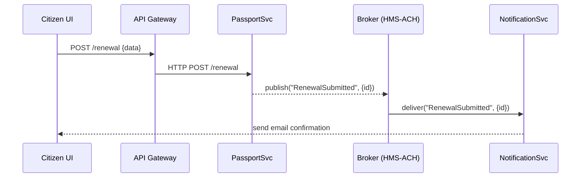
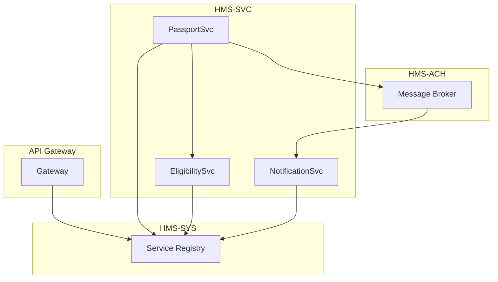

# Chapter 6: Microservices Infrastructure

In [Chapter 5: Backend API](05_backend_api_.md) we saw how a single API gateway exposes endpoints for applications and policies. Now we’ll learn how to split that backend into **independent, scalable microservices**—each like its own government office that can grow, update, or restart without shutting down the entire system.

---

## Why Microservices?

Imagine the Department of State runs a **Passport Renewal** service. In a monolith, any code change to email notifications might force the whole app offline. With microservices:

- The **Passport Service** handles renewal logic.
- The **Notification Service** sends emails.
- The **Eligibility Service** checks rules.
- The **API Gateway** routes requests to each service.
- A **Message Broker** (event bus) lets services talk asynchronously.

Each “department” can scale or redeploy on its own.

---

## Key Components in HMS-UHC

HMS-UHC splits its infrastructure into four layers:

1. **HMS-SYS (System Core)**  
   - Service Registry, Configuration, Auth  
   - “Central admin office” that tracks where services live.

2. **HMS-SVC (Services)**  
   - Business microservices (e.g., PassportSvc, NotificationSvc)  
   - Each is a self-contained department.

3. **HMS-ACH (Asynchronous Channels)**  
   - Event bus or message broker (e.g., RabbitMQ, Kafka)  
   - Allows services to publish/subscribe events.

4. **HMS-A2A (App-to-App Communication)**  
   - Synchronous calls between services (HTTP/gRPC)  
   - For query or command workflows that need immediate response.

---

## Example Use Case: Passport Renewal

When a citizen submits a renewal:

1. The **API Gateway** receives `POST /renewal`.  
2. It forwards the call to **Passport Service**.  
3. PassportSvc saves the application and **publishes** a `RenewalSubmitted` event.  
4. **Notification Service** subscribes to that event and sends a confirmation email.  
5. Later, **Eligibility Service** may call back synchronously to verify rules.

---

## End-to-End Sequence



1. **API Gateway** routes to PassportSvc.  
2. **PassportSvc** persists data and raises an event.  
3. **Message Broker** hands the event to subscribers.  
4. **NotificationSvc** reacts and sends email.

---

## Behind the Scenes: System Core (HMS-SYS)

File: `src/sys/discovery.rs`

```rust
pub struct ServiceRegistry { entries: HashMap<String, String> }

impl ServiceRegistry {
    pub fn register(name: &str, addr: &str) {
        // store in memory or etcd/Consul
    }
    pub fn discover(name: &str) -> Option<String> {
        // return service address
        None
    }
}
```

> The registry lets the API Gateway or services find each other by name.

---

## Business Microservice Example (HMS-SVC)

File: `src/svc/passport_service.rs`

```rust
fn main() {
    // 1. Register service location
    ServiceRegistry::register("PassportSvc", "http://localhost:7001");

    // 2. Start HTTP server
    App::new()
        .post("/renewal", |req| {
            let id = save_to_db(&req.body);
            // 3. Publish event
            Broker::publish("RenewalSubmitted", id);
            HttpResponse::Ok().json({ "id": id })
        })
        .run("127.0.0.1:7001");
}
```

> On startup, PassportSvc tells HMS-SYS where it lives. Each request saves data and emits an event.

---

## Asynchronous Channels (HMS-ACH)

File: `src/ach/broker.rs`

```rust
pub struct Broker;
impl Broker {
    pub fn publish(topic: &str, payload: impl Serialize) {
        // e.g. push to Kafka or in-memory queue
    }
    pub fn subscribe(topic: &str, handler: fn(Event)) {
        // on each message, call handler
    }
}
```

> The broker decouples services: publishers don’t need to know who consumes the event.

---

## Synchronous Service-to-Service Calls (HMS-A2A)

If PassportSvc needs immediate eligibility check:

```rust
// inside PassportSvc handler
let url = ServiceRegistry::discover("EligibilitySvc").unwrap();
let resp: Eligibility = http::post(&format!("{}/check", url), &data)?;
if !resp.allowed {
    return HttpResponse::Forbidden().body("Not eligible");
}
```

> PassportSvc looks up EligibilitySvc, then issues a normal HTTP call.

---

## Visualizing the Full Stack



---

## Conclusion

You’ve seen how **Microservices Infrastructure** splits HMS-UHC into independent, scalable services:

- **HMS-SYS** handles discovery and common config.  
- **HMS-SVC** hosts small, focused services.  
- **HMS-ACH** provides event-based messaging.  
- **HMS-A2A** supports direct, synchronous service calls.

Each “department” can scale, deploy, or upgrade on its own—just like in a real government agency.  

Next up, we’ll see how these services expose user-friendly interfaces in the [Interface Layer](07_interface_layer_.md).

---

Generated by [AI Codebase Knowledge Builder](https://github.com/The-Pocket/Tutorial-Codebase-Knowledge)