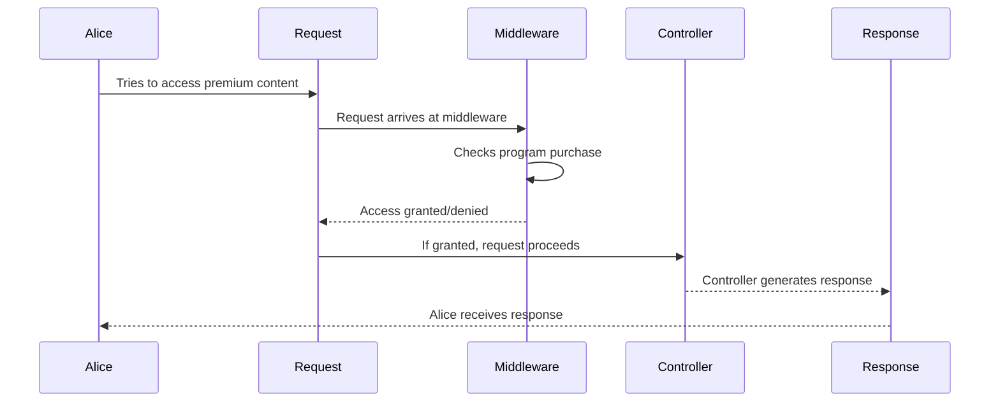

# Chapter 6: Middleware

In the previous chapter, [Tenancy](05_tenancy_.md), we learned how to keep data separate for different clinics. Now, let's explore *Middleware*, which acts like a security guard for your application, controlling access to your routes.

## The Use Case: Protecting Premium Program Content

Imagine you have a premium program, "Advanced Weight Loss Techniques," and you only want users who have purchased this program to access its content. Middleware can help you enforce this restriction.

## What Problem Does Middleware Solve?

Without middleware, you would need to write code in every controller method to check if the user has access. This would be repetitive and difficult to maintain. Middleware provides a centralized way to handle these checks before a request even reaches your controller.

## Key Concepts

1. **Request:**  When a user interacts with your application (e.g., clicks a link, submits a form), they send a *request* to the server.

2. **Response:** After processing the request, the server sends back a *response* (e.g., the webpage, some data).

3. **Middleware:**  Middleware sits between the request and the response. It can inspect the request, modify it, or even block it entirely. Think of it as a gatekeeper.

## Protecting Premium Content: Step-by-Step

Here's how middleware helps protect your premium content:

1. Alice, a user, tries to access the "Advanced Weight Loss Techniques" program content.
2. The `CheckProgramPurchase` middleware intercepts the request.
3. The middleware checks if Alice has purchased the program.
4. If Alice has purchased the program, the middleware allows the request to proceed to the controller.
5. If Alice hasn't purchased the program, the middleware blocks the request and returns an error message.

## Under the Hood: Code Implementation

Here's a simplified look at how middleware works:



The `routes/tenant.php` file defines routes that use middleware:

```php
// File: routes/tenant.php (simplified)

// ... other code ...

Route::get('/premium-program/{program}', [PremiumProgramController::class, 'show'])
    ->middleware('check-program-purchase');

// ... other code ...
```

**Explanation:**

The `middleware` method attaches the `check-program-purchase` middleware to this route.

The `CheckProgramPurchase` middleware handles the access check:

```php
// File: app/Http/Middleware/CheckProgramPurchase.php (simplified)

// ... other code ...

public function handle(Request $request, Closure $next)
{
    // 1. Get the program ID from the request.
    $programId = $request->route('program');

    // 2. Check if the user has purchased the program.
    // ... database query logic ...

    // 3. If purchased, allow the request to proceed.
    if ($purchased) {
        return $next($request);
    }

    // 4. If not purchased, return an error.
    return response()->json(['message' => 'You must purchase this program to access its content'], 403);
}

// ... other code ...
```

**Explanation:**

1. The `handle` method receives the request and a `Closure` called `$next`.
2. It retrieves the program ID from the request.
3. It checks if the authenticated user has purchased the program (imagine a database query here).
4. If purchased, it calls `$next($request)`, which allows the request to proceed to the controller.
5. If not purchased, it returns an error response.

## Conclusion

In this chapter, we learned about Middleware and how it acts as a gatekeeper for our routes. We saw how it can be used to protect premium content by checking if a user has purchased a program.  Next, we'll explore [Protocols and Chains](07_protocols_and_chains_.md) to understand how to structure health programs within your application.


---

Generated by [AI Codebase Knowledge Builder](https://github.com/The-Pocket/Tutorial-Codebase-Knowledge)