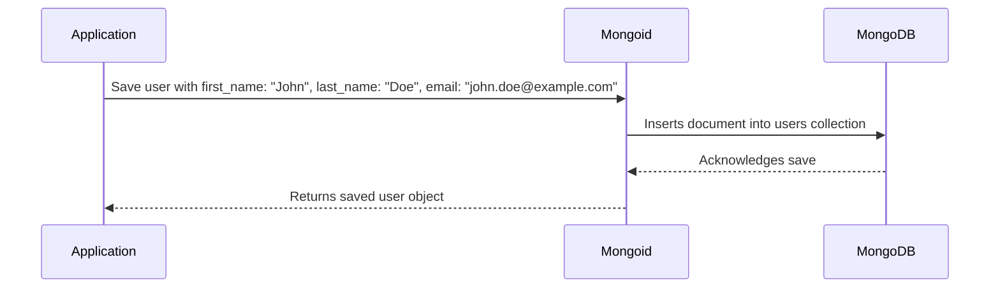

# Chapter 6: Models (Mongoid)

In the previous chapter, [Application Configuration (`settings.yml`)](05_application_configuration__settings_yml_.md), we learned how to manage global settings for our application. Now, let's think about how we actually store and retrieve data, like information about users.  Our central use case is storing and retrieving user information, such as their name and email address.  This is where Models and Mongoid come in.

## Models: Your Application's Blueprints

Models are like blueprints for the data in your application. They define what information is stored and how it's organized.  Think of a blueprint for a house – it defines the rooms, their sizes, and how they're connected.  Similarly, a User model defines the attributes of a user, like name, email, and address.

## Mongoid: Talking to the Database

Mongoid is an Object Document Mapper (ODM).  It's like a translator between your application and the MongoDB database.  Imagine you want to tell the database to save a new user.  Instead of speaking the database's language directly, you can tell Mongoid, and it will translate your request into something the database understands.

## Example: Creating a User Model

Let's create a simplified User model:

```ruby
# app/models/user.rb
class User
  include Mongoid::Document

  field :first_name, type: String
  field :last_name, type: String
  field :email, type: String
end
```

This code defines a User model with three fields: `first_name`, `last_name`, and `email`, all of which are strings.  `include Mongoid::Document` tells Mongoid that this is a model that should be stored in the database.

## Saving a New User

```ruby
# Somewhere in your controller
user = User.new(first_name: "John", last_name: "Doe", email: "john.doe@example.com")
user.save!
```

This code creates a new User object with the given attributes and saves it to the database.  The `save!` method raises an error if the save fails.

## Retrieving a User

```ruby
# Somewhere in your controller
user = User.find_by(email: "john.doe@example.com")
puts user.first_name # Output: John
```

This code retrieves the user with the email address "john.doe@example.com" and prints their first name.

## How Mongoid Works Under the Hood



When you call `user.save!`, Mongoid translates this into a database command to insert a new document into the `users` collection in MongoDB.  MongoDB acknowledges the save, and Mongoid returns the saved user object back to your application.

## Internal Implementation

Mongoid's configuration is primarily handled in the `config/mongoid.yml` file. This file defines the database connection details, such as the host, port, and database name.  It also includes settings for different environments (development, test, production).

```yaml
# config/mongoid.yml (simplified)
development:
  clients:
    default:
      database: enroll_development
      hosts:
        - localhost:27017
```

This snippet shows the configuration for the development environment, connecting to a database named `enroll_development` on `localhost:27017`.  The `on_worker_boot` block in the [puma.rb](puma.rb) file ensures that the MongoDB connection is re-established for each worker process.

## Conclusion

In this chapter, we learned how Models represent the data in our application and how Mongoid acts as a translator between our application and the MongoDB database.  We saw how to create a simple User model, save a new user, and retrieve a user from the database. This provides a structured way to manage and interact with our application's data.

Next, we'll explore how to interact with external services: [FDSH Services](07_fdsh_services.md).


---

Generated by [AI Codebase Knowledge Builder](https://github.com/The-Pocket/Tutorial-Codebase-Knowledge)