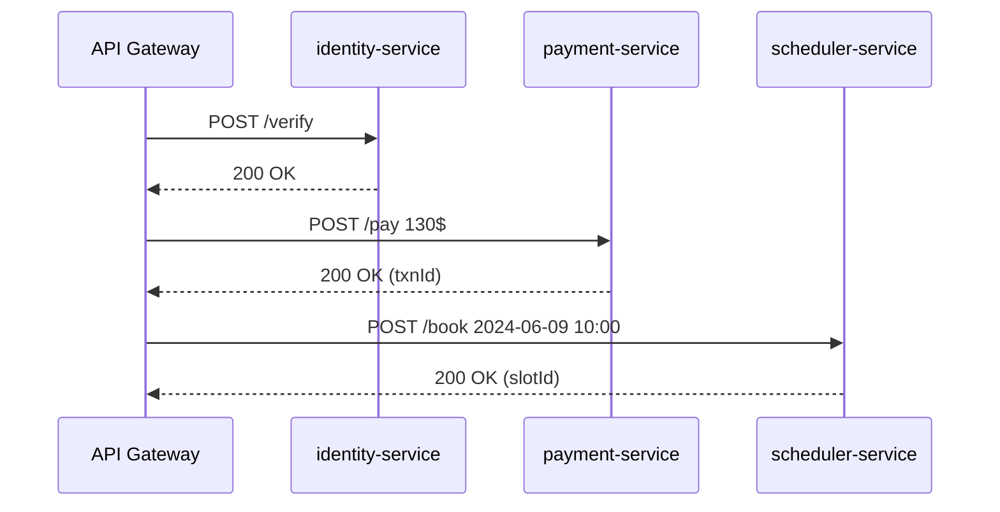

# Chapter 6: Modular Microservice Architecture

*(In the previous chapter you learned how [HMS-OPS](05_management_layer__hms_svc___hms_ops__.md) breaks big directives into bite-sized jobs.  
Now let’s zoom in on the workers themselves and see **how to build them so they can be swapped or scaled like Lego bricks**.)*

---

## 1 · Why Another Architecture Buzz-word?

### A 60-second story

The Bureau of Consular Affairs has three citizen-facing tasks:

1. **Identity Check** – “Is María really María?”  
2. **Payment** – collect a $130 passport fee.  
3. **Appointment** – schedule a 10-minute photo slot.

Last summer Congress temporarily waived the fee for veterans.  
With a **modular microservice** approach the team simply replaced the *payment-service* with `payment-service-veterans`.
The **identity** and **appointment** blocks kept running; airports never noticed the change.

With a monolith they would have redeployed the entire passport portal—risking downtime at JFK and LAX the day before July 4th.

---

## 2 · Key Ideas in Plain English

| Term                        | Beginner-Friendly Meaning                                          |
|-----------------------------|--------------------------------------------------------------------|
| Service                     | A tiny app that does one job well (e.g., payments).               |
| API Contract                | The public “edge” of a service: paths, verbs, data shapes.        |
| Module Boundary             | Everything inside the service; **nothing** leaks out.             |
| Stateless vs Stateful       | “Does it remember?” – stateless is easier to scale.               |
| Replaceability              | You can swap one service for another if they share the same API.  |
| Independent Scaling         | Run 2 copies of *payments* at tax time without touching others.   |

> Analogy: a metro system where each line (service) has its own tracks (database/cache) but shares common stations (APIs). You can add more trains to the blue line during rush hour without rebuilding the red line.

---

## 3 · Lego Blocks in Action – The Passport Renewal Flow

We’ll build the smallest possible set of three services.

### 3.1 Service List

| Service Name        | Responsibility                       | Tech (example) |
|---------------------|--------------------------------------|----------------|
| identity-service    | Verify SSN + photo                   | Python Flask   |
| payment-service     | Charge credit card                   | Node Express   |
| scheduler-service   | Book appointment                     | Go Fiber       |

Each lives in its **own repo, Dockerfile, and CI pipeline**.

---

### 3.2 Quick Start – A 12-line Payment Service

```js
// payment-service/index.js
import express from 'express';
const app = express(); app.use(express.json());

app.post('/pay', (req, res) => {
  const { amount, card } = req.body;
  // pretend we call Stripe
  res.json({ ok: true, txnId: 'TX-' + Date.now() });
});

app.listen(7001);
```

Explanation:  
• The whole “edge” is `/pay`.  
• Internal logic (Stripe keys, retries) stays **inside** the block.  
• Any caller only sees the JSON `{ ok: true, txnId: … }`.

---

### 3.3 Wire Them Together (dev-only)

```yaml
# docker-compose.yml  (18 lines)
services:
  identity:
    build: ./identity-service
    ports: ["7000:7000"]
  payment:
    build: ./payment-service
    ports: ["7001:7001"]
  scheduler:
    build: ./scheduler-service
    ports: ["7002:7002"]
```

Run:

```bash
$ docker compose up
```

Now the three Lego bricks are running locally, ready for [HMS-OPS](05_management_layer__hms_svc___hms_ops__.md) to dispatch tasks.

---

## 4 · How the Blocks Talk

### 4.1 A Tiny OpenAPI Contract

```yaml
# payment-service/openapi.yaml  (≤15 lines)
paths:
  /pay:
    post:
      requestBody:
        content:
          application/json:
            schema:
              $ref: '#/components/schemas/Payment'
      responses:
        '200':
          description: OK
components:
  schemas:
    Payment:
      type: object
      properties: { amount: integer, card: string }
      required: [amount, card]
```

Explanation:  
• This file is the **legal agreement** between teams.  
• Change it and you must publish a version `v2`.

---

### 4.2 End-to-End Sequence



Only the **Gateway** is exposed to the outside world (see [Backend API Gateway](03_backend_api_gateway__hms_api___hms_mkt__.md)).

---

## 5 · Swapping or Scaling a Block – 2 Examples

### 5.1 Replacing Payments for Veterans

```bash
# switch traffic (Kong example - 2 lines)
$ kong service update payment url=http://payment-veterans:7001
$ kong route update payment strip_path=false
```

No downtime for identity or scheduler.

### 5.2 Auto-Scaling Scheduler at Noon

```yaml
# k8s/hpa-scheduler.yaml
minReplicas: 2
maxReplicas: 10
metrics:
  - type: Resource
    resource: { name: cpu, targetAverageUtilization: 70 }
```

Only *scheduler-service* pods scale; payment & identity stay at 2 pods.

---

## 6 · Under the Hood – Registration & Discovery

When a service starts it calls HMS-OPS to say “I’m alive”.

```ts
// payment-service/bootstrap.ts
await fetch('http://hms-ops:4500/register', {
  method: 'POST',
  body: JSON.stringify({
    name: 'payment',
    url:  process.env.SELF_URL,
    version: '1.3.0'
  })
});
```

HMS-OPS stores this in Redis so the Gateway and future [Service Mesh](07_cross_domain_service_mesh_.md) can discover healthy instances.

---

## 7 · Common Pitfalls & Quick Fixes

| Pitfall                                     | Fix |
|---------------------------------------------|-----|
| “Chatty” calls between services             | Aggregate in a **facade** service or use async messages. |
| Sharing one database between many services  | Give each service its **own schema or DB**; join in reporting layer. |
| Large APIs that keep growing                | Publish **versioned contracts** and deprecate old ones. |
| Hidden coupling via shared environment vars | Pass configuration **through the Gateway** or a config service, never ad-hoc env vars. |

---

## 8 · Recap

You learned to:

• Think of each capability as a Lego block with a **clear edge (API)**.  
• Build, run, and version services **independently**.  
• Replace or scale one block without halting the metro line next to it.  

In the next chapter we’ll connect these blocks with high-speed “tunnels” called a service mesh—handling encryption, retries, and cross-agency traffic automatically.

[Next Chapter: Cross-Domain Service Mesh](07_cross_domain_service_mesh_.md)

---

Generated by [AI Codebase Knowledge Builder](https://github.com/The-Pocket/Tutorial-Codebase-Knowledge)