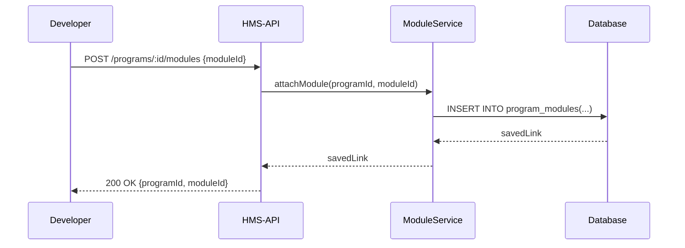
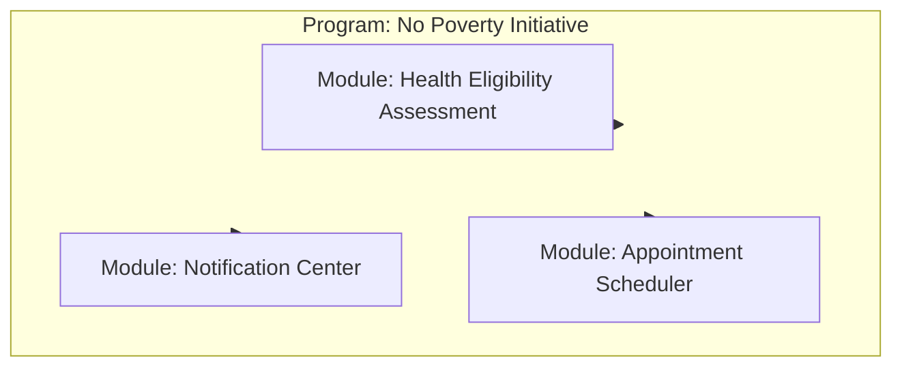

# Chapter 6: Module System & Business Logic

In [Chapter 5: Policy Management API](05_policy_management_api_.md) we learned how to draft, approve, and enforce policies for your Programs. Now let’s see how to plug in reusable **modules**—self-contained chunks of business logic like assessments, notifications, or scheduling—into any Program.

---

## 1. Motivation: Mix-and-Match Program Features

Imagine each module is like a dedicated “division” inside your agency:

- **Health Eligibility Assessment** checks a citizen’s income and age.  
- **Appointment Scheduler** lets users book clinic visits.  
- **Notification Center** sends emails or SMS alerts.  

Instead of hard-coding these into every Program, you keep them as independent building blocks in the `Modules` directory. Then you “attach” the ones you need to your Program—just like adding a department to a project’s org chart.

---

## 2. Key Concepts

### 2.1 Module  
A package of business logic (JS code, config, database hooks) that delivers one feature.

Analogy: A modular office unit that you can plug into any building.

### 2.2 Module Directory  
A folder (`src/modules/…`) where each module lives with its own `manifest.json` and entry code.

### 2.3 Attaching a Module  
When you “install” or **attach** a module to a Program, HMS-API records that link and runs the module’s setup logic (e.g., DB migrations, default settings).

### 2.4 Frontend Rendering  
Each module can declare how it wants to appear in the UI (form fields, buttons). The front-end reads the module’s metadata to render its components.

---

## 3. Getting Started: Attaching Modules to a Program

Below is a minimal example showing how to list available modules, attach one to your Program, and fetch the active modules.

### 3.1 List Available Modules

```js
// listModules.js
const { ModuleService } = require('hms-api');

async function listAll() {
  const modules = await ModuleService.listAvailableModules();
  console.log('📦 Available Modules:', modules.map(m => m.name));
}
listAll().catch(console.error);
```
This returns an array of module objects, e.g.:  
`[{ id: 'mod-001', name: 'Health Eligibility Assessment' }, …]`.

### 3.2 Attach a Module

```js
// attachModule.js
const { ModuleService } = require('hms-api');

async function attach() {
  const programId = 'program-456';
  const moduleId = 'mod-001'; // from listAvailableModules()
  await ModuleService.attachModule(programId, moduleId);
  console.log('✅ Module attached to program');
}
attach().catch(console.error);
```
After this call, HMS-API runs any setup logic and marks the module as **active** on that Program.

### 3.3 Fetch Active Modules

```js
// getProgramModules.js
const { ModuleService } = require('hms-api');

async function activeMods() {
  const active = await ModuleService.getProgramModules('program-456');
  console.log('🔗 Active Modules:', active.map(m => m.name));
}
activeMods().catch(console.error);
```
You’ll see a list of modules currently plugged into your Program.

---

## 4. Under the Hood: What Happens When You Attach a Module



1. The front-end calls `/programs/:id/modules`.  
2. HMS-API routes to `ModuleService.attachModule`.  
3. Service writes the link into `program_modules` table.  
4. HMS-API responds with confirmation.

---

## 5. Internal Implementation

### 5.1 Service Layer (`src/services/module.service.ts`)

```ts
import { v4 as uuid } from 'uuid'
import { moduleRepo, programModuleRepo } from '../repositories'

export async function listAvailableModules() {
  return moduleRepo.findAll()                      // reads src/modules/*
}

export async function attachModule(programId, moduleId) {
  const id = uuid()
  return programModuleRepo.insert({ id, programId, moduleId })
}

export async function getProgramModules(programId) {
  return programModuleRepo.findByProgram(programId)
}
```
- `moduleRepo.findAll()` reads your local module manifests.  
- `programModuleRepo.insert()` links a module to the Program.

### 5.2 Repository Layer (`src/repositories/programModule.repo.ts`)

```ts
export const programModuleRepo = {
  insert: rec => db('program_modules').insert(rec).returning('*')[0],
  findByProgram: programId =>
    db('program_modules').where({ programId }).join('modules','modules.id','moduleId')
}
```

### 5.3 File System Layout

```text
src/modules/
├─ health-eligibility-assessment/
│  ├─ manifest.json      # name, version, UI hints
│  └─ index.ts           # setup hooks, API endpoints
├─ appointment-scheduler/
│  ├─ manifest.json
│  └─ index.ts
└─ notification/
   ├─ manifest.json
   └─ index.ts
```
Each folder is a self-contained module with metadata and code.

---

## 6. Visualizing Programs & Modules


- Dashed lines show how modules “plug in” to a Program.  
- You can add or remove modules at any time.

---

## 7. Conclusion & Next Steps

You’ve learned how to:

- Discover and list reusable **modules** in `src/modules`.  
- **Attach** a module to your Program with `ModuleService.attachModule`.  
- Fetch which modules are active on a Program.  
- Peek under the hood at service, repository, and file-system layouts.

Up next, we’ll build the user interface with reusable components in  
[Chapter 7: Frontend Component Library](07_frontend_component_library_.md).

---

Generated by [AI Codebase Knowledge Builder](https://github.com/The-Pocket/Tutorial-Codebase-Knowledge)