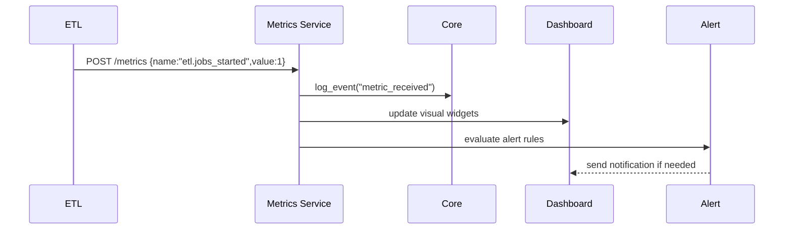

# Chapter 6: Monitoring & Metrics Dashboard

In [Chapter 5: External System Synchronization](05_external_system_synchronization_.md) we saw how to push real-time updates to downstream systems. Now it’s time to watch those systems—and our ETL pipelines—live, so we know immediately if something slows down, breaks, or drifts off track.

---

## 1. Motivation: Why Monitoring & Metrics?

Imagine the Veterans Health Administration (VHA) runs a daily ETL job to sync patient records, then pushes policy updates to thousands of clinic schedulers. Without a live dashboard, you only learn about failures when nurses call the help desk—or worse, when a patient misses an appointment.  

A good **Monitoring & Metrics Dashboard** is like a highway traffic map:  
- You see where the jams (pipeline slowdowns) occur  
- You catch accidents (errors) before they cascade  
- You plan better routes (optimize processes)  

Key government scenarios:  
- Federal Mine Safety and Health Review Commission wants to know if its accident-report pipeline stalls.  
- Air Force analytics needs to track data freshness for mission planning.  

With monitoring, you get real-time insights instead of surprise outages.

---

## 2. Key Concepts

1. **Metrics**  
   Numeric measurements (e.g., records processed per minute, error counts, response times).  

2. **Dashboards**  
   Visual pages showing charts, gauges, and tables of your metrics.

3. **Alerts**  
   Rules that fire notifications (email, Slack) when a metric crosses a threshold (e.g., error rate > 5/hr).

4. **KPIs (Key Performance Indicators)**  
   High-level metrics you care about most:  
   - Process efficiency (throughput)  
   - User satisfaction (feedback scores)  
   - Conflict resolution rates (merge successes vs. failures)

---

## 3. Using Monitoring & Metrics

Let’s instrument a simple ETL pipeline to send metrics.

### 3.1 Install and Initialize a Metrics Client

File: `hms_etl/monitoring.py` (we’ll reference the implementation later)
```python
from hms_etl.monitoring import MetricsClient

# Point at our monitoring service
metrics = MetricsClient(
  base_url="https://monitor.gov.example",
  api_key="ETL_MON_KEY"
)
```
This gives us `metrics.increment()`, `metrics.gauge()`, and `metrics.timing()` to record events.

### 3.2 Instrument Your ETL Code

File: `etl_pipeline.py`
```python
import time
from monitoring import metrics

def run_etl():
    start = time.time()
    metrics.increment("etl.jobs_started")
    try:
        # ... extract, transform, load ...
        count = 5000  # imagine we processed 5,000 records
        metrics.gauge("etl.records_processed", count)
    except Exception:
        metrics.increment("etl.errors")
        raise
    finally:
        metrics.timing("etl.duration_seconds", start)
```
What happens when you run `run_etl()`:
1. A counter `etl.jobs_started` goes up by 1  
2. After processing, you send a gauge `etl.records_processed` = 5000  
3. On error, an `etl.errors` counter increments  
4. Finally, you record how long the job took  

### 3.3 Viewing the Dashboard

In your browser, open `https://monitor.gov.example/dashboard` and you’ll see:
- A line chart of `etl.duration_seconds` over the past 24 hours  
- A bar showing total `etl.records_processed` per day  
- An alert widget if `etl.errors` > 0 in the last hour  

You can customize to show only your KPIs and share links with stakeholders.

### 3.4 Setting Up an Alert

Some dashboards let you define alert rules. For example:
- **If** `etl.duration_seconds` > 600 (10 minutes)  
- **Notify** the on-call team via email or Slack  

Alerts ensure you don’t wait for a pager call—they ring it for you.

---

## 4. Internal Workflow

Here’s a simplified sequence when your ETL code emits metrics:



1. **ETL** sends metric data to **Metrics Service**  
2. **Metrics Service** logs the receipt via [HMS-SYS Core Infrastructure](01_hms_sys_core_infrastructure_.md).  
3. Dashboard is updated in real time.  
4. Alert engine checks thresholds and notifies if rules fire.

---

## 5. Under the Hood: Metrics Client Code

Let’s peek at a minimal implementation in `hms_etl/monitoring.py`.

```python
# hms_etl/monitoring.py
import time, requests
from hms_sys import CoreClient

class MetricsClient:
    def __init__(self, base_url, api_key):
        # Authenticate to HMS-SYS for secure logging
        core = CoreClient(base_url="https://core.gov.example")
        self.token = core.authenticate(api_key=api_key)
        self.base_url = base_url

    def _post(self, payload):
        headers = {"Authorization": f"Bearer {self.token}"}
        requests.post(f"{self.base_url}/metrics", json=payload, headers=headers)

    def increment(self, name, value=1):
        self._post({"metric": name, "value": value, "type": "count"})

    def gauge(self, name, value):
        self._post({"metric": name, "value": value, "type": "gauge"})

    def timing(self, name, start_time):
        duration = time.time() - start_time
        self.gauge(name, duration)
```

- We reuse **HMS-SYS Core** for authentication and central logging.  
- Each metric call posts to a simple `/metrics` endpoint.  
- In production, the metrics service would store timeseries data, evaluate alerts, and feed dashboards.

---

## 6. Conclusion

In this chapter you learned how to:

- Instrument your ETL jobs with counters, gauges, and timing metrics  
- Visualize those metrics in a live dashboard (like a traffic map)  
- Define alerts so you catch problems the moment they happen  

With these tools, your teams—from mine-safety analysts to clinic schedulers—stay informed and can optimize processes before small issues become big outages.

Up next: we’ll build intelligent agents that can react to these metrics and automate tasks for you:

[Chapter 7: HMS-A2A AI Agent Framework](07_hms_a2a_ai_agent_framework_.md)

---

Generated by [AI Codebase Knowledge Builder](https://github.com/The-Pocket/Tutorial-Codebase-Knowledge)