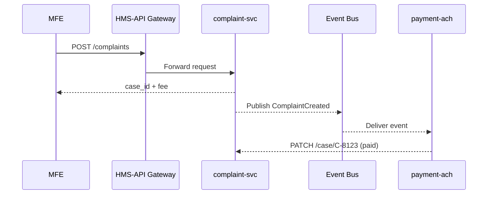

# Chapter 6: Multi-Layered Microservice Architecture
*[Link back to Chapter 5: Access & Identity Management](05_access___identity_management_.md)*  

---

## 1. Why Yet Another “Layer”?
Central Use Case  
• A citizen submits a new **online food-safety complaint** to the Food Safety and Inspection Service (FSIS).  
• The form must be validated, stored, and—if the case needs lab-testing—trigger a **$25 lab-fee** through Treasury rails.  
• Ten minutes later an auditor from the Office of Inspector General searches the same record.  

We want these tasks to feel like **one action** to the citizen, yet run on **separate, independently scalable services**:

1. HMS-MFE (front-end form)  
2. HMS-SVC (complaint service)  
3. HMS-ACH (payment rail)  
4. HMS-SYS core libraries (logging, auth)  

A **Multi-Layered Microservice Architecture** glues these “city districts” together while keeping their traffic (API calls & events) safe and predictable.

---

## 2. Birds-Eye View (One-Minute Tour)

```mermaid
graph LR
  subgraph Core
    SYS[HMS-SYS<br>(common libs)]
  end
  subgraph Platform
    SVC[HMS-SVC<br>(domain services)]
    ACH[HMS-ACH<br>(financial rails)]
  end
  MFE[HMS-MFE<br>(user portal)]
  BUS[(Event&nbsp;Bus)]
  
  MFE-->|REST&nbsp;API|SVC
  SVC-->|Event "ComplaintCreated"|BUS
  BUS-->|Event|ACH
  ACH-->|Status API|SVC
  SVC-->|JSON payload|MFE
  SYS---SVC
  SYS---ACH
```

Think of each box as a *department* in a federal city; the Event Bus is the highway and REST APIs are city streets.

---

## 3. Key Concepts (Plain-English)

| Concept | City Analogy | Newbie Take |
|---------|--------------|------------|
| Layer | District (Downtown, Finance) | Group of services with similar duties |
| Vertical Slice | City block | One user flow that crosses layers |
| Contract | Zoning rule | OpenAPI file or event schema everyone respects |
| Sync vs Async | Car vs Subway | REST = request/response; Event = fire-and-forget |
| Loose Coupling | Buildings share roads, not walls | Change one service without rebuilding others |

---

## 4. Our Use-Case Walk-Through

### 4.1 Submit the Complaint (Sync Call)

```python
# MFE (front-end) -> Complaint API
resp = requests.post(
    "https://api.fsis.gov/complaints",
    json={"citizen_id": 42, "text": "Undercooked chicken"},
    timeout=3,
)
print(resp.json())   # → {"case_id": "C-8123", "payment_due": 25}
```

Explanation  
1. Front-end hits **HMS-API** gateway (we’ll meet it in the next chapter).  
2. Gateway routes to `complaint-svc` inside HMS-SVC.  
3. Service returns a `case_id` and fee amount.

### 4.2 Trigger Payment (Async Event)

```python
# Inside complaint-svc (≤ 10 lines)
from hms_bus import publish

publish(
    topic="ComplaintCreated",
    payload={"case_id": "C-8123", "fee": 25},
)
```

What happens?  
• `publish` hands the JSON to the **Event Bus**.  
• The `payments-ach` service (HMS-ACH) is subscribed and starts card processing.  
• No blocking—complaint-svc can reply to the citizen immediately.

### 4.3 Receive Payment Status (Sync Callback)

```python
# payment-ach notifies complaint-svc (≤ 12 lines)
import requests, os, json

def on_payment_settled(event):
    data = json.loads(event["payload"])
    requests.patch(
        f"{os.getenv('COMPLAINT_SVC')}/case/{data['case_id']}",
        json={"payment_status": "SETTLED"},
        timeout=2,
    )
```

Now the citizen can refresh the portal and see “Fee paid ✅”.

---

## 5. How Do Layers Talk? (Step-By-Step)



Only five hops, each hop belongs to a different *layer*.

---

## 6. Spinning-Up Your First Service

A tiny **Service Manifest** tells the platform where a service lives and which lanes (APIs/events) it drives on.

```yaml
# complaint_svc/manifest.yaml
service: complaint-svc
layer: HMS-SVC
port: 7000
routes:
  - POST /complaints
  - PATCH /case/{id}
events:
  publish:  ["ComplaintCreated"]
  consume:  ["PaymentSettled"]
deps:
  - hms-sys>=1.0.0   # shared libs
```

Explanation  
• `layer` keeps zoning clear (core vs backend vs rails).  
• `routes` register REST endpoints with the API mesh.  
• `events` auto-subscribe to the bus.  

Deploying is one CLI call:

```bash
hms deploy complaint_svc/manifest.yaml
```

The platform wires networking, IAM, and monitoring automatically.

---

## 7. Under the Hood (Source Peek)

### 7.1 Service Registration (≤ 18 lines)

```python
# hms_sys/bootstrap.py
import json, os, requests

def register(manifest_path):
    spec = json.load(open(manifest_path))
    ctrl = os.getenv("HMS_CONTROL_PLANE")
    requests.post(f"{ctrl}/register", json=spec, timeout=1)
```

Runs on container start; the control plane:

1. Allocates a service name in DNS.  
2. Adds API routes to the mesh.  
3. Grants publish/subscribe rights based on `events`.

### 7.2 In-Process SDK (≤ 15 lines)

```python
# complaint_svc/app.py
from hms_sys import bus, auth

@route("POST", "/complaints")
def new_complaint(body, ctx):
    auth.require(ctx.jwt, "CREATE_COMPLAINT")
    case_id = db.save(body)
    bus.publish("ComplaintCreated", {"case_id": case_id, "fee": 25})
    return {"case_id": case_id, "payment_due": 25}
```

Beginner take-away: all the heavy lifting (IAM, bus, mesh) hides in `hms_sys` libs.

---

## 8. Safety Rails You Already Know

• Governance approvals from [Chapter 1](01_governance_layer__hms_gov__.md) must clear each manifest.  
• Signed policies from [Policy & Process Engine](02_policy___process_engine_.md) validate route names.  
• Version & Rollback pointers (Chapter 3) let you revert a bad service version fast.  
• Security seals (Chapter 4) attach to each container image.  
• Every API call passes through the PEP you built in [Chapter 5](05_access___identity_management_.md).

The architecture is *layered* so each concern lives in its own neighborhood.

---

## 9. Common Pitfalls & Quick Fixes

| Oops! | Root Cause | Fast Fix |
|-------|-----------|----------|
| “Payments time-out the complaint service.” | Using synchronous **HTTP** to call ACH | Switch to async event publish (`publish()` shown above). |
| Circular calls between two SVCs | No clear contract ownership | Designate a single “source of truth” service; other layer consumes via events. |
| Hard-coding hostnames | Breaks when services scale | Always use service discovery (`http://complaint-svc`) provided by control plane. |

---

## 10. Mini-Lab: Trace a Vertical Slice

1. Deploy `complaint-svc` and `payment-ach` (manifests in `examples/`).  
2. Run `hms trace --case C-8123`.  
3. Observe output:  

```
MFE → API → complaint-svc → BUS → payment-ach → complaint-svc ↩
```

4. Kill `payment-ach` pod; re-submit a complaint.  
5. Notice complaint still returns instantly—layering + async events saved UX!

---

## 11. What You Learned

✓ Why we split duties into **HMS-SYS → HMS-SVC → HMS-ACH** layers.  
✓ The difference between sync API streets and async event highways.  
✓ How a Service Manifest declares routes & events in < 20 lines.  
✓ Internal flow: service registration, control plane wiring, SDK helpers.  
✓ How previous chapters’ governance, security, and IAM automatically apply.

Ready to deep-dive into the **API mesh** that routes all those calls?  
Continue to [Backend Service Mesh (HMS-API)](07_backend_service_mesh__hms_api__.md).

---

Generated by [AI Codebase Knowledge Builder](https://github.com/The-Pocket/Tutorial-Codebase-Knowledge)