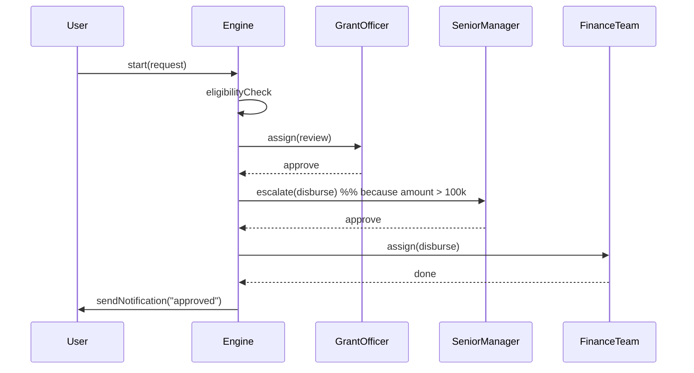
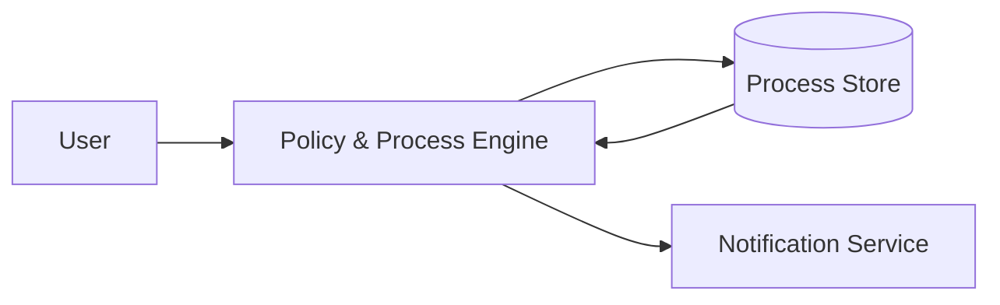

# Chapter 6: Policy and Process Engine

In the previous chapter, we saw how the [Human-in-the-Loop (HITL) Mechanism](05_human_in_the_loop__hitl__mechanism_.md) guarantees human review of AI-generated drafts. Now it’s time to build the “rulebook and traffic controller” behind the scenes: the **Policy and Process Engine**.

## 1. Motivation and Use Case

Imagine the **Small Business Administration (SBA)** processes grant applications. A typical workflow looks like this:

1. Entrepreneur submits an application  
2. System checks eligibility rules  
3. If eligible, route to a Grant Officer for approval  
4. Once approved, route to Finance Team to disburse funds  
5. Notify the applicant by email  
6. If the grant is over \$100 000, escalate to a Senior Manager  

Without a policy engine, you’d write custom code for each step. With the **Policy and Process Engine**, you define:

- **Policies** (business rules)  
- **Processes** (ordered steps)  
- **Roles** (who does what)  
- **Conditions** and **escalation** paths  
- **Notifications** and exception handlers  

The engine then enforces these, routes work, triggers alerts, and handles errors automatically.

## 2. Key Concepts

1. **Policy**  
   A JSON or YAML file that lists rules (e.g., “auto-approve if amount ≤ \$50 000”).

2. **Process (Workflow)**  
   An ordered sequence of steps (e.g., `eligibilityCheck → review → disburse`).

3. **Roles & Actors**  
   Who owns each step (e.g., “GrantOfficer”, “FinanceTeam”, “SeniorManager”).

4. **Conditions & Escalation**  
   Logic to jump to special paths (e.g., “if amount > 100 000 → escalate”).

5. **Notifications & Exceptions**  
   Automatic emails or alerts on certain events (e.g., approval, rejection).

## 3. Solving the SBA Grant Use Case

### 3.1 Define Policy & Workflow

Create a small JSON file that holds everything:

```js
// File: grantPolicy.json
{
  "name": "SBAGrant",
  "steps": [
    { "id": "eligibilityCheck", "role": "System" },
    { "id": "review",          "role": "GrantOfficer" },
    { "id": "disburse",        "role": "FinanceTeam" }
  ],
  "conditions": [
    {
      "if": "data.amount > 100000",
      "action": "escalate",
      "to": "SeniorManager"
    }
  ],
  "notifications": [
    { "on": "approved", "message": "Your grant is approved" },
    { "on": "rejected", "message": "Your grant is rejected" }
  ]
}
```

- Steps list the ordered tasks.  
- Conditions say “if amount > 100 000, then escalate.”  
- Notifications define messages for final states.

### 3.2 Start the Engine

```js
// File: engine.js
const engine = new PolicyEngine();
await engine.loadPolicy('grantPolicy.json');

const request = { id: 1, applicant: 'Alice', amount: 150000 };
engine.start(request);
```

- `loadPolicy` reads our JSON rules.  
- `start(request)` kicks off the workflow with the applicant’s data.

## 4. What Happens Step-by-Step?



1. Engine runs **eligibilityCheck**.  
2. Routes to **GrantOfficer** for **review**.  
3. Officer approves.  
4. Condition triggers **escalation** to **SeniorManager**.  
5. After Manager approves, engine assigns **disburse** to **FinanceTeam**.  
6. Finally, engine sends an “approved” notification to the user.

## 5. Under the Hood: Simplified Implementation

### 5.1 Engine Core (`policyEngine.js`)

```js
class PolicyEngine {
  async loadPolicy(path) {
    this.policy = await fetch(path).then(r => r.json());
  }
  start(data) {
    this.runStep(data, 0);
  }
  runStep(data, idx) {
    const step = this.policy.steps[idx];
    if (!step) return this.notify(data, 'approved');
    this.checkConditions(data);
    console.log(`Assigning ${step.id} to ${step.role}`);
    // Simulate an approval callback
    this.onComplete(data, idx, true);
  }
  onComplete(data, idx, approved) {
    if (!approved) return this.notify(data, 'rejected');
    this.runStep(data, idx + 1);
  }
  checkConditions(data) {
    for (let c of this.policy.conditions) {
      if (eval(c.if)) console.log(`Escalating to ${c.to}`);
    }
  }
  notify(data, event) {
    const note = this.policy.notifications.find(n => n.on === event);
    if (note) console.log(`Notify: ${note.message}`);
  }
}
```

- `loadPolicy` fetches our JSON.  
- `start` triggers the first step.  
- `runStep` handles each step, calls `checkConditions`, and simulates assignment.  
- `onComplete` moves to the next step or terminates.  
- `notify` prints the final message.

### 5.2 Real-World Next Steps

In production you would:

- Replace `console.log` with actual task-assignment APIs.  
- Hook `onComplete` to real approval callbacks (e.g., API endpoints).  
- Send real emails via a **Notification Service**.  
- Persist state and history in a **Process Store**.

## 6. Architecture Overview



- **User** submits a request.  
- **Engine** orchestrates steps, conditions, roles.  
- **Store** keeps each step’s state.  
- **Notifier** sends emails or alerts.

---

## Conclusion

You’ve learned how the **Policy and Process Engine**:

- Centralizes business rules in policy files  
- Automates step routing, approvals, escalations, and notifications  
- Keeps workflows configurable and maintainable  

Next up, we’ll connect these processes to outside systems in [External System Integration](07_external_system_integration_.md).

---

Generated by [AI Codebase Knowledge Builder](https://github.com/The-Pocket/Tutorial-Codebase-Knowledge)