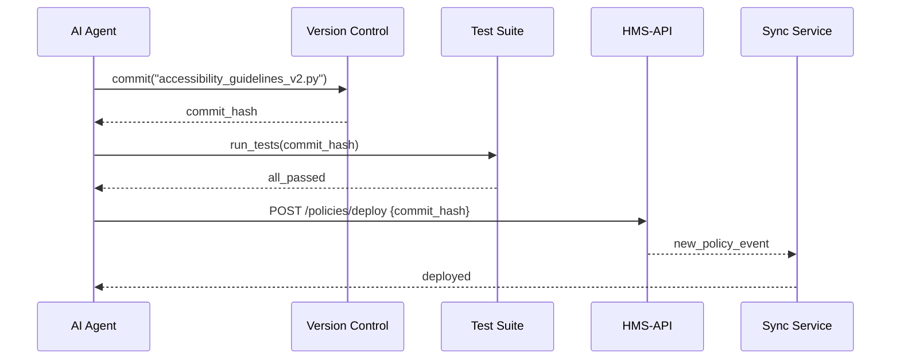

# Chapter 6: Policy Deployment Workflow

In [Chapter 5: AI Representative Agent](05_ai_representative_agent_.md), we saw how our AI Agent drafts policy recommendations—like a researcher writing a memo. Now we need to move those approved policies from draft into live production, just like a bill becomes law. This chapter shows you how the **Policy Deployment Workflow** does exactly that.

## 1. Motivation & Central Use Case

Imagine the National Council on Disability (NCD) finalizes new accessibility guidelines.  
- The guidelines start as text drafts.  
- After review by experts (Human-in-the-Loop), they need to be deployed as machine-enforced rules.  

We want an automated flow where the AI Agent pushes policy code through our system, triggering:
1. Version control commits  
2. Automated tests  
3. Synchronization across all services  

Once complete, the new rules take effect everywhere—just like a law published in the Federal Register.

## 2. Key Concepts

We break the workflow into five simple steps:

1. Draft & Review  
   - Policies live on your laptop or in a review portal until approved.

2. Version Control  
   - Approved code is committed and tagged in Git (or similar).

3. Testing & Validation  
   - Automated tests check syntax, conflicts, and security rules.

4. Deployment API Call  
   - A call to our [Backend API (HMS-API/HMS-MKT)](02_backend_api__hms_api_hms_mkt__.md) registers the new version.

5. System Synchronization  
   - All microservices pull the new policy version and reload rules.

Analogy: This mirrors how a bill is drafted, debated, voted on, signed by the President, then printed and distributed.

## 3. Using the Workflow

Here’s how a script or the AI Agent kicks off deployment:

```python
from hms_mkt.services.policy_deployment import PolicyDeploymentWorkflow

workflow = PolicyDeploymentWorkflow(api_token="<TOKEN>")
result = workflow.deploy("accessibility_guidelines_v2.py")
print("Deployment status:", result.status)
```

What happens:
- `deploy()` commits the policy file to version control.
- Runs tests and waits for pass/fail.
- Calls `/hms-api/v1/policies/deploy` to register the new version.
- Triggers all systems to sync policies.

## 4. Step-by-Step Flow



1. Commit to VCS  
2. Run tests  
3. Call Deployment API  
4. Sync services  

## 5. Under the Hood: Implementation

### 5.1 Orchestrator

File: `hms_mkt/services/policy_deployment.py`

```python
class PolicyDeploymentWorkflow:
    def __init__(self, api_token):
        self.api_token = api_token

    def deploy(self, policy_path):
        commit = self._commit_to_vcs(policy_path)
        self._run_tests(commit)
        return self._call_deploy_api(commit)
```

- `deploy()` ties together all steps in order.

### 5.2 Version Control Commit

```python
    def _commit_to_vcs(self, path):
        # Simplified: add, commit, and tag
        commit_hash = GitClient.commit_and_tag(path)
        return commit_hash
```

- Uses a Git client to commit the file and return its hash.

### 5.3 Testing

```python
    def _run_tests(self, commit):
        # Runs unit & integration tests
        passed = TestRunner.run(commit)
        if not passed:
            raise Exception("Tests failed for " + commit)
```

- Fails early if any test breaks.

### 5.4 Deployment API Call

```python
    def _call_deploy_api(self, commit):
        resp = requests.post(
            "https://api.hms.gov/hms-api/v1/policies/deploy",
            json={"commit": commit},
            headers={"Authorization": f"Bearer {self.api_token}"}
        )
        return resp.json()
```

- Calls our [Backend API (HMS-API/HMS-MKT)](02_backend_api__hms_api_hms_mkt__.md) to finalize deployment.

## 6. Summary & Next Steps

You’ve learned how approved policies move from draft to production, mirroring the legislative process. We covered:

- Draft, review, commit, test, and deploy steps  
- A beginner-friendly orchestrator that ties it all together  
- Internal methods for VCS, testing, and API calls

Next up, we’ll add a final safety net with human overrides in the **Human-in-the-Loop (HITL) Override**:

[Chapter 7: Human-in-the-Loop (HITL) Override](07_human_in_the_loop__hitl__override_.md)

---

Generated by [AI Codebase Knowledge Builder](https://github.com/The-Pocket/Tutorial-Codebase-Knowledge)