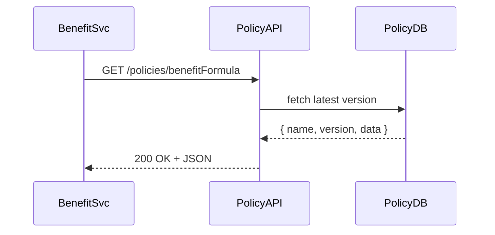

# Chapter 6: Policy Module

In [Chapter 5: Governance Layer](05_governance_layer_.md) we learned how to validate data against a “constitution” of rules. Now, we’ll build the **Policy Module**—a dedicated microservice that **defines**, **stores**, and **serves** those rules and parameters. Think of it as the official rulebook judges consult in a courtroom. In a labor‐department system, this service holds employment standards, wage scales, and benefit‐eligibility formulas.

---

## Why a Policy Module?

Imagine a citizen applying for an unemployment benefit. The application service needs to know:

- What’s the current minimum wage?  
- How many weeks of benefits is someone eligible for?  
- What formula calculates their benefit amount?  

Instead of hardcoding each rule, the application calls the Policy Module. That way:

- Policy changes (e.g., new wage law) go in one place  
- All services see updates immediately  
- We version and audit every policy change  

---

## Key Concepts

1. **Policy Definitions**  
   A small JSON document describing a rule or parameter set (e.g., wage scales).

2. **Policy Store**  
   A database (or key–value store) that saves policy definitions, with version history.

3. **Retrieval API**  
   Endpoints to `GET` a named policy, or `POST` a new/updated policy.

4. **Versioning & Audit**  
   Each time a policy is changed, we record who did it and when—critical for compliance.

---

## Typical Request Flow

Here’s what happens when the Benefits Service asks for the “benefitFormula” policy:



1. The Benefits Service calls our Policy Module.  
2. The module looks up the latest policy version in its DB.  
3. It returns the rule data so the service can apply it.

---

## Using the Policy Module

### 1. Fetch a Policy

```http
GET /policies/wageScale
```

Response (example):

```json
{
  "name": "wageScale",
  "version": 3,
  "data": { "minWage": 15.00, "overtimeRate": 1.5 }
}
```

Explanation:  
- `name`: policy identifier  
- `version`: increments on each change  
- `data`: the actual parameters

### 2. Create or Update a Policy

```http
POST /policies
Content-Type: application/json

{
  "name": "benefitFormula",
  "data": { "weeks": 26, "ratePct": 0.5 }
}
```

Response:

```json
{ "name": "benefitFormula", "version": 1 }
```

Explanation:  
- If `benefitFormula` is new, version 1 is created.  
- If it exists, version is bumped and old version is archived.

---

## A Minimal Policy API in Express

File: `src/policy/routes.js`

```js
const express = require('express');
const router = express.Router();
const { getPolicy, savePolicy } = require('./policyService');

// 1. Retrieve a policy
router.get('/policies/:name', (req, res) => {
  const policy = getPolicy(req.params.name);
  if (!policy) return res.sendStatus(404);
  res.json(policy);
});

// 2. Create or update a policy
router.post('/policies', (req, res) => {
  const { name, data } = req.body;
  const version = savePolicy(name, data);
  res.json({ name, version });
});

module.exports = router;
```

Explanation:  
- `getPolicy(name)` looks up the latest version.  
- `savePolicy(name, data)` stores data, returns new version.

---

## Under the Hood: Policy Service

File: `src/policy/policyService.js`

```js
const db = {}; // simple in-memory store: { name: [{version, data, ts}] }

// Fetch latest version
function getPolicy(name) {
  const history = db[name];
  if (!history) return null;
  return history[history.length - 1];
}

// Save new version
function savePolicy(name, data) {
  const history = db[name] || [];
  const version = history.length + 1;
  history.push({ version, data, ts: new Date().toISOString() });
  db[name] = history;
  // In real life, write audit log here
  return version;
}

module.exports = { getPolicy, savePolicy };
```

Explanation:  
- We keep an array of versions per policy.  
- Each save increments `version` and stamps a timestamp.  
- A real setup would use a persistent DB and an audit log.

---

## Why Version & Audit?

- **Versioning** lets you roll back to an earlier policy if a new rule is buggy.  
- **Auditing** shows *who* changed a rule and *why*—essential for government compliance.

---

## Conclusion

In this chapter, you learned how to:

- Build a **Policy Module** microservice that stores and serves business rules  
- Use a minimal API to `GET` and `POST` policy definitions  
- Version policies automatically and lay groundwork for auditing  

Up next, we’ll see how policies drive automated decisions in the [AI Governance Engine](07_ai_governance_engine_.md).

---

Generated by [AI Codebase Knowledge Builder](https://github.com/The-Pocket/Tutorial-Codebase-Knowledge)