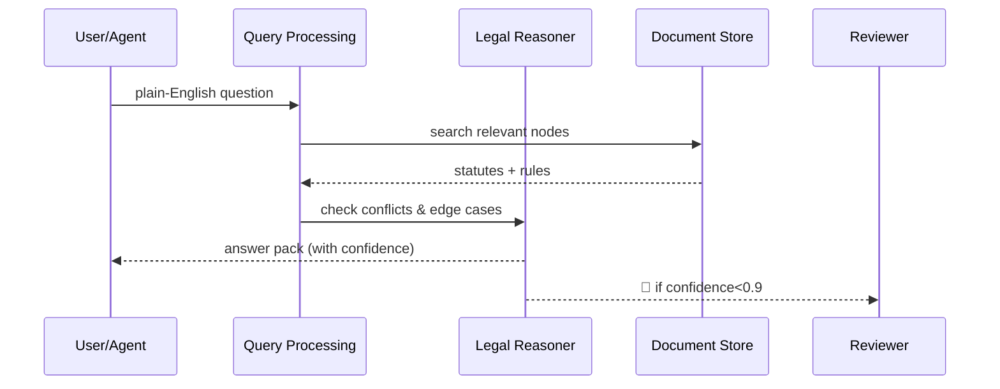
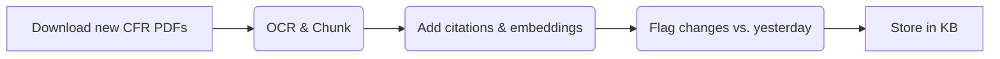

# Chapter 6: Policy & Regulatory Knowledge Base (HMS-EDU + ESQ)

[← Back to Chapter&nbsp;5: Codified Democracy Foundation Engine (HMS-CDF)](05_codified_democracy_foundation_engine__hms_cdf__.md)

---

## 1. Why do we need a “searchable CFR on steroids”?

Imagine Lily, a city engineer, wants to build a *solar canopy* over a federal parking lot.  
Before she drills the first screw she must check:

1. 18 different Code of Federal Regulations (CFR) sections.  
2. Two executive orders about renewable energy.  
3. A brand-new memo from the General Services Administration.

If she misses one line, her project can be halted for months.

**Policy & Regulatory Knowledge Base (KB)** is the giant, annotated library that lets humans *and* AI agents ask:

> “Can I build a solar canopy over Lot 42 in 2024?”

…and instantly get a **legally safe** answer, with citations.

You will learn how to:

1. Ask plain-English questions.  
2. Retrieve relevant statutes, rules, and precedents.  
3. See why the system answers “yes”, “no”, or “maybe—ask HITL”.

---

## 2. Key ideas in plain English

| Concept | Think of it as… |
|---------|-----------------|
| **Doc Node** | One paragraph of law (e.g., “40 CFR §102-4(a)”). |
| **Citation Graph** | A spider-web showing which nodes reference each other. |
| **Annotation** | Sticky notes by lawyers (“overruled”, “superseded”, “budget cap \$5M”). |
| **Query Processor (EDU)** | A librarian who pulls the right pages. |
| **Legal Reasoner (ESQ)** | A junior attorney who checks consistency and risk. |
| **Update Pipeline** | Nightly newspaper delivery—keeps the library fresh. |

---

## 3. A 10-second tour (5 lines of code)

```python
from hms_agx.kb import KnowledgeBase

kb = KnowledgeBase()                           # 🔌 connect
ans = kb.ask("Build solar canopy over federal lot 42 in 2024")
print(ans.summary)
```

Output (abridged):

```
Allowed with conditions:
• Must follow 40 CFR §102-4(a)
• Obtain NEPA environmental review (42 USC §4321)
• Budget limit $10M (GSA Memo 22-014)
Confidence: 0.83 (HITL review suggested) 
```

Explanation:  
1. `ask()` turns a question into a structured search.  
2. The KB returns a machine-readable **Answer Pack** (`.summary`, `.citations`, `.confidence`).  
3. Confidence < 0.9 triggers Human-in-the-Loop (see [Chapter 4](04_human_in_the_loop__hitl__oversight_.md)).

---

## 4. How does the KB think? – A picture



Five participants; no black boxes.

---

## 5. Under the hood in 3 small code snippets

### 5.1 Minimal Doc Node

```python
# file: hms_agx/kb/models.py
@dataclass
class DocNode:
    id: str                 # "40_CFR_102_4_a"
    text: str
    citations: list[str]    # other node IDs
    status: str = "active"  # or "overruled"
```

*Each node is one paragraph of law, linked to others.*

---

### 5.2 Tiny Query Processor (EDU)

```python
# file: hms_agx/kb/query.py
class QueryProcessor:
    def run(self, question: str) -> list[DocNode]:
        terms = self._extract_terms(question)     # "solar", "parking", etc.
        return self._vector_search(terms)[:15]    # top-15 nodes

    # helpers hidden for brevity
```

*Does basic NLP + vector search—nothing fancy for now.*

---

### 5.3 Micro Legal Reasoner (ESQ)

```python
# file: hms_agx/kb/reasoner.py
class Reasoner:
    def analyze(self, nodes: list[DocNode]) -> dict:
        bad = [n for n in nodes if n.status != "active"]
        confidence = 1 - (0.1 * len(bad))
        return {"citations": [n.id for n in nodes],
                "confidence": round(confidence, 2)}
```

*Flags outdated paragraphs; lowers confidence accordingly.*

---

## 6. End-to-end helper class

```python
# file: hms_agx/kb/core.py
class KnowledgeBase:
    def __init__(self):
        self.qp  = QueryProcessor()
        self.rs  = Reasoner()

    def ask(self, question: str):
        nodes = self.qp.run(question)
        meta  = self.rs.analyze(nodes)
        return AnswerPack(summary=self._summarize(nodes),
                          **meta)

    # ... _summarize() builds human text
```

All under 20 lines—real HMS-AGX adds versioning, multilingual support, and streaming updates.

---

## 7. Nightly Update Pipeline (conceptual)



1. Scrapes **Federal Register** + agency memos.  
2. Breaks docs into `DocNode`s.  
3. Runs diff to mark “amended” or “repealed”.  
4. Saves everything in append-only storage.

---

## 8. Hands-on: spotting a conflict

```python
conf = kb.diff("40_CFR_102_4_a", "GSA_Memo_22-014")
print(conf.result)
```

Possible output:

```
Conflict: Memo raises budget cap to $10M, CFR still says $5M.
Suggested action: HITL escalate to Legal Counsel.
```

Agents (e.g., in [AI Representative Agent](03_ai_representative_agent__gov_admin__.md)) read this to avoid illegal advice.

---

## 9. How other chapters connect

• **Intent-Driven Navigation** (Chapter 1) asks the KB which permits apply.  
• **AI Representative Agent** (Chapter 3) checks every recommendation against the KB.  
• **HITL Gateway** (Chapter 4) shows citations pulled from the KB.  
• **CDF Engine** (Chapter 5) imports precedents to validate bills.  
• The next chapter, [Compliance & Legal Reasoning Service (HMS-ESQ)](07_compliance___legal_reasoning_service__hms_esq__.md), dives deeper into *advanced* legal reasoning and conflict resolution that build on this KB.

---

## 10. FAQ

**Q: Where does the text come from?**  
Daily crawlers fetch the CFR, U.S. Code, case law, and agency bulletins.

**Q: Can agencies add private rules?**  
Yes, upload a Markdown or PDF; it enters the same Node + Graph structure with access controls.

**Q: How big is this thing?**  
Roughly 8 million nodes (~30 GB) compressed. Queries return in ~150 ms.

**Q: What about state or local laws?**  
Connector scripts let states publish nodes; they appear in the same graph, namespaced (`CA_HSC_11362.1`).

---

## 11. What you learned

• The KB is a *living, annotated CFR* that both humans and AI can search.  
• Core pieces: Doc Node, Citation Graph, Query Processor (EDU), Legal Reasoner (ESQ), Update Pipeline.  
• You ran a 5-line example that answered a real compliance question.  
• You peeked inside the minimal implementation and nightly data flow.

Ready to see how we turn those citations into **formal legal arguments and compliance checks**?  
Continue to [Chapter 7: Compliance & Legal Reasoning Service (HMS-ESQ)](07_compliance___legal_reasoning_service__hms_esq__.md)

---

---

Generated by [AI Codebase Knowledge Builder](https://github.com/The-Pocket/Tutorial-Codebase-Knowledge)