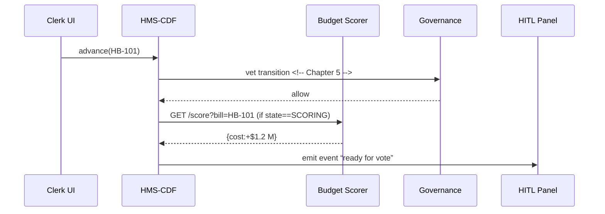

# Chapter 6: Policy Workflow Engine (HMS-CDF)
*(continues from [Governance Layer & AI Values Framework](05_governance_layer___ai_values_framework_.md))*  

---

## 1. Why Do We Need HMS-CDF?

### A concrete story  

A city council member uploads a **Noise-Control Bill** that would ban late-night jack-hammering.  
Before the bill can turn into an enforceable ordinance the city charter says it must:

1. Go to the **Public Safety Committee** for comments.  
2. Receive **amendments** from the Construction Union.  
3. Get a **budget impact score** from the Finance Office.  
4. Pass a **final vote**.  

With paper folders this takes weeks.  
With **HMS-CDF** the same path is encoded as a digital workflow, so every step moves at “AI speed” yet stays fully traceable and compliant.

Think of it as **“Trello for laws”** run by bots and guarded by humans.

---

## 2. Key Concepts (plain English)

| Term | What it really means | Analogy |
|------|----------------------|---------|
| Workflow State | Current stage of a bill (Draft, Committee, Vote…) | Train station |
| Transition | Rule that moves a bill to the next state | Track switch |
| Amendment | A patch that changes text before the next state | Git pull-request |
| Committee | A group of reviewers, human or AI | Code reviewers |
| Score Step | Automatic CBO-style cost estimate | Financial health check |
| Docket | Queue of all items waiting in a given state | Inbox tray |

---

## 3. Quick Start — Pass a Bill in 18 Lines

Below we spin up HMS-CDF locally and walk one bill through the entire path.

```python
# demo_cdf.py
from hms_cdf import CDF, Bill

cdf = CDF()                                 # ❶ engine
bill = Bill(id="HB-101", title="Noise Control")  # ❷ draft

cdf.submit(bill)                            # ❸ into Draft
cdf.advance("HB-101")                       # ❹ to Committee
cdf.amend("HB-101", "Replace 10 pm with 11 pm")  # ❺ amendment
cdf.advance("HB-101")                       # ❻ to Scoring
cdf.advance("HB-101")                       # ❼ to Final Vote
state = cdf.state("HB-101")                 # ❽ lookup

print("Current state →", state)
```

Typical output:

```
Current state → ENACTED
```

Line-by-line:  
❶ create the engine (wraps a tiny local web-server).  
❷ a Bill object is just an ID and title.  
❸ submit places it in the *Draft* docket.  
❹ `advance()` obeys the charter rules baked into HMS-CDF.  
❺ `amend()` edits text and auto-logs who did it.  
❻–❼ engine auto-invokes the budget score before allowing the vote.  
❽ we ask where the bill now sits—*ENACTED!* 🎉

---

## 4. What Happens Under the Hood?



1. A clerk (or script) asks to advance a bill.  
2. Governance confirms the move is legal.  
3. If the next state is **SCORING**, CDF calls the budget micro-service.  
4. When all mandatory checks pass, CDF notifies humans via the [HITL Control Panel](04_human_in_the_loop__hitl__control_panel_.md).

---

## 5. Peeking Inside the Rust Core (simplified)

Even if you never touch Rust, knowing its shape helps.

### 5.1 State Machine (`src/states.rs`, 12 lines)

```rust
#[derive(Clone)]
pub enum State {
    Draft,
    Committee,
    Scoring,
    Vote,
    Enacted,
}

impl State {
    pub fn next(&self) -> Self {
        use State::*;
        match self {
            Draft => Committee,
            Committee => Scoring,
            Scoring => Vote,
            Vote => Enacted,
            Enacted => Enacted,
        }
    }
}
```

• `next()` encodes the legal path.  
• Adding a new checkpoint (e.g., *Legal-Review*) is one extra line in the `match`.

### 5.2 HTTP Wrapper (`src/api.rs`, 15 lines)

```rust
#[post("/advance/<id>")]
fn advance(id: String, db: StateDB) -> Json<Response> {
    let mut bill = db.get(&id)?;
    let new_state = bill.state.next();
    // call Governance before committing
    if !gov::vet(&bill, &new_state) { 
        return Json(Response::denied("blocked by governance"));
    }
    if new_state == State::Scoring {
        score::enqueue(&bill);         // async scoring job
    }
    bill.state = new_state;
    db.save(bill);
    Json(Response::ok(new_state))
}
```

Beginners’ tour:  
• Uses the tiny `rocket` web framework.  
• Calls `gov::vet` (binding to the Python Governance API you met last chapter).  
• If the move is to *Scoring* it kicks off an async job.

---

## 6. Adding a Custom Step in 30 Seconds

Scenario: every environmental bill must pass a **Climate Impact** check.

1. Edit the state enum:

```rust
Draft -> Committee -> Climate -> Scoring -> Vote -> Enacted
```

2. Insert a new branch in `next()` (3 lines).  
3. Write `climate::score(&bill)` function (can proxy to an external API).  
4. No downstream code changes! The engine enforces the new gate automatically.

---

## 7. Frequently Asked Questions

**Q: Do I need to write Rust to use HMS-CDF?**  
A: No. Most agencies call the engine through HTTP or the tiny Python SDK (`hms_cdf`). Rust is only the under-hood motor.

**Q: How does CDF interact with other layers?**  
A:  
• It calls `POST /vet` on the [Governance Layer](05_governance_layer___ai_values_framework_.md).  
• It posts events to the [HITL Panel](04_human_in_the_loop__hitl__control_panel_.md).  
• Execution tasks are handed to the [Activity Orchestrator](07_activity_orchestrator__hms_act__.md) after enactment.

**Q: Can multiple committees work in parallel?**  
A: Yes. A bill can branch into sub-workflows. For beginners stick to the linear `next()` path; advanced branching is covered in the appendix.

**Q: How is every change tracked?**  
A: Each transition appends a row in the immutable ledger (timestamp, user, diff) stored by the [Secure Infrastructure Core](15_secure_infrastructure_core__hms_sys__.md).

---

## 8. Wrap-Up

In this chapter you:

• Learned why a **Policy Workflow Engine** is the backbone of digital legislation.  
• Advanced a bill from draft to law in under 20 lines of Python.  
• Peeked at the Rust state machine that enforces your charter.  
• Saw how budget scoring and governance plug right in.

Next we’ll see how **enacted actions actually get done** through bots and schedules:  
[Activity Orchestrator (HMS-ACT)](07_activity_orchestrator__hms_act__.md)

Welcome to your very own digital Capitol Hill!

---

Generated by [AI Codebase Knowledge Builder](https://github.com/The-Pocket/Tutorial-Codebase-Knowledge)