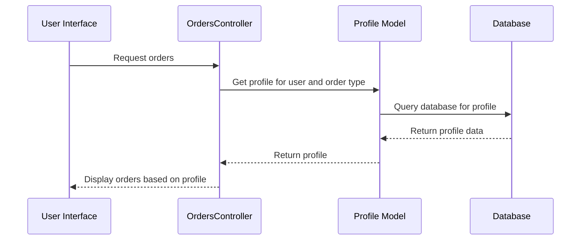

# Chapter 6: Profile

Coming from learning about [Task](05_task.md)s, let's now explore how we can personalize the way users see their [Order](02_order.md)s. Imagine our online store has grown, and we now have different types of users: customers, chefs, and delivery drivers.  Customers might only need to see the order code, order type, and status. Chefs need to see the order details, like toppings and crust type. Delivery drivers need the delivery address.  We need a way to customize the order list view for each user and [Order Type](03_order_type.md). That's where the `Profile` concept comes in.

## What is a Profile?

A `Profile` allows customization of the order list view for each user and [Order Type](03_order_type.md). Think of it like personalized settings for how a user wants to see their orders. It determines which columns are shown and hidden.

## Alice and the Chef: Different Views

Let's revisit Alice's pizza order. Alice, as a customer, only needs to see the order code, order type, and status.  The chef, on the other hand, needs to see the order details, like toppings and crust.  Alice and the chef will have different `Profile`s for the "Pizza Order" [Order Type](03_order_type.md).

## Key Concepts

* **User:** The [User](01_user.md) whose view is being customized.
* **Order Type:** The [Order Type](03_order_type.md) for which the view is being customized.
* **Data:**  A collection of settings that determine which columns are shown or hidden.  This is stored as a hash.

## Customizing the View

Let's see how Alice's `Profile` might look for "Pizza Order":

```ruby
# Example Profile data for Alice (simplified)
{
  code: { show: true },
  order_type_code: { show: true },
  state: { show: true },
  toppings: { show: false }, # Alice doesn't need to see this
  crust: { show: false } # Alice doesn't need to see this either
}
```

The chef's `Profile` for "Pizza Order" would look different:

```ruby
# Example Profile data for the Chef (simplified)
{
  code: { show: true },
  order_type_code: { show: true },
  state: { show: true },
  toppings: { show: true }, # The chef needs this information
  crust: { show: true } # The chef needs this too
}
```

## Under the Hood

When a user views the order list, the application retrieves the appropriate `Profile` based on the user and the [Order Type](03_order_type.md).



The `Profile` model, defined in `app/models/profile.rb`, handles database interactions related to profiles.

```ruby
# app/models/profile.rb (simplified)
profile = Profile.find_by(user_id: current_user.id, order_type_id: order_type.id)
```

This code retrieves the `Profile` for the current user and the given `order_type`.

The `ProfilesHelper` module (located in `app/helpers/profiles_helper.rb`) provides helper methods for working with profiles.  For example, the `custom_profile` method retrieves the profile for a given user and order type, creating a default profile if one doesn't exist.

```ruby
# app/helpers/profiles_helper.rb (simplified)
profile = custom_profile(order_type)
```

## Conclusion

You've learned about the `Profile` concept and how it allows customization of the order list view. You've seen how different users can have different views for the same [Order Type](03_order_type.md). Next, let's explore how we can add custom data to our orders using [Custom Fields](07_custom_fields.md). [Next: Custom Fields](07_custom_fields.md)


---

Generated by [AI Codebase Knowledge Builder](https://github.com/The-Pocket/Tutorial-Codebase-Knowledge)