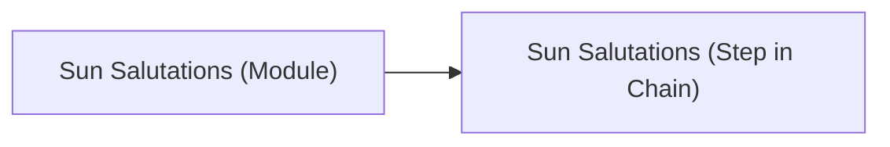
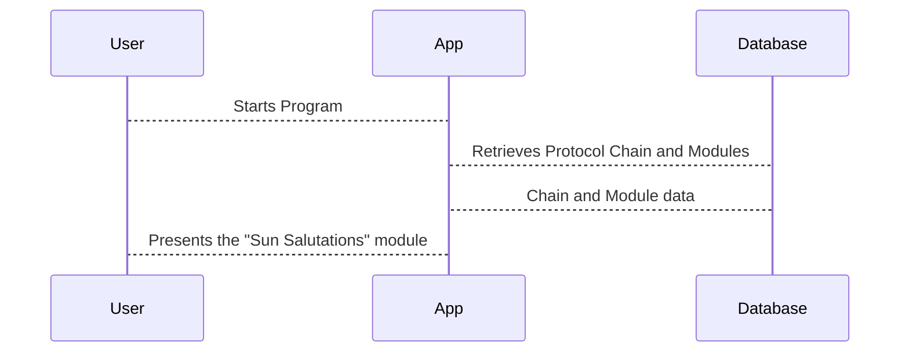

# Chapter 6: Protocol Modules

In the previous chapter, [Protocol Chains](05_protocol_chains.md), we learned how the steps of a [Protocol](03_protocols.md) are organized.  Now, let's explore the individual building blocks that make up those steps: *Protocol Modules*.

Imagine Alice's "Morning Yoga" [Protocol](03_protocols.md).  It includes steps like "Sun Salutations" and "Warrior Pose."  Each of these steps is a *Protocol Module*.  They are the individual actions or tasks within the overall workout routine.

## What is a Protocol Module?

A Protocol Module is a single, specific action within a [Protocol](03_protocols.md).  Think of it like a single instruction in a cooking recipe.  "Mix flour and sugar" is one instruction, "Bake for 30 minutes" is another.  Similarly, "Sun Salutations" and "Warrior Pose" are individual Protocol Modules in Alice's yoga routine.

## Key Concepts in a Protocol Module

* **Name:** A descriptive name for the module (e.g., "Sun Salutations").
* **Description:**  More details about what the module involves (e.g., "A sequence of 12 yoga poses").
* **Type:**  The kind of action the module represents (e.g., exercise, assessment, nudge).  We'll keep this simple for now.

## Creating a Protocol Module

Let's create the "Sun Salutations" module for Alice's "Morning Yoga" Protocol.

```php
// File: factories/Core/Protocol/ProtocolModuleFactory.php

use App\Models\Core\Protocol\ProtocolModule;

$sunSalutationsModule = ProtocolModule::factory()->create([
    'name' => 'Sun Salutations',
    'description' => 'A sequence of 12 yoga poses',
    // ... other fields ...
]);
```

This code creates a new entry in the `protocol_modules` table.  We're skipping some less important details for now.

## Using a Protocol Module

Once created, Protocol Modules are used as the building blocks of [Protocol Chains](05_protocol_chains.md).  Remember how we created the "Morning Yoga" Protocol Chain in the previous chapter?  Each step in that chain refers to a specific Protocol Module.



## Under the Hood

When a [User](01_users.md) starts a [Program](02_programs.md), the application retrieves the associated [Protocol Chain](05_protocol_chains.md).  Each step in the chain points to a Protocol Module.  The application then presents the user with the current Protocol Module.



The `protocol_modules` table stores the information about each module. The `CreateProtocolModulesTable` migration file defines the structure of this table.

```php
// File: migrations/2022_06_08_085521_create_protocol_modules_table.php
// ... code to create the protocol_modules table ...
```

## Conclusion

In this chapter, we learned about Protocol Modules, the individual building blocks of a [Protocol](03_protocols.md). We saw how they are created and how they fit into the larger structure of [Protocol Chains](05_protocol_chains.md). In the next chapter, we'll explore [User Teams](07_user_teams.md).


---

Generated by [AI Codebase Knowledge Builder](https://github.com/The-Pocket/Tutorial-Codebase-Knowledge)