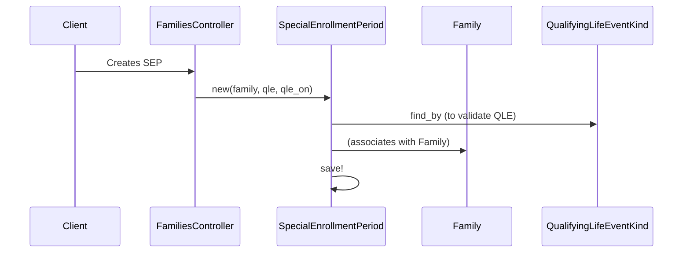

# Chapter 6: QualifyingLifeEventKind (QLE) / SpecialEnrollmentPeriod (SEP)

In the previous chapter, [Broker/BrokerAgency/BrokerAgencyProfile](05_broker_brokeragency_brokeragencyprofile_.md), we learned how brokers can assist individuals and families in navigating the health insurance marketplace.  This chapter introduces the concepts of `QualifyingLifeEventKind` (QLE) and `SpecialEnrollmentPeriod` (SEP), which allow individuals and families to enroll in health insurance outside of the typical Open Enrollment Period.

## Why do we need QLEs and SEPs?

Imagine Jane Doe just got married.  Congratulations, Jane!  Because of this major life event, she needs to update her health insurance coverage.  She can't wait until the next Open Enrollment Period, so she needs a way to enroll *now*.  This is where QLEs and SEPs come in.

## Key Concepts

* **QualifyingLifeEventKind (QLE):**  A QLE represents a *type* of life event that might qualify someone for a Special Enrollment Period.  Think of it as a category.  Examples include:
    * Marriage
    * Birth or adoption of a child
    * Loss of other health coverage
    * Moving to a new address

* **SpecialEnrollmentPeriod (SEP):** An SEP is a *specific instance* of a QLE for a particular [Family](01_person_family_familymember_.md).  It's like a permission slip that allows the family to shop for and enroll in a health plan outside of Open Enrollment.  It has a start and end date, defining the window of time when the family can enroll.

## Solving the Use Case: Jane's Marriage

1. **Find the QLE:**  Since Jane got married, we need to find the "Marriage" QLE.

2. **Create an SEP:** We create a new SEP for Jane's [Family](01_person_family_familymember_.md) based on the "Marriage" QLE.  We also record the date of the marriage (the QLE date).

3. **Shop and Enroll:** Jane's family now has an active SEP, allowing them to shop for [Plan](02_plan_.md)s and create a new [HbxEnrollment](04_hbxenrollment_.md).

```ruby
# Simplified example (actual implementation is more complex)

marriage_qle = QualifyingLifeEventKind.find_by(title: "Marriage")

jane_sep = SpecialEnrollmentPeriod.new(
  family: jane.primary_family,
  qualifying_life_event_kind: marriage_qle,
  qle_on: jane.marriage_date # Example date
)

jane_sep.save!

# Now Jane's family can shop and enroll
```

This code finds the "Marriage" QLE and creates an SEP for Jane's family, allowing them to enroll in a plan.

## Internal Implementation

When an SEP is created, the system stores it in the database and associates it with the family.



1. The `families_controller.rb` (or a similar controller like `insured/families_controller.rb`) receives the request to create the SEP.

2. A new `SpecialEnrollmentPeriod` object is created.

3. The QLE is retrieved to ensure it's a valid QLE.

4. The SEP is associated with the family.

5. The SEP is saved to the database.

The relevant code can be found in `insured/families_controller.rb`, the `SpecialEnrollmentPeriod` model, and the `QualifyingLifeEventKind` model.

```ruby
# insured/families_controller.rb (simplified)
def record_sep
  # ...
  special_enrollment_period = @family.special_enrollment_periods.new(...)
  special_enrollment_period.qualifying_life_event_kind = qle
  # ...
  special_enrollment_period.save
  # ...
end
```

## Conclusion

This chapter introduced `QualifyingLifeEventKind` and `SpecialEnrollmentPeriod`, explaining how they allow enrollment outside of Open Enrollment.  We used Jane's marriage as an example to illustrate how these concepts work. We also looked at the internal implementation to understand how SEPs are created and stored.

Next, we'll explore document verification with [VerificationType/VlpDocument/RidpDocument](07_verificationtype_vlpdocument_ridpdocument_.md).


---

Generated by [AI Codebase Knowledge Builder](https://github.com/The-Pocket/Tutorial-Codebase-Knowledge)