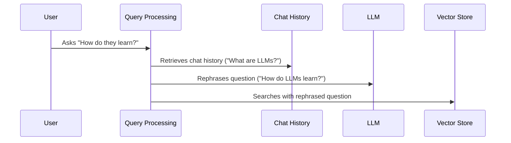

# Chapter 6: Query Analysis/Rephrasing

In the previous chapter, [Ingestion](05_ingestion_.md), we learned how to add information to our chatbot's "meaning library."  Now, let's explore how we can make sure the chatbot *understands* what we're asking, even if our questions aren't perfectly phrased. This is where *Query Analysis/Rephrasing* comes in.

Imagine you're asking your chatbot a follow-up question about [LLMs](01_llm__large_language_model__.md), like "How do they learn?" after initially asking "What are LLMs?".  You understand the context, but the chatbot needs a little help connecting the dots. Query analysis acts like a helpful librarian, clarifying your question ("How do LLMs learn?") before searching the "meaning library" ([Vector Store](03_vector_store_.md)).

## What is Query Analysis/Rephrasing?

Query analysis takes your initial question and, using the conversation history, rephrases it to be more understandable for the [Vector Store](03_vector_store_.md) search. This improves the accuracy of the information retrieved by the [Retrieval](02_retrieval_.md) system.

## How Query Analysis Works

Let's break down the process with our example:

1. **Initial Question:** You ask "What are LLMs?".

2. **Follow-up Question:** You then ask "How do they learn?".

3. **Rephrasing:** The query analysis system uses the chat history (containing "What are LLMs?") to rephrase the follow-up question as "How do LLMs learn?".

4. **Improved Search:** This rephrased question is then used to search the [Vector Store](03_vector_store_.md), resulting in more relevant results.



## Query Analysis in Code

```python
# backend/chain.py (simplified)
from langchain.prompts import PromptTemplate

REPHRASE_TEMPLATE = """\
Given the following conversation and a follow up question, rephrase the follow up \
question to be a standalone question.

Chat History:
{chat_history}
Follow Up Input: {question}
Standalone Question:"""

prompt = PromptTemplate.from_template(REPHRASE_TEMPLATE)
rephrased_question = prompt.format(chat_history=chat_history, question=question)

# ... use rephrased_question for retrieval ...
```

This code shows how a `PromptTemplate` is used to rephrase the question. The `chat_history` and the current `question` are used to create a standalone, contextually aware question.

## Looking Under the Hood: `create_chain`

The `create_chain` function in `backend/chain.py` uses query analysis for follow-up questions.

```python
# backend/chain.py (simplified)
# ... other imports ...

def create_chain(...):
    # ... other code ...

    if chat_history:
        # Rephrase the question using chat history
        _inputs = RunnableMap({
            "standalone_question": {
                "question": lambda x: x["question"],
                "chat_history": lambda x: x["chat_history"],
            } | CONDENSE_QUESTION_PROMPT | model | StrOutputParser(),
            # ...
        })
        # ... use standalone_question for retrieval ...
    else:
        # For the initial question, no rephrasing is needed
        # ...
```

This simplified code shows how the `CONDENSE_QUESTION_PROMPT` (similar to `REPHRASE_TEMPLATE` above) is used with the [LLM](01_llm__large_language_model__.md) (`model`) and the chat history to rephrase the question only when a chat history exists.  The rephrased question (`standalone_question`) is then used for [Retrieval](02_retrieval_.md).

## Conclusion

Query analysis helps our chatbot understand follow-up questions by using the conversation history to rephrase them into more complete queries. This leads to more accurate searches in the [Vector Store](03_vector_store_.md) and ultimately better answers. In the next chapter, [LangSmith](07_langsmith_.md), we'll explore a powerful tool for debugging and evaluating our chatbot.


---

Generated by [AI Codebase Knowledge Builder](https://github.com/The-Pocket/Tutorial-Codebase-Knowledge)