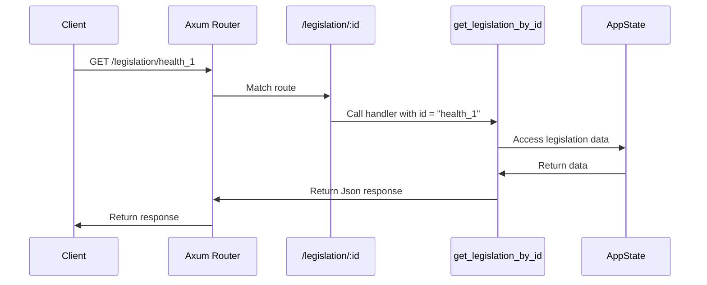

# Chapter 6: Routes

Following on from our understanding of the [AppState](05_appstate.md), we'll now explore how we interact with it using *Routes*.

Imagine our legislative factory again. The [AppState](05_appstate.md) is the central control room, holding all the information.  But how do external systems, or even internal [Agents](04_agent.md), access this information?  They use designated entry points – these are our *Routes*.

Let's say a [Stakeholder](01_stakeholder.md) wants to check the status of the "Healthcare Reform Act".  How do they do that? They use a specific *Route* designed for retrieving legislation information.

## Understanding Routes

In HMS-CDF, *Routes* are defined using the `axum` framework.  Each *Route* maps a specific URL path and HTTP method (like `GET`, `POST`, `PUT`) to a handler function. This handler function then interacts with the [AppState](05_appstate.md) to perform the requested action.

## Example: Getting Legislation by ID

Let's look at a simplified example of a *Route* for retrieving legislation by its ID:

```rust
// src/routes/legislation.rs
use axum::{
    extract::Path,
    routing::get,
    Json, Router,
    http::StatusCode,
};
// ... other imports

async fn get_legislation_by_id(
    Path(id): Path<String>,
    State(state): State<Arc<AppState>>, // Access the AppState
) -> Result<Json<Legislation>, (StatusCode, String)> {
    // ... (Implementation details omitted for simplicity)
    // This function would access the AppState to find the legislation
}

// ... (Other routes)

pub fn router() -> Router {
    Router::new()
        .route("/legislation/:id", get(get_legislation_by_id)) // Define the route
        // ... (Other routes)
}
```

This code snippet defines a *Route* that responds to `GET` requests at the path `/legislation/:id`. The `:id` part is a placeholder for the legislation ID.  When a request comes in, the `get_legislation_by_id` function is called. The `axum` framework extracts the `id` from the URL and passes it to the handler. The handler also receives the [AppState](05_appstate.md) via the `State` extractor.

## Inside a Route

Here's a simplified sequence diagram showing what happens when a *Route* is called:



1. The client sends a `GET` request to `/legislation/health_1`.
2. The `axum` router matches the request to the `/legislation/:id` route.
3. The router calls the `get_legislation_by_id` handler, passing in the extracted `id` ("health_1").
4. The handler accesses the [AppState](05_appstate.md) to retrieve the legislation data.
5. The [AppState](05_appstate.md) returns the data.
6. The handler constructs a JSON response containing the legislation data.
7. The `axum` router sends the JSON response back to the client.

## Where Routes are Defined

Routes are defined in separate modules within the `src/routes` directory. For example, routes related to [Legislation Process](02_legislation_process.md) are defined in `src/routes/legislation.rs`, and routes related to [Agent](04_agent.md) are defined in `src/routes/agent.rs`.  These routes are then combined in the main application router in `src/lib.rs` and `src/main.rs`.

```rust
// src/lib.rs
// ... other code

pub fn create_app(state: Arc<AppState>) -> Router {
    // ...
    Router::new()
        // ... other routes
        .merge(legislation_router()) // Include legislation routes
        .nest("/api", agent_router()) // Include agent routes under /api
        // ...
}
```

## Conclusion

Routes act as the entry points to our legislative factory, allowing external systems and internal [Agents](04_agent.md) to interact with the [AppState](05_appstate.md) and perform actions within the simulation. Understanding routes is essential for understanding how the HMS-CDF project works.  Next, we'll delve into the [MCP (Model Context Protocol)](07_mcp__model_context_protocol_.md).


---

Generated by [AI Codebase Knowledge Builder](https://github.com/The-Pocket/Tutorial-Codebase-Knowledge)