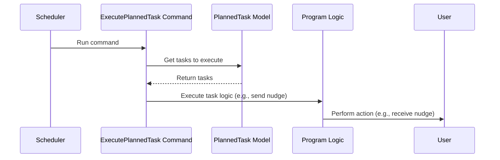

# Chapter 6: Scheduled Tasks

In the previous chapter, [Multi-Tenancy](05_multi_tenancy.md), we learned how our app can serve multiple organizations simultaneously. Now, let's explore how to automate tasks within your Programs using **Scheduled Tasks**.

## Automating Your Programs

Imagine you're running a 30-day weight loss program. You want to send participants a motivational message every morning and remind them to log their meals every evening.  Instead of manually sending these messages every day, you can use Scheduled Tasks to automate the process.  Think of it like setting alarms on your phone – once set, they'll go off automatically at the specified times.

## What are Scheduled Tasks?

Scheduled Tasks are like automated reminders or actions that run in the background at predefined intervals. They allow you to perform tasks automatically, without manual intervention.

## How Scheduled Tasks Work

Let's say you want to send a daily nudge to your program participants. You would create a Scheduled Task that specifies:

* **What to do:** Send a nudge message.
* **When to do it:** Every day at 8:00 AM.
* **Who to send it to:** All participants in the program.

The system will then automatically send the nudge message every day at 8:00 AM.

## Using Scheduled Tasks

You don't directly create Scheduled Tasks through the user interface. They are created automatically when you configure certain features, like recurring [Modules](02_modules.md) or timed challenges. For example, when you set a recurring daily nudge within your [Program](01_protocols_and_programs.md), a Scheduled Task is created behind the scenes to handle the automated sending of the nudge.

## Internal Implementation

The `PlannedTask` model (in `Models/PlannedTask.php`) stores information about scheduled tasks.  When a task is due to be executed, a command is run that performs the specified action.



The `execute:task` command (in `Console/Commands/ExecutePlannedTask.php`) and `execute-central:task` command (in `Console/Commands/ExecutePlannedTaskCentral.php`) are responsible for executing scheduled tasks.  The scheduler runs these commands at regular intervals (defined in `Console/Kernel.php`).

Here's a simplified example of how the `execute:task` command works:

```php
// Console/Commands/ExecutePlannedTask.php (simplified)
$plannedTask = new PlannedTask();
$plannedTask->executeTask();
```

This command retrieves all pending tasks from the `PlannedTask` model and executes them.

The `PlannedTask` model's `executeTask` function then dispatches specific jobs based on the task type:

```php
// Models/PlannedTask.php (simplified)
if (PlannedTaskTypes::RecurringModule === $singleTask['command']) {
    RunGlobalModuleForPersonalChain::dispatch( /* ... */ )->delay($delay)->onQueue('global-module');
}
```

This code snippet shows how a recurring module task is handled.  The `RunGlobalModuleForPersonalChain` job is dispatched to execute the module logic.  The `PlannedTaskTypes` enum (in `Enums/PlannedTaskTypes.php`) defines the different types of scheduled tasks.

## Conclusion

In this chapter, we learned about Scheduled Tasks and how they can automate actions within your Programs. We saw how they work behind the scenes and how they are triggered by the scheduler.  We also explored the internal implementation, including the `PlannedTask` model and the `execute:task` command.

Next, we'll learn about [Events and Listeners](07_events_and_listeners.md), which allow different parts of the app to communicate with each other.


---

Generated by [AI Codebase Knowledge Builder](https://github.com/The-Pocket/Tutorial-Codebase-Knowledge)