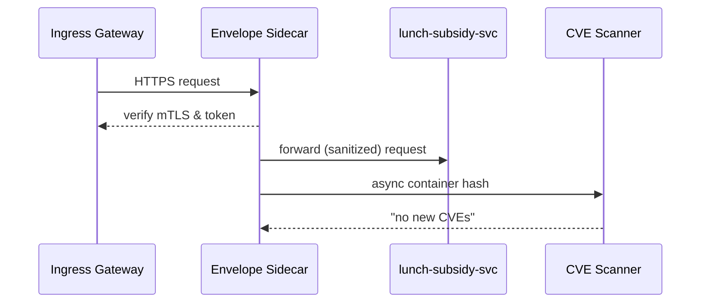

# Chapter 6: Security & Compliance Envelope  
*(a.k.a. the “digital SCIF” of HMS-AGX)*  

*[Jump back to Chapter 5: External System Adapter / Sync Bridge](05_external_system_adapter___sync_bridge_.md)*  

---

## 1. Why Do We Need Yet Another Layer?

Picture the **Office of Elementary and Secondary Education** rolling out a brand-new “Digital Lunch Subsidy” API.  
It will collect:

* Student names & SSNs (PII)  
* Household-income docs (sensitive PDFs)  
* ACH details for reimbursements  

Regulations say:

* **Encrypt everything** (FIPS-140-2).  
* **Isolate** the service from the open internet (NIST 800-53).  
* **Prove** no known CVEs are hiding in containers (FedRAMP High).  

Instead of hand-coding all that, we drop the service **inside** the  
**Security & Compliance Envelope**—think of it as marking an office room “Sensitive Compartmented Information Facility (SCIF)” inside a federal building.  
The walls, locks, and badge readers *come pre-installed*; developers can focus on features, not firewalls.

---

## 2. Key Concepts (Plain-English Cheatsheet)

| Term | Friendly Analogy |
|------|------------------|
| Envelope | The SCIF walls around your service |
| mTLS Tunnel | Two couriers in sealed briefcases exchanging letters |
| Egress Control | A “need-to-talk” list; calls to unlisted domains are blocked |
| Continuous Scanner | A TSA agent that re-scans bags every 15 min |
| FedRAMP Blueprint | Building code the SCIF already meets |
| Zero-Trust Token | A one-time passcode you must show at **each** doorway |

---

## 3. 60-Second Mental Model

```mermaid
graph TD
  CitizenForm[Citizen Form<br>(HTTPS)] -->|mTLS| Gateway
  subgraph Security & Compliance Envelope
      Gateway --> LunchSvc[Lunch-Subsidy-Svc]
      LunchSvc --> Vault[Secrets Vault]
      LunchSvc --> Adapter[Sync Bridge]
  end
  classDef box fill:#f4faff,stroke:#0069c2,stroke-width:2px
  class Gateway,LunchSvc,Vault,Adapter box
```

Everything inside the blue box inherits:

* AES-256 encryption at rest  
* Network policies → only approved endpoints reachable  
* Auto CVE scans & patch suggestions  

---

## 4. Hands-On: Wrapping Your First Service (≤ 3 min)

We’ll secure `lunch-subsidy-svc`.

### 4.1 Declare Desired Guardrails

`hms-sec.yml` (10 lines)

```yaml
service: lunch-subsidy-svc
classification: pii-high
outboundAllowList:
  - "ledger.hms.local"     # internal
  - "irs.gov"              # external API
scannerInterval: 15m
```

### 4.2 One-Command Wrap

```bash
hms-sec wrap lunch-subsidy-svc
```

Console:

```
✔ Sidecar injected (sec-envelope:1.2)
✔ mTLS cert issued
✔ egress policy compiled (2 domains allowed)
✔ CVE scan scheduled every 15m
Service now running inside envelope
```

### 4.3 Verify Encryption

```bash
hms-sec status lunch-subsidy-svc
# ➜ Storage: Encrypted (KMS key arn:hms:pii-high)
# ➜ Traffic: mTLS enforced
# ➜ Last CVE scan: CLEAN (0 critical)
```

No code changes so far—just config!

---

## 5. Using Secrets Inside the Envelope

```js
// lib/bankToken.js   (Node, 12 lines)
import { envelope } from "@hms/sdk";

export async function getToken() {
  // Vault is auto-mounted & mTLS protected
  return envelope.vault.read("banking/apiToken");
}
```

Explanation  
1. `envelope.vault.read` → sidecar fetches short-lived token from the  
   [Data Privacy & Consent Vault](07_data_privacy___consent_vault_.md).  
2. Token never lands on disk; memory is wiped after use.

---

## 6. What Happens Under the Hood?

### 6.1 Five-Step Flow When a Request Arrives



*If* a new critical CVE is found, the sidecar can auto-quarantine the pod and alert the [Human-In-The-Loop Oversight](12_human_in_the_loop_oversight__hitl__.md) system.

### 6.2 Mini Peek at Sidecar Enforcement (18 lines)

```go
// file: sidecar/firewall.go  (simplified)
func Outbound(req *http.Request) error {
    if !allowList.Match(req.URL.Host) {
        return errors.New("egress blocked")
    }
    token := issueZeroTrustToken(serviceID)
    req.Header.Set("X-ZT", token)   // add one-time token
    return next.RoundTrip(req)      // proceed
}
```

Line-by-line  
1. Compare target host with YAML allow-list.  
2. Deny everything else.  
3. Inject a fresh zero-trust token so the *receiver* can validate provenance.  

---

## 7. Continuous Vulnerability Scanning Pipeline

```bash
hms-sec scan lunch-subsidy-svc --watch
```

Typical output:

```
[12:00] Image sha256:ab3f… CLEAN
[12:15] Image unchanged
[12:30] CVE-2024-12345 found (High)  → Auto-patch candidate available
[12:30] Pod cordoned; Traffic routed to healthy replicas
```

Behind the scenes the scanner pulls NVD feeds every hour and cross-checks running images.

---

## 8. Common Questions

| Q | A |
|---|---|
| **Does this replace agency ATO paperwork?** | No, but it **pre-implements** many NIST/FedRAMP controls, greatly shortening ATO time. |
| **Can I add my own IDS tool?** | Yes—register it as a plug-in; the sidecar will mirror traffic to it. |
| **What about on-prem deployments?** | Same envelope—only the KMS endpoint differs. |
| **How big is the overhead?** | ~25 MB RAM & < 2 ms latency per call in benchmark. |

---

## 9. What You Learned

• Dropping a service inside the **Security & Compliance Envelope** automatically grants encryption, network isolation, zero-trust auth, and nonstop CVE scanning.  
• Guardrails are declared in *one* YAML file—no bespoke code.  
• Sidecar proxies enforce outbound rules and inject one-time tokens.  
• CVE findings can trigger auto-quarantine and human review.

Ready to see how we store the *most* sensitive citizen data and manage consent?  
Continue to [Chapter 7: Data Privacy & Consent Vault](07_data_privacy___consent_vault_.md).

---

Generated by [AI Codebase Knowledge Builder](https://github.com/The-Pocket/Tutorial-Codebase-Knowledge)