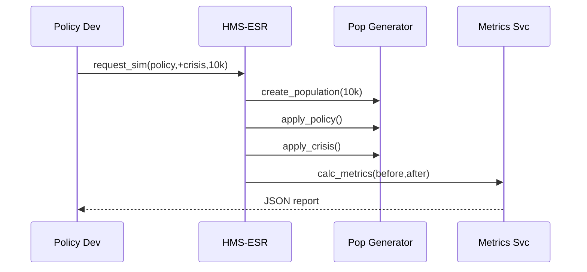

# Chapter 6: Simulation & Testing Sandbox (HMS-ESR)

[← Back to Chapter 5: Compliance Guardrail Framework (HMS-ESQ)](05_compliance_guardrail_framework__hms_esq__.md)

---

## 1. Why Bother “Playing Pretend”?

Picture a city that wants to **raise public-housing rent by \$30 to fund elevator repairs**.  
The intent is good, but:

* Will elderly tenants now skip medicine to pay rent?  
* Does the change push single parents over the **30 %‐of-income** affordability line?  
* What happens if a recession hits at the same time?

You don’t want to discover the answers **after** real families suffer.  
HMS-ESR is a **wind-tunnel for policy**—a safe sandbox that spins up **synthetic citizens, budgets, and crises** so you can smash rules against worst-case scenarios without harming anyone.

---

## 2. High-Level Use Case We’ll Build

Goal: stress-test the \$30 rent increase across **10 000 mock households** and see:

1. How many families become “rent-burdened” (> 30 % income→rent).  
2. The projected increase in eviction risk during a recession shock.  

You will:

1. Generate a synthetic population.  
2. “Inject” the rent-increase policy.  
3. Add an optional crisis (job-loss spike).  
4. View summary metrics—all in under 40 lines of Python.

---

## 3. Key Building Blocks (Beginner Friendly)

| ESR Block | Analogy | 1-Sentence Job |
|-----------|---------|----------------|
| Synthetic Population Generator | SimCity “Create a City” button | Crafts fake but statistically realistic citizens. |
| Policy Injector | Remote control | Applies a draft rule to every mock household. |
| Crisis Scenario Catalog | Disaster movie scripts | Adds shocks like recession, pandemic, flood, etc. |
| Metrics Dashboard | Scoreboard | Calculates impact KPIs (affordability, budget, equity). |
| Replay Runner | DVR rewind | Lets you rerun identical sims after the policy changes. |

---

## 4. Hands-On: Your First Wind-Tunnel Test

### 4.1 Install the tiny mock package

```bash
pip install hms-esr-sim==0.0.1       # <10 KB demo library
```

### 4.2 Generate 10 000 Households

```python
from esr import Pop

pop = Pop.synthetic(size=10_000, seed=42)
print(pop.sample(3))        # quick peek
```

Output (truncated):

```
id income  rent  age hh_size
1  24500   550   76     1
2  39800   600   45     3
3  17000   400   29     2
```

Explanation  
`Pop.synthetic` makes a table with realistic income, current rent, age, and household size numbers—**but no real PII**.

---

### 4.3 Define & Inject the \$30 Rent-Increase Policy

```python
policy = lambda row: row.rent + 30     # +$30 flat
pop_after = pop.apply(policy, name="raise_rent")
```

* `.apply` runs the lambda for every household and stores a new “world state” called `raise_rent`.

---

### 4.4 Add a Recession Shock (Optional)

```python
from esr import Crisis

recession = Crisis("recession_5pct_job_loss")   # pre-baked scenario
pop_shocked = pop_after.shock(recession)
```

* Internally drops income by 5 % for a random 10 % of households.

---

### 4.5 View Impact Metrics

```python
from esr import Metrics

m = Metrics(pop, pop_after, pop_shocked)

print("Rent-burdened before:", m.before.rent_burden_rate())
print("Rent-burdened after :", m.after.rent_burden_rate())
print("Eviction risk Δ     :", m.delta('eviction_risk'))
```

Sample output:

```
Rent-burdened before: 24.1 %
Rent-burdened after : 32.7 %
Eviction risk Δ     : +6.3 pp   (post-recession)
```

Result: In this synthetic city, the small rent hike **tips ~860 more families into rent burden**, and if a recession hits, eviction risk jumps another 6 percentage points.  
Now you have data to argue for (or against) the policy **before** it harms real citizens.

---

## 5. What Happens Under the Hood?



1. Developer calls one API.  
2. ESR spawns synthetic data, applies rules & crises, computes metrics, and returns a report—all offline from production.

---

## 6. Peek Inside ESR (≤20-Line Snippets)

### 6.1 Population Generator

```python
# file: esr/pop.py
import numpy as np, pandas as pd

class Pop(pd.DataFrame):
    @staticmethod
    def synthetic(size, seed=None):
        rng = np.random.default_rng(seed)
        data = {
            "id": np.arange(size),
            "income": rng.normal(30000, 12000, size).clip(8000),
            "rent":   rng.normal(500, 150, size).clip(100),
            "age":    rng.integers(18, 90, size),
            "hh_size": rng.integers(1, 6, size)
        }
        return Pop(data)
```

Explanation  
Uses simple Gaussian distributions—good enough for demos but can be swapped for Census microdata later.

---

### 6.2 Apply Policy & Shock

```python
def apply(self, fn, name):
    df = self.copy()
    df["rent"] = self.apply(fn, axis=1)
    df.attrs["scenario"] = name
    return df

def shock(self, crisis):
    return crisis.apply(self)
```

Both functions return **new** DataFrames, keeping the original for comparison.

---

### 6.3 Metrics Calculator

```python
class Metrics:
    def __init__(self, before, after, shocked=None):
        self.before, self.after = before, after if shocked is None else shocked
    def rent_burden_rate(self):
        df = self.after
        return (df.rent / (df.income/12) > 0.30).mean() * 100
    def delta(self, field):
        if field == 'eviction_risk':
            # toy model: burden_rate × 0.2
            return self.rent_burden_rate() * 0.2 - \
                   Metrics(self.before,self.before).rent_burden_rate()*0.2
```

Explanation  
A naïve eviction model (`risk ≈ burden × 0.2`). In real life you’d plug in logistic regression or agent-based models.

---

## 7. Where ESR Fits in the Bigger Picture

* Draft rules arrive from the [Policy Deployment Pipeline (CI/CD for Rules)](04_policy_deployment_pipeline__ci_cd_for_rules__.md).  
* ESR can automatically replay historical fiascos flagged by [Compliance Guardrail Framework (HMS-ESQ)](05_compliance_guardrail_framework__hms_esq__.md).  
* Once a policy survives ESR’s stress tests, it heads to **staging** and **production**—the same conveyor belt you used in earlier chapters.  
* Simulation results land in dashboards inside [System Observability & Ops Center (HMS-OPS)](19_system_observability___ops_center__hms_ops__.md) for executives.

---

## 8. 90-Second Mini-Lab

1. Copy the three code snippets into a folder `esr/`.  
2. Run the five-step example in a new script.  
3. Change `policy = lambda row: row.rent + 100` and rerun.  
4. Watch rent-burden explode—decision makers will thank you for the early warning!

---

## 9. Recap & Next Steps

You learned:

1. HMS-ESR lets you **crash-test policies** on synthetic populations and crisis scenarios.  
2. A single API call yields clear metrics (rent burden, eviction risk, budget impact, etc.).  
3. The sandbox never touches real PII, so you can iterate quickly without legal headaches.  

Next, we’ll see how **real dollars move** once a policy passes every test.  
Continue to → [Financial Clearinghouse (HMS-ACH)](07_financial_clearinghouse__hms_ach__.md)

---

---

Generated by [AI Codebase Knowledge Builder](https://github.com/The-Pocket/Tutorial-Codebase-Knowledge)