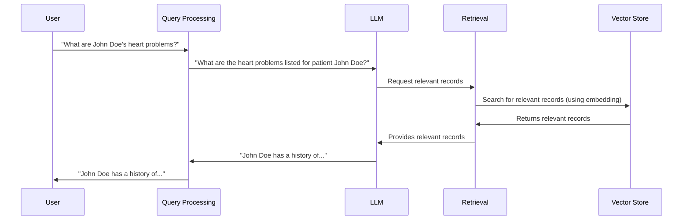

# Chapter 6: Vector Store

In the previous chapter, [Embeddings](05_embeddings.md), we learned how HMS-MED represents the meaning of text as vectors. Now, let's explore where these vectors are stored and how they are accessed: the *Vector Store*.

Imagine you have a lot of patient medical records.  You want to quickly find all records related to "heart conditions".  A Vector Store is like a specialized database that allows you to search for records not just by keywords, but by meaning.  It uses the embeddings we learned about in the previous chapter to find records with similar meanings.

## What Problem Does a Vector Store Solve?

A Vector Store solves the problem of efficiently searching through a large collection of documents based on their meaning.  Traditional databases are good at searching for exact keyword matches, but they struggle with understanding the relationships between words and phrases.  A Vector Store, on the other hand, understands that "heart condition", "cardiac issue", and "cardiovascular disease" are related concepts.

## How a Vector Store Works

Think of a Vector Store as a vast map where each point represents a piece of information (a medical record, for example).  Each point's location is determined by its embedding.  Similar documents are clustered together on the map.  When you search for information, the Vector Store finds the points on the map closest to your query's embedding.

## Using a Vector Store in HMS-MED

When you ask HMS-MED a question like "What are John Doe's heart problems?", the following happens:

1. HMS-MED converts your question into an embedding.
2. HMS-MED searches the Vector Store for records with embeddings close to your question's embedding.
3. The Vector Store returns the most relevant records.

## Internal Implementation

Here's a simplified view of how the Vector Store interacts with other components:



The code for interacting with the Vector Store can be found in `HMS-EHR/backend/retrieval.py`.  Here's a simplified example:

```python
# ... other code ...

# This function creates the retriever object, which connects to the Vector Store.
with make_retriever(config) as retriever:
    # This is where the retrieval happens.  The 'query' is converted to an embedding.
    docs = retriever.get_relevant_documents(query)

# ... more code to process the retrieved documents ...
```

The `make_retriever` function in the same file sets up the connection to the Vector Store.  The specific implementation depends on the type of Vector Store being used (e.g., Weaviate, FAISS, Chroma).  The `HMS-EHR/MODIFY.md` file provides more details on how to configure different Vector Stores.

The `HMS-EHR/backend/ingest.py` file shows how documents are added to the Vector Store.  Here's a simplified example using Weaviate:

```python
# ... other code ...

client = weaviate.Client(...) # Connect to Weaviate

vectorstore = WeaviateVectorStore(
    client=client,
    index_name=WEAVIATE_DOCS_INDEX_NAME,
    # ... other parameters ...
)

# Add documents to the Vector Store.  'docs_transformed' contains the documents and their metadata.
indexing_stats = index(docs_transformed, ..., vectorstore, ...)

# ... more code ...
```

This code snippet shows how to connect to a Weaviate Vector Store and add documents to it.  The `index` function handles the process of generating embeddings for the documents and storing them in the Vector Store.  The `_scripts/clear_index.py` file shows how to clear the index.

## Conclusion

The Vector Store is a crucial component of HMS-MED, enabling efficient retrieval of information based on meaning.  It acts as a bridge between the user's questions and the vast amount of data stored in the medical records. Now, let's explore how we get the data into the Vector Store: [Ingestion](07_ingestion.md).


---

Generated by [AI Codebase Knowledge Builder](https://github.com/The-Pocket/Tutorial-Codebase-Knowledge)