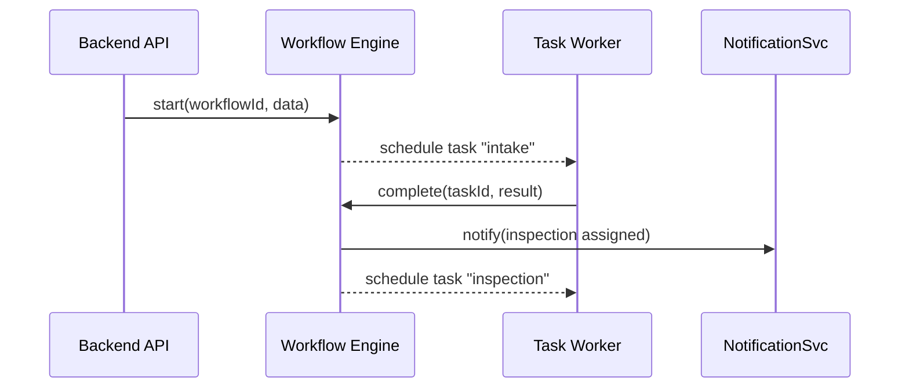

# Chapter 6: Workflow Engine

In [Chapter 5: Backend API](05_backend_api_.md) we built a secure, audited gateway for calls like “renew license” or “submit report.” Now it’s time to see **how those calls actually turn into sequenced work**—from intake to review to approval—using our **Workflow Engine**.

---

## 6.1 Motivation: Like a City Clerk’s Queue Manager

Imagine a citizen applies for a building permit online:

1. They click “Submit Permit” in the portal.  
2. An **intake officer** checks the form.  
3. An **inspector** schedules a site visit.  
4. A **supervisor** signs off.  
5. The permit is issued—and the citizen gets notified.

Without a central orchestrator, tasks can pile up on someone’s desk, deadlines slip, and reminders never go out. The **Workflow Engine** is our digital clerk:

- **Sequences tasks** in the right order.  
- **Sends notifications** at each step.  
- **Enforces SLAs** (e.g., remind if review isn’t done in 48 hours).  
- **Handles escalations** or manual handoffs when deadlines pass.

---

## 6.2 Key Concepts

1. **Workflow Definition**  
   A named list of steps (tasks) to perform.

2. **Task**  
   A single unit of work (e.g., “intake review”, “site inspection”).

3. **Instance**  
   A running copy of a workflow, tied to one permit request.

4. **Transitions**  
   The rules that move you from one task to the next.

5. **SLA Policy**  
   Time limits per task, with reminders or escalations if overdue.

6. **Notifications**  
   Emails or system messages sent when tasks start, complete, or miss SLAs.

7. **Manual Handoff**  
   A way to pause automation and wait for human input before continuing.

---

## 6.3 Using the Workflow Engine

Let’s define a tiny “building permit” workflow and start an instance.

### 6.3.1 Registering a Workflow

File: `src/workflow_engine/index.js`  
```js
const WorkflowEngine = require('./WorkflowEngine');
const engine = new WorkflowEngine();

// Define a three-step workflow
engine.registerWorkflow('build_permit', [
  { name: 'intake', handler: () => {/* send form to clerk */} },
  { name: 'inspection', handler: () => {/* notify inspector */} },
  { name: 'approval', handler: () => {/* notify supervisor */} },
]);

module.exports = engine;
```
Here we give our engine the steps, in order. Each `handler` will run when that task becomes active.

### 6.3.2 Starting a Workflow Instance

```js
const engine = require('./index');

// Begin a new “build_permit” run for citizen Alice
const inst = engine.start('build_permit', {
  applicant: 'Alice',
  address: '123 Main St'
});

console.log('Workflow started with ID', inst.id);
```
This kicks off the `intake` task immediately and returns an `inst.id` you can use to track progress.

---

## 6.4 Under the Hood

### 6.4.1 Sequence Diagram



1. **Backend API** calls `start()`.  
2. **Workflow Engine** schedules the first task.  
3. A **Task Worker** (could be manual or code) picks up “intake,” completes it.  
4. The engine sends a **notification** and moves to “inspection.”

### 6.4.2 Core Engine Code

File: `src/workflow_engine/WorkflowEngine.js`  
```js
class WorkflowEngine {
  constructor() {
    this.defs = {};      // stored workflow definitions
    this.instances = {}; // running instances
    this.nextInstanceId = 1;
  }

  registerWorkflow(id, steps) {
    this.defs[id] = steps;
  }

  start(id, data) {
    const def = this.defs[id];
    const inst = { id: this.nextInstanceId++, def, pointer: 0, data };
    this.instances[inst.id] = inst;
    this._runNext(inst);
    return inst;
  }

  _runNext(inst) {
    if (inst.pointer >= inst.def.length) return;
    const task = inst.def[inst.pointer];
    // schedule task.handler asynchronously
    setTimeout(() => this._completeTask(inst.id, task.name), 0);
  }

  _completeTask(instId, taskName) {
    const inst = this.instances[instId];
    inst.pointer++;
    // here you'd trigger notifications or SLA checks
    this._runNext(inst);
  }
}

module.exports = WorkflowEngine;
```
- `registerWorkflow` stores the steps list.  
- `start` makes a new instance and runs the first step.  
- `_completeTask` moves the pointer forward and calls the next task.  
- In a real system you’d hook in **notifications**, **SLA timers**, and **manual handoff** queues.

---

## 6.5 What We Learned

- The **Workflow Engine** is the heart of HMS-CUR’s orchestration.  
- We saw how to **define**, **start**, and **advance** workflows through code.  
- Under the hood, it keeps definitions, instances, and a pointer to the current task.  

Up next, we’ll see how **policies and processes** get modeled and enforced in the [Policy/Process Module](07_policy_process_module_.md).

---

Generated by [AI Codebase Knowledge Builder](https://github.com/The-Pocket/Tutorial-Codebase-Knowledge)