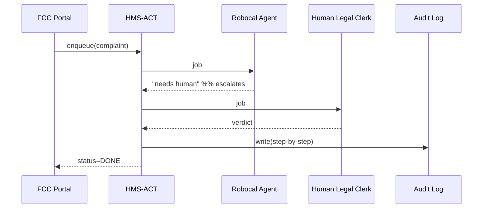

# Chapter 7: Action Orchestration Service (HMS-ACT)

*(If you just finished stress-testing bots in the [Simulation & Training Sandbox (HMS-ESR / HMS-EDU)](06_simulation___training_sandbox__hms_esr___hms_edu__.md), you’re probably asking, “How do we move from a safe sandbox to real-world action without chaos?”  HMS-ACT is the answer.)*

---

## 1. Why Do We Need HMS-ACT?  

Picture the **Federal Communications Commission (FCC)** help-desk.  
Thousands of citizens file daily complaints about illegal robocalls.  
Behind every complaint the agency must:

1. Validate the form.  
2. Check caller IDs against a fraud database.  
3. Ask legal staff if the case meets enforcement thresholds.  
4. Hand off valid cases to investigators.  
5. Report back to the complainant within 48 hours (SLA).

Doing this manually is like directing planes at JFK with walkie-talkies.  
**HMS-ACT is the air-traffic controller**—it queues each complaint, picks the right AI agent *or* human, tracks progress, retries failures, and logs everything for auditors.

---

## 2. Core Building Blocks (Plain English)

| Building Block | Think of it as | Why a beginner should care |
|----------------|---------------|----------------------------|
| Job Queue | Line at the DMV | Ensures “first in, first out” fairness. |
| Dispatcher | Airport gate agent | Assigns each job to the next free worker (agent or person). |
| SLA Timer | Kitchen egg-timer | Sounds the alarm if a task runs too long. |
| Retry & Recovery | Spare runway | Reroutes failed jobs without losing data. |
| Performance Log | Black box recorder | Stores every step for audits & metrics. |

You can do useful work with just the **Job Queue** and **Dispatcher**; the other parts come free.

---

## 3. A 10-Minute Hands-On Walk-Through

Below is a **TypeScript-flavored** demo that:

1. Submits a robocall complaint.  
2. Polls for status.  
3. Fetches performance metrics.  

All snippets are under 20 lines.

### 3.1 Submit a Job

```ts
// act_demo_submit.ts      (≤15 lines)
import { enqueue } from "hms-act-sdk";

const jobId = await enqueue({
  type: "robocall_complaint",
  payload: {
    phone: "202-555-0136",
    time:  "2024-04-21T09:15Z",
    notes: "Threatened to cut off my Social Security."
  }
});

console.log("Ticket #", jobId);
```

**What happens?**  
• The complaint is pushed into HMS-ACT’s **Job Queue**.  
• You get back a `jobId` like `COM-20240421-00042`.

---

### 3.2 Poll for Status

```ts
// act_demo_status.ts
import { getStatus } from "hms-act-sdk";

const status = await getStatus(jobId);
console.log(status);
/*
Possible values:
  QUEUED → DISPATCHED → IN_REVIEW → DONE | FAILED
*/
```

---

### 3.3 Fetch Performance Metrics (for managers)

```ts
// act_demo_metrics.ts
import { metrics } from "hms-act-sdk";

const m = await metrics("robocall_complaint");
console.log("Avg. first response:", m.avgFirstResponseMins, "mins");
console.log("SLA breaches today:", m.slaBreaches);
```

Now a supervisor sees live numbers—no spreadsheets!

---

## 4. What Happens Behind the Scenes?



Key points:  
1. HMS-ACT is the hub—no service talks directly to another.  
2. Each hop is time-stamped for SLA tracking.  
3. Failures are retried or escalated automatically.

---

## 5. Under the Hood: Tiny Implementation Peeks

### 5.1 In-Memory Queue (Python, 18 Lines)

```py
# act/queue.py
import asyncio, uuid, time
Q = asyncio.Queue()

async def enqueue(job):
    jid = str(uuid.uuid4())
    await Q.put({"id": jid, "job": job, "ts": time.time()})
    return jid

async def dequeue():
    job = await Q.get()
    job["picked"] = time.time()
    return job
```

Beginner notes:  
• `asyncio.Queue` = thread-safe line.  
• Each job gets a UUID + timestamp for SLA math.

---

### 5.2 Simple Dispatcher Loop (TypeScript, 16 Lines)

```ts
// act/dispatcher.ts
import { dequeue } from "./queue";
import { pickWorker } from "./router";
import { log } from "./audit";

export async function run() {
  while (true) {
    const job = await dequeue();         // wait until something arrives
    const worker = await pickWorker(job);
    try {
      const result = await worker.handle(job);
      log(job.id, "DONE", result);
    } catch (e) {
      log(job.id, "FAILED", e.message);
      // push back for retry
    }
  }
}
```

Beginner notes:  
• `pickWorker` may return an **AI agent** (from [Agent Framework](05_agent_framework__hms_agt_agx__.md)) or a **human inbox** link.  
• Failure falls through to a retry path (omitted for brevity).

---

### 5.3 SLA Timer (Rust, 12 Lines)

```rs
// act/sla.rs
pub fn breached(start: u64, now: u64, limit_secs: u64) -> bool {
    now - start > limit_secs
}
```

A one-liner in Rust—called on every status poll.

---

## 6. Advanced Patterns (Optional Reading)

| Pattern | When to Use | One-Line Idea |
|---------|-------------|---------------|
| Fan-Out | Bulk data export to many agencies | ACT splits one “export” job into N sub-jobs and waits for all to finish. |
| Human-in-the-Loop | High-risk decisions (e.g., benefits denial) | Dispatcher inserts a mandatory “HUMAN_REVIEW” stage. |
| Blue-Green Rollback | Rolling out new agents | ACT routes 10 % traffic to **Agent v2**; if error rate ↑, instant rollback. |

All patterns are **configuration**, not new code.

---

## 7. Mini-FAQ

**Q: How does HMS-ACT know which worker to pick?**  
A: A tiny routing table stored in the [Marketplace & Capability Registry](12_marketplace___capability_registry__hms_mkt__.md) lists agents/humans by skill and capacity.

**Q: What if the whole service crashes?**  
A: The queue persists to the [Unified Data Fabric](09_unified_data_fabric__hms_dta__.md). When ACT restarts, it replays pending jobs.

**Q: Can citizens track their own ticket?**  
A: Yes! The FCC portal simply exposes `getStatus(jobId)` to the public UI.

---

## 8. Recap & What’s Next

In this chapter you:

• Learned why HMS-ACT is the **air-traffic controller** for every task.  
• Submitted, tracked, and measured a robocall complaint in under 40 lines of code.  
• Peeked inside the queue, dispatcher, and SLA timer.  
• Saw how ACT coordinates AI agents *and* humans while keeping auditors happy.

Ready to see how tasks get *created* and *batched* before they even hit HMS-ACT?  
Turn the page to the [Workflow & Task Management Hub (HMS-OMS)](08_workflow___task_management_hub__hms_oms__.md).

---

---

Generated by [AI Codebase Knowledge Builder](https://github.com/The-Pocket/Tutorial-Codebase-Knowledge)