# Chapter 7: Activity & Workflow Orchestrator (HMS-ACT)

*(Picking up right after [Specialized Agent Extensions (HMS-AGX)](06_specialized_agent_extensions__hms_agx__.md))*  

> “I’m the stage-manager—everyone else just needs to hit their marks.” 
> —HMS-ACT service log, 07:00 Monday

---

## 1. Why Do We Need ACT?

### 1.1 A Concrete Use-Case – “Instant Airport Badge”

The Transportation Security Administration (TSA) wants to issue **temporary airport credentials** within 30 minutes—no lines, no paper shuffling.

Typical steps today                           | Pain
----------------------------------------------|------------------
Applicant submits Form TSA-400                | Manual email triage
Fingerprint sensor collects biometrics        | Tech team waits for email
CBP database check for watch-list             | 3rd party script, no audit trail
Badge printer at gate prints pass             | Human calls printer desk

**HMS-ACT** glues these pieces into one *auditable* workflow:

1. **Event**: Form TSA-400 received.  
2. **Activity**: Fingerprint agent runs.  
3. **Activity**: CBP-Check agent runs.  
4. **Human Task** (optional): Supervisor clicks “Approve”.  
5. **Activity**: Badge-Printer service prints pass.  
6. **Log**: Entire chain saved for OIG auditors.

Result: applicant walks to the gate with a badge in < 30 min, and TSA can replay every click later—no mystery emails.

---

## 2. Key Concepts in Two Minutes

| Term | 10-Word Definition | Real-World Analogy |
|------|-------------------|--------------------|
| Event | Something happened | Form lands in inbox |
| Activity | One step to handle event | Run fingerprint script |
| Workflow | Ordered list of activities | TSA badge checklist |
| Orchestrator | Service that triggers & tracks activities | Stage manager with clipboard |
| Ledger | Append-only log of every step | Security camera footage |

Keep these five words in mind while reading the rest of the chapter.

---

## 3. ACT From 30 000 ft

```mermaid
graph TD
    E[Event Bus] --> ACT[HMS-ACT<br>Orchestrator]
    ACT --> A1[Agents&nbsp;/&nbsp;Services (HMS-AGT)]
    ACT --> H1[Humans (HITL)]
    ACT --> L[Audit Ledger]
    subgraph Other HMS pieces
        ESQ[HMS-ESQ] -. compliance .- ACT
        AGX[HMS-AGX] -. extensions .- A1
    end
```

• **ACT** subscribes to events ⟶ fires activities  
• Each activity calls an **agent**, **service**, or **human**  
• **ESQ** can veto any illegal step before it runs

---

## 4. Declaring a Workflow (≤ 20 Lines)

Create `airport_badge.workflow.yaml`:

```yaml
id: TSA_TEMP_BADGE
trigger: form.TSA_400.submitted           # Event name
steps:
  - name: fingerprint
    uses: FingerprintBot
  - name: watchlist_check
    uses: CBPCheckBot
  - name: supervisor_signoff            # Human in loop
    uses: HITL:BadgeSupervisor
  - name: print_badge
    uses: BadgePrinterSvc
```

Explanation (for beginners):

1. `trigger` – the event that kicks everything off.  
2. `steps` – plain top-to-bottom list.  
3. `uses` – any **AGT agent**, **AGX-powered agent**, or **HITL** human role.

No code so far—just YAML.

---

## 5. Running the Workflow in Code (≤ 15 Lines)

```python
# run_workflow.py
import act_sdk as act

wf = act.load("airport_badge.workflow.yaml")

# Somebody submits TSA-400 → produce event
act.emit("form.TSA_400.submitted", data={"applicant_id": "A123"})

# ACT does the rest; we can poll status
print(act.status("TSA_TEMP_BADGE", "A123"))
```

What happens:

1. `emit` drops an event on the bus.  
2. ACT matches `trigger`, starts the workflow.  
3. Each `step` runs in order; status stored in ledger.

---

## 6. Peeking Under the Hood (Step-By-Step)

```mermaid
sequenceDiagram
    participant UI as Web Portal
    participant ACT as HMS-ACT
    participant FP as FingerprintBot
    participant CB as CBPCheckBot
    participant SV as Supervisor
    UI->>ACT: Event(form.TSA_400.submitted)
    ACT->>FP: run(applicant A123)
    FP-->>ACT: ok
    ACT->>CB: run(A123)
    CB-->>ACT: ok
    ACT->>SV: approve(A123)
    SV-->>ACT: approved
    ACT-->>UI: badge_ready ✅
```



Only 5 participants—easy for auditors to follow.

---

## 7. Inside ACT: Minimal Implementation (≤ 20 Lines)

```python
# act/core.py
import yaml, queue, threading

EVENTS = queue.Queue()
LEDGER = []

def load(path):
    return yaml.safe_load(open(path))

def emit(event, data):
    EVENTS.put((event, data))

def _worker(wf):
    while True:
        event, data = EVENTS.get()
        if event == wf["trigger"]:
            ctx = data.copy()
            for step in wf["steps"]:
                LEDGER.append((step["name"], "start", ctx))
                agent = step["uses"]
                ok = _run_activity(agent, ctx)
                LEDGER.append((step["name"], "end", ok))
                if not ok:
                    break

def _run_activity(name, ctx):
    # stub: pretend every activity succeeds
    print(f"Running {name} with {ctx}")
    return True

def start(wf):
    threading.Thread(target=_worker, args=(wf,), daemon=True).start()
```

Beginner highlights:

• `EVENTS` queue = inbox for ACT  
• `_worker` waits for the trigger, then loops through steps  
• Every action logged in `LEDGER`

Full orchestration in ~20 lines—proof that concepts, not code bulk, matter.

---

## 8. Adding Governance & Compliance

Before each `_run_activity`, ACT can query [HMS-ESQ](04_compliance___legal_reasoning__hms_esq__.md):

```python
from esq_sdk import allow

...
    for step in wf["steps"]:
        if not allow(step, ctx):     # ESQ says “no”
            LEDGER.append((step["name"], "blocked", "ESQ"))
            break
```

One line integrates legal guardrails.

---

## 9. Human-in-the-Loop (HITL) Hooks

If `uses:` starts with `HITL:`, ACT pauses and waits for a human signal:

```python
if agent.startswith("HITL:"):
    notify(agent[5:], ctx)       # send Slack / email
    wait_for_approval(ctx["applicant_id"])
```

Details will appear in [Human-in-the-Loop Oversight (HITL)](08_human_in_the_loop_oversight__hitl__.md).

---

## 10. Quick “Did I Do It Right?” Checklist

☐ Workflow YAML has `trigger` + ordered `steps`  
☐ Every `uses:` references a registered **AGT agent** or `HITL:` role  
☐ `act.emit()` fires at least one event in your test  
☐ Ledger records `start` and `end` for each activity  
☐ ESQ veto path tested (try forcing a failure)  

If all five boxes are ticked, you’ve orchestrated your first government-grade workflow!

---

## 11. Where ACT Lives in the HMS Family

```mermaid
graph LR
    EV[Event Bus]
    ACT[HMS-ACT]
    AGT[Agents (HMS-AGT)]
    HITL[Human Oversight (HITL)]
    ESQ[Compliance (HMS-ESQ)]
    EV --> ACT
    ACT --> AGT
    ACT --> HITL
    ACT -.check.- ESQ
```

---

## 12. What’s Next?

Sometimes an activity *needs a human thumb-up* or a manual data entry before the next bot can proceed. In the next chapter we’ll zoom into that human checkpoint system.

👉 Continue to: [Human-in-the-Loop Oversight (HITL)](08_human_in_the_loop_oversight__hitl__.md)

Happy orchestrating!

---

Generated by [AI Codebase Knowledge Builder](https://github.com/The-Pocket/Tutorial-Codebase-Knowledge)