# Chapter 7: Agent Framework (HMS-AGT / HMS-AGX)

*A friendly sequel to [Model Context Protocol (HMS-MCP)](06_model_context_protocol__hms_mcp__.md)*  

---

## 1. Why Do We Need an “Agent Framework”?

Picture the U.S. **Passport Agency** on a hectic Monday:

1. 19-year-old Alex uploads a blurry photo.  
2. A chatbot must politely ask for a better image.  
3. If Alex refuses, policy says the bot must escalate to a human officer.  
4. Every utterance must be archived for audits and—of course—*never* leak Alex’s SSN.

Without a standard “brain,” every team would code these rules from scratch.  
**HMS-AGT** is that shared brain:  
* it teaches new agents *how to talk*,  
* enforces policy guard-rails, and  
* shows them *how* to request tools (OCR, databases, payment APIs, …).  

**HMS-AGX** adds “electives” for specialized tasks—think of it as graduate school: OCR, legal reasoning, trade-data tricks, medical privacy modules, and more.

---

## 2. Key Ideas in Plain English

| Term | Friendly Analogy | Passport Example |
|------|------------------|------------------|
| Core Curriculum | TSA basic training | “Always wrap replies in MCP” |
| Elective | Night-school class | “Detect photo glare with OCR” |
| Policy Guard-rail | Bowling lane bumper | No SSN in responses |
| Tool Request | Library checkout card | “I need `ocr.readImage`” |
| Memory Slot | Sticky note on screen | `user_photo_status = pending` |

---

## 3. A 3-Minute Walk-Through: Building **PhotoBot**

We’ll create a *PhotoBot* that asks for a clear photo, uses OCR to detect quality, and escalates if needed.

### 3.1 Create the Agent Skeleton (Core AGT)

```js
// agents/photoBot.js  (≤ 15 lines)
import { defineAgent } from 'hms-agt'

export const PhotoBot = defineAgent({
  name:     'PhotoBot',
  purpose:  'Guide applicants to upload a valid passport photo',
  tools:    ['ocr.readImage', 'hitl.request'],   // allowed tools
  policy:   ['no-PII-outbound'],                 // guard-rail
  onMessage (mcp, ctx) {
    if (!ctx.memory.photoOk){
      return { reply: 'Could you upload a clearer photo?', needs: ['ocr.readImage'] }
    }
    return { reply: 'Great, photo accepted! 🎉' }
  }
})
```

**What happened?**  
* `defineAgent` gives us the AGT starter kit.  
* `tools` lists what *PhotoBot* is allowed to call.  
* `policy` attaches canned rules from [HMS-ESQ](04_compliance___legal_reasoning__hms_esq__.md).  
* `ctx.memory` is a tiny key-value store the framework keeps per user.

---

### 3.2 Talk to the Bot (Everything in MCP!)

```js
// talk.js  (≤ 20 lines)
import { send } from 'hms-agt'
import { PhotoBot } from './agents/photoBot.js'

const envelope = {
  speaker: 'user',
  goal:    'Submit passport photo',
  state:   { photoUrl: 'https://bad-photo.jpg' }
}

const botTurn = await send(PhotoBot, envelope)
console.log(botTurn.reply)      // -> "Could you upload a clearer photo?"
```

`send` automatically:  
1. Wraps *user* input & bot output in MCP.  
2. Logs the turn for audits.  
3. Blocks any reply that violates the `'no-PII-outbound'` guard-rail.

---

### 3.3 Upgrade to **AGX**: Add an OCR Elective

```js
// agents/photoBot.agx.js  (≤ 18 lines)
import { withSkill } from 'hms-agx'
import { PhotoBot }  from './photoBot.js'

export const SmartPhotoBot = withSkill(PhotoBot, 'ocr_quality', {
  threshold: 0.8,                       // elective config
  onOcrResult (score, ctx){
    ctx.memory.photoOk = score > 0.8
  }
})
```

Now, when the bot gets an image back, the **`ocr_quality`** skill auto-runs and sets `photoOk`.  
No new policy code, *no* new infrastructure—just one decorator!

---

## 4. What Happens Behind the Curtain?

```mermaid
sequenceDiagram
  participant U as User
  participant AGT as PhotoBot
  participant OCR as OCR Service
  participant GOV as Policy Guard
  participant HITL as Human Officer

  U->>AGT: photo in MCP
  AGT->>OCR: request quality check
  OCR-->>AGT: score=0.6
  AGT->>GOV: "Can I reply?"
  GOV-->>AGT: ✅ (no PII)
  AGT->>U: "Please upload clearer photo"
  AGT-->>HITL: if 3 failures -> escalate
```



*Five participants max—easy to trace.*

---

## 5. Peeking at the Framework Code

### 5.1 `defineAgent` (simplified)

```js
// hms-agt/core/defineAgent.js  (≤ 20 lines)
export function defineAgent(opts){
  return async function agent(mcp){
    const ctx = loadContext(mcp)           // memory + tools
    const out = await opts.onMessage(mcp, ctx)
    await enforcePolicy(out, opts.policy)  // call HMS-ESQ
    return packageMCP(out, opts.name)
  }
}
```

Beginners can see the flow:

1. **Load context**  
2. **Run user logic**  
3. **Check policy**  
4. **Return MCP**

### 5.2 `withSkill` (decorator)

```js
// hms-agx/withSkill.js  (≤ 15 lines)
export function withSkill(agent, skillName, cfg){
  const skill = importSkill(skillName)
  return async (mcp) => {
    const res = await agent(mcp)
    if (skill.shouldRun(mcp)) await skill.run(mcp, cfg)
    return res
  }
}
```

One wrapper, one dynamic import—keeps **AGX** pluggable.

---

## 6. File Structure Cheat-Sheet

```
/agents
  photoBot.js          // core agent
  photoBot.agx.js      // upgraded agent
/hms-agt
  core/
    defineAgent.js
  send.js
/hms-agx
  skills/
    ocr_quality.js
```

All files are tiny; beginners won’t get lost.

---

## 7. Frequently Asked Questions

**Q: Do agents write their own prompts?**  
Not directly. The framework auto-generates a system prompt containing policy, allowed tools, and memory. You can append custom text via `opts.purpose`.

**Q: Can one agent call another?**  
Yes—just list the other agent in `tools` (e.g., `"agent:GeoBot"`). HMS-AGT routes the call and keeps the audit chain intact.

**Q: How does an agent get new skills?**  
Drop a skill file in `/hms-agx/skills` and wrap the agent with `withSkill()`. No redeploy required.

**Q: What if a reply violates policy?**  
`enforcePolicy()` blocks it and returns an MCP error envelope. [Human-in-the-Loop Control](08_human_in_the_loop__hitl__control_.md) can then step in.

---

## 8. What You Learned

• **HMS-AGT** provides the *core* agent template: policy guard-rails, tool requests, memory, and MCP I/O.  
• **HMS-AGX** layers *electives*—pluggable skills for advanced reasoning or domain needs.  
• Building a compliant, tool-aware bot took < 20 lines of business logic.  
• The framework integrates seamlessly with earlier layers (MCP, ESQ, ACT).

Ready to see how humans jump in when an agent hits a road-block or policy conflict?  
Move on to [Human-in-the-Loop (HITL) Control](08_human_in_the_loop__hitl__control_.md).

---

---

Generated by [AI Codebase Knowledge Builder](https://github.com/The-Pocket/Tutorial-Codebase-Knowledge)