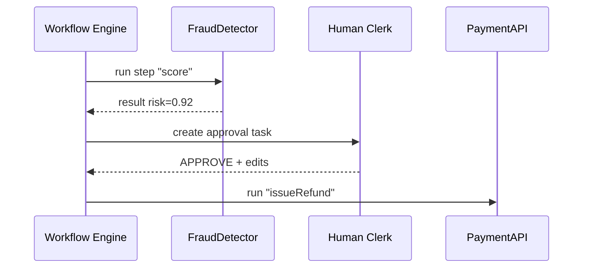

# Chapter 7: Agent-Orchestrated Workflow Manager (HMS-ACT) 🚦

*Arriving from [Agent Marketplace (HMS-MKT)](06_agent_marketplace__hms_mkt__.md)?  
Perfect — you just installed shiny new agents.  
Now let’s see **how those agents, humans, and APIs play together without chaos.***

---

## 0. Why Do We Need a “Traffic Cop”?

Imagine the **Government Accountability Office (GAO)** is auditing how State Agencies handle **Medicaid Over-Payment** cases.

1. An AI Fraud Detector flags a suspicious claim.  
2. A human clerk reviews evidence and may override.  
3. The Backend API writes a recovery letter.  
4. An external payment gateway issues a refund.

Without a *single conductor* you get:

* 🤷‍♀️ **“Who changed the amount?”**  
* 🤔 **“Was the letter sent before the override?”**  
* 😱 **“Which data set did the AI see?”**

**HMS-ACT** fixes this by being the **traffic cop & court stenographer**:

* Decides *who* runs next (AI vs. human vs. API).  
* Logs every action (“what, when, using which data”).  
* Offers one-click replay for inspectors.

---

## 1. Key Concepts (Plain English)

| Word | Think “beginner” |
|------|------------------|
| **Workflow** | A to-do list with ordered steps (e.g., “score → review → refund”). |
| **Actor** | Who does a step: *Human* (“Clerk-Anna”), *AI* (“FraudBot”), or *System* (“PaymentAPI”). |
| **Ticket** | A live instance of a workflow (like “Case #7782”). |
| **Event Log** | Immutable journal; every step appends a row. |
| **Guard Rail** | Rule that blocks risky steps until approved (ties into [HITL](11_human_in_the_loop_oversight__hitl__.md)). |

---

## 2. First Walk-Through — Flag & Refund a Medicaid Claim

Below we build a **mini workflow** in <15 lines, run it, and peek at the audit trail.

### 2.1 Define the Workflow (YAML, 11 lines)

```yaml
# File: workflows/overpayment.yaml
id: medicaid_overpay
steps:
  - id: score
    actor: FraudDetector.score         # AI
  - id: manual_review
    actor: human                       # Clerk queue
    guard: needsApproval               # safety
  - id: refund
    actor: PaymentAPI.issueRefund      # System
```

Beginner notes:

* Three steps: AI scores → human reviews → system refunds.  
* The `guard` says “pause here until a person approves”.

### 2.2 Start a Ticket (Node, 7 lines)

```js
import { startTicket } from 'hms-act'

const ticket = await startTicket('medicaid_overpay', {
  claimId: 555,
  amount: 1200
})
console.log(ticket.id)   // e.g., T-90210
```

What happened?

1. HMS-ACT copied the YAML template into a **Ticket**.  
2. Logged “Ticket created”.  
3. Immediately ran step `score`.

### 2.3 View the Live Log (CLI)

```bash
hms-act log T-90210
```

Output:

```
[0] Ticket created by user:alice         2024-06-10 14:00
[1] score  -> FraudDetector.score        2024-06-10 14:00  risk=0.92
[2] PAUSED -> needsApproval (manual_review)
```

*Step 2* waits until a human clicks **Approve** in the Dashboard.

### 2.4 Human Overrides

Clerk-Anna opens the **Policy Management Dashboard** and sees:

```
Ticket T-90210 • Risk 0.92 • Requested refund $1 200
[Approve] [Reject] [Edit Amount]
```

She edits amount to `$900` and clicks **Approve**.

ACT instantly:

1. Updates the payload.  
2. Logs the override.  
3. Executes `PaymentAPI.issueRefund`.

Final log tail:

```
[3] manual_review APPROVED by clerk:anna    2024-06-10 14:07  newAmount=900
[4] refund -> PaymentAPI.issueRefund        2024-06-10 14:07  status=200
[5] Ticket closed                           2024-06-10 14:07
```

Auditors are happy 🎉.

---

## 3. How Does ACT Decide What Runs Next?



*No step executes until the previous one logs a success.*

---

## 4. Inside the Code (Super-Light)

### 4.1 Tiny Scheduler (13 lines)

```js
// File: act/runner.js
export async function runNext(ticket){
  const step = ticket.steps.find(s => s.state === 'pending')
  if(!step) return close(ticket)

  if(step.guard && !step.approved) return   // wait!

  const actorFn = registry[step.actor]
  const output  = await actorFn(ticket.data)

  log(ticket.id, step.id, output)           // audit
  step.state = 'done'
  ticket.data = { ...ticket.data, ...output }

  return runNext(ticket)                    // recurse
}
```

Beginner explanation:

1. Find the first **pending** step.  
2. If it needs approval and none given — stop.  
3. Call the actor function (AI, human proxy, or API).  
4. Write to the **Event Log**.  
5. Mark as done and move on.

### 4.2 Event Logger (7 lines)

```js
// File: act/log.js
import fs from 'fs/promises'

export async function log(tid, step, data){
  const line = { tid, step, ts: Date.now(), ...data }
  await fs.appendFile('act.log', JSON.stringify(line)+'\n')
}
```

One line per action, append-only — perfect for auditors.

---

## 5. Registering Actors

```js
// File: act/registry.js
import { mcpRequest } from '../mcp/helper.js'   // from Chapter 5

export default {
  'FraudDetector.score': p => mcpRequest('call','FraudDetector.score',p),
  'PaymentAPI.issueRefund':p=> mcpRequest('call','PaymentAPI.issueRefund',p),
  human: async () => ({})   // placeholder; resolved via UI
}
```

Every actor is just a function returning a **Promise** — easy!

---

## 6. Guard Rails & HITL

A `guard: needsApproval` automatically pushes the step into the  
[Human-in-the-Loop Oversight](11_human_in_the_loop_oversight__hitl__.md) queue.  
ACT blocks further execution until a human (with proper OAuth scope from [Security & Authorization Layer](09_security___authorization_layer__hms_sys__zero_trust__.md)) approves or rejects.

---

## 7. Where ACT Touches Other Chapters

* **Agents** come from [HMS-MKT](06_agent_marketplace__hms_mkt__.md).  
* Calls to tools flow through [Model Context Protocol](05_model_context_protocol__hms_mcp__.md).  
* Human approvals surface in the Dashboard micro-frontend ([HMS-MFE](02_micro_frontend_architecture__hms_mfe__.md)).  
* Telemetry is streamed to [Metrics & Monitoring](14_metrics___monitoring__hms_ops___hms_act_telemetry__.md).  
* Persisted tickets live in the **Backend Policy API** (next chapter!).

---

## 8. Quick FAQ

**Q:** *Can I edit a workflow while tickets are running?*  
A: Yes. New tickets use the new definition; existing ones keep their original steps.

**Q:** *How big is the log file?*  
A: ACT rotates daily and ships old slices to the [Central Data Repository](15_central_data_repository__hms_dta__.md).

**Q:** *What if an actor crashes?*  
A: The step marks **failed**; ACT retries (`maxRetry:3`) or escalates to a human.

---

## 9. Summary & Next Steps

You learned:

1. HMS-ACT orchestrates multi-actor workflows and writes an **immutable audit trail**.  
2. Guards pause risky steps for human approval.  
3. Adding a workflow is as simple as a tiny YAML file.  
4. Each step calls agents or APIs via MCP, keeping the system safe and traceable.

Ready to see **where all these workflows store and fetch their data**?  
Continue to [Backend Policy API (HMS-SVC / HMS-API)](08_backend_policy_api__hms_svc___hms_api__.md).

---

Generated by [AI Codebase Knowledge Builder](https://github.com/The-Pocket/Tutorial-Codebase-Knowledge)