# Chapter 7: Agent Orchestration Service (HMS-ACT)

[← Back to Chapter 6: Model Context Protocol (HMS-MCP)](06_model_context_protocol__hms_mcp__.md)

---

> “The project manager for every AI, bot, and micro-service.”

---

## 1. Why Do We Need HMS-ACT?

Imagine a citizen, Maria, applying for a **Small Business Emergency Loan**:

1. She uploads Form 4506-T (tax transcript request).  
2. An AI intake agent validates the PDF.  
3. Financial risk checks run.  
4. Legal review confirms compliance with SBA rules.  
5. Finally, the Treasury payment module wires the funds.

Many moving parts—one bad hop and the entire process unravels.  
**HMS-ACT is the traffic cop that decides _which agent runs next, waits, retries, or rolls back_.**

---

## 2. Quick-Glance Analogy

| Real-World Analogy  | HMS-ACT Role |
|---------------------|-------------|
| Airport Control Tower | Tells each plane (agent) when to take off or land |
| Kanban Board with Motors | Moves the “task card” from column to column automatically |
| UPS Package Scanner | Logs every stop so you can track a shipment end-to-end |

---

## 3. Key Concepts (Beginner Friendly)

| Term | Plain-English Meaning | One-Line Job |
|------|-----------------------|--------------|
| Task  | A single card on the Kanban board | “Validate Maria’s tax form.” |
| Step  | One action inside a task | Call the OCR agent. |
| Workflow | Ordered list of steps with rules | “After OCR → legal check → payment.” |
| Event Bus | Intercom used by all agents | Publishes “step-done” or “step-failed.” |
| Compensation | Undo recipe when things break | Refund the payment if legal check fails. |
| Trace Hook | Built-in audit logger | Pushes every event to [Activity Logging](21_activity_logging___audit_trail_.md). |

Keep these in mind—everything else is plumbing.

---

## 4. A Minimal “Loan Application” Workflow

Let’s model Maria’s journey in **12 lines of JSON**:

```jsonc
// loan_workflow.json
{
  "id": "SBA_LOAN_V1",
  "steps": [
    { "id":"ocr",       "agent":"AGT_OCR_PDF" },
    { "id":"legal",     "agent":"AGT_LEGAL_CHECK", "after":"ocr" },
    { "id":"payment",   "agent":"ACH_PAYOUT",      "after":"legal",
                        "compensate":"refund" }
  ],
  "compensations": {
    "refund": { "agent":"ACH_REFUND" }
  }
}
```

Explanation  
• `steps` run in order (`after` declares the dependency).  
• If **payment** later fails legal requirements, ACT triggers **refund** automatically.

---

## 5. Running the Workflow (10-Line Script)

```js
// submitLoan.js
import { startTask } from 'hms-act-sdk';

const taskId = await startTask({
  workflowId: 'SBA_LOAN_V1',
  payload   : { applicantId: 'MARIA42', formUrl: '/4506T.pdf' }
});

console.log('📦 Task queued →', taskId);
```

What happens?

1. `startTask` enqueues the payload.  
2. ACT emits `task.queued` → the first agent (**AGT_OCR_PDF**) picks it up.  
3. Each completed step fires an event; ACT moves the card forward.  
4. On any failure, compensation steps run.

---

## 6. Life of a Task (Sequence Diagram)

```mermaid
sequenceDiagram
    participant Portal
    participant ACT
    participant OCR as AGT_OCR_PDF
    participant ESQ as AGT_LEGAL_CHECK
    participant ACH as ACH_PAYOUT
    Portal->>ACT: startTask(SBA_LOAN_V1)
    ACT->>OCR: dispatch step "ocr"
    OCR-->>ACT: done
    ACT->>ESQ: dispatch step "legal"
    ESQ-->>ACT: done
    ACT->>ACH: dispatch step "payment"
    ACH-->>ACT: done
    ACT-->>Portal: 🎉 task complete
```



Only five actors—easy to follow!

---

## 7. Peeking Under the Hood

### 7.1 Folder Layout

```
/hms-act
 ├─ server.js           # 90 lines – core HTTP & event bus
 ├─ workflows/
 │    └─ loan_workflow.json
 ├─ queues/
 │    └─ inMemory.js    # swap with RabbitMQ later
 └─ sdk/
      └─ index.js       # client helper shown earlier
```

### 7.2 Core Dispatch Logic (18 Lines)

```js
// server.js snip
import { bus } from './queues/inMemory.js';
import { loadWorkflow } from './workflows/util.js';

bus.on('task.queued', async t => {
  const wf = loadWorkflow(t.workflowId);
  const step = wf.steps.find(s => !s.after);
  dispatchStep(step, t);
});

function dispatchStep(step, task){
  bus.emit(`run.${step.agent}`, { step, task });      // 8
  bus.once(`done.${step.id}.${task.id}`, res => {     // 9
    const next = wf.steps.find(s => s.after === step.id);
    next ? dispatchStep(next, task)
         : bus.emit('task.done', task);
  });
}
```

Line-by-line:

8. Tell the specific agent to run.  
9-13. When the agent reports `done`, find the next step; if none, fire `task.done`.

*Error handling & compensation live in another 15-line helper, omitted for brevity.*

---

## 8. Agent-Side Listener (15 Lines)

```js
// agt_ocr_listener.js
import { bus } from 'hms-act-sdk';

bus.on('run.AGT_OCR_PDF', async ({ step, task }) => {
  // …do OCR (skipped)…
  bus.emit(`done.${step.id}.${task.id}`, { text:'Parsed PDF' });
});
```

Any language can implement a listener—just respect the event names.

---

## 9. Rollback in Action (Tiny Demo)

```js
// simulateLegalFail.js
bus.on('run.AGT_LEGAL_CHECK', ({step,task})=>{
  bus.emit(`fail.${step.id}.${task.id}`, 'Rule §12.3 violated');
});
```

HMS-ACT reacts:

1. Detects `fail.*`  
2. Looks up `compensate` target (`refund`).  
3. Dispatches **ACH_REFUND**.  
4. Marks task as `error` and logs everything to [Activity Logging & Audit Trail](21_activity_logging___audit_trail_.md).

All automatic—no extra code!

---

## 10. Connecting the Dots with Other Chapters

• Every dispatched message carries an [MCP envelope](06_model_context_protocol__hms_mcp__.md) so agents know model settings.  
• Agents themselves are built with [HMS-AGT](04_ai_representative_agent_framework__hms_agt__.md).  
• Legal failures often originate from checks inside [HMS-ESQ](03_legal_reasoning_service__hms_esq__.md).  
• If risk is high, an agent can raise a [HITL](05_human_in_the_loop__hitl__override_.md) ticket; ACT simply waits for the step to return `done`.

---

## 11. Common Questions

**Q: Do agents need to know the full workflow?**  
No. They only listen for `run.<agentName>` events.

**Q: Can steps run in parallel?**  
Yes. Omit the `after` field or use arrays (see docs). ACT fires multiple events simultaneously.

**Q: What if the queue crashes?**  
Server.js persists state every 5 s. On restart it replays unfinished steps.

---

## 12. Key Takeaways

• **HMS-ACT orchestrates tasks, tracks progress, and triggers rollbacks—so you don’t write spaghetti callbacks.**  
• Workflows are simple JSON; each line declares *what* happens, not *how*.  
• Agents remain small and focused; ACT handles timing, retries, and audits.  
• The entire service is event-driven, making horizontal scaling trivial.

---

### Up Next

Now that workflows can hop across dozens of services, we need a **stable API layer** to expose those services to the outside world. Continue to [Chapter 8: Core Backend API Layer (HMS-SVC)](08_core_backend_api_layer__hms_svc__.md).

---

Generated by [AI Codebase Knowledge Builder](https://github.com/The-Pocket/Tutorial-Codebase-Knowledge)