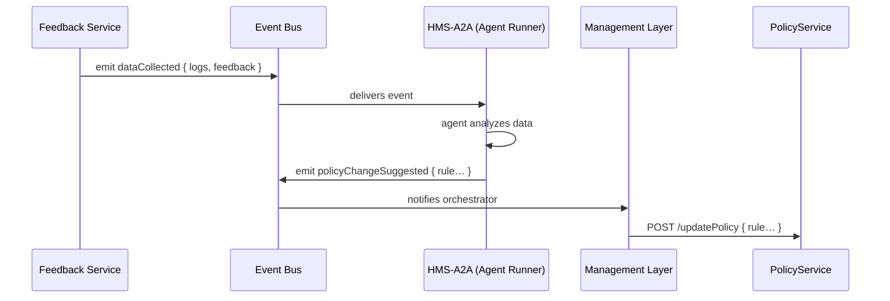

# Chapter 7: AI Agent Framework (HMS-A2A)

In [Chapter 6: Financial System (HMS-ACH)](06_financial_system__hms_ach__.md) we automated payments and audit logs. Now let’s give our system a team of on-call data scientists and policy analysts—day and night. Welcome to the **AI Agent Framework (HMS-A2A)**!

## Why an AI Agent Framework?

Imagine you run the Bureau of Safety and Environmental Enforcement. You collect user feedback, system logs, and performance metrics—but manually reviewing dozens of spreadsheets every week is slow. What if an “AI Agent” could:

- Read incoming data  
- Propose new workflow rules (e.g., speed up hazard reviews)  
- Monitor outcomes, then adjust further  

That’s exactly what HMS-A2A does: hosts specialized agents that analyze data, suggest policy tweaks, and watch results—24/7.

### Central Use Case: Process Optimization Agent

1. A service emits user feedback and log data (e.g., slow workflows).  
2. **Process Optimization Agent** ingests that data.  
3. It drafts updated workflow rules (e.g., “auto-approve low-risk cases”).  
4. It emits a `policyChangeSuggested` event for approval by the Management Layer.

## Key Concepts

1. **Agent Container**  
   A central host (`HMS-A2A`) where all AI agents run.  

2. **Agent Definition**  
   A small program that:
   - Subscribes to events  
   - Runs analysis  
   - Emits new events or calls APIs  

3. **Event Bus Integration**  
   A pub/sub channel (e.g., Kafka, Redis) that:
   - Feeds data to agents  
   - Carries agent suggestions to orchestrators or UIs  

4. **Agent API**  
   A simple interface:
   - `on(eventType, handler)` to listen  
   - `emit(eventType, payload)` to publish  

## How to Use HMS-A2A

Below is an example of registering a **Process Optimization Agent**.

```js
// config/agents.js
module.exports = [
  {
    name: 'ProcessOptimizationAgent',
    entry: './agents/ProcessOptimizationAgent.js'
  },
  // add more agents here...
];
```
*We declare which agent files HMS-A2A should load.*

```js
// src/a2a/agentRunner.js
const bus = require('../eventBus');
const agents = require('../../config/agents');

for (const { name, entry } of agents) {
  const AgentClass = require(entry);
  const agent = new AgentClass(bus);
  agent.start(); // hooks into events
}
```
*The runner loads each agent, gives it the event bus, and starts it.*

```js
// src/a2a/agents/ProcessOptimizationAgent.js
class ProcessOptimizationAgent {
  constructor(bus) { this.bus = bus; }
  start() {
    this.bus.on('dataCollected', data => this.handleData(data));
  }
  async handleData(data) {
    // analyze feedback logs (omitted)
    const suggestion = { rule: 'autoApproveLowRisk', params: {} };
    this.bus.emit('policyChangeSuggested', suggestion);
  }
}
module.exports = ProcessOptimizationAgent;
```
*This agent listens for `dataCollected`, analyzes it, and suggests a policy change.*

## What Happens When Data Arrives?



1. **Feedback Service** publishes raw data.  
2. **HMS-A2A** agents analyze and emit suggestions.  
3. **Management Layer** ([Chapter 4](04_management_layer__service_orchestration__.md)) picks it up and invokes the **Policy Service**.

## Inside HMS-A2A: A Closer Look

1. **Event Bus** (`src/eventBus.js`)  
   A simple pub/sub wrapper:

   ```js
   const EventEmitter = require('events');
   module.exports = new EventEmitter();
   ```

2. **Agent Runner** (`src/a2a/agentRunner.js`)  
   - Reads `config/agents.js`  
   - `require(entry)` and calls `start()`

3. **Agent Template**  
   - Agents extend a simple interface: constructor(bus) + `start()`  
   - Use `bus.on`/`bus.emit` to communicate

You can add new agents by listing them in `config/agents.js` and following the template above.

## Conclusion

You’ve learned how **HMS-A2A** hosts and runs specialized AI agents that:

- Listen for domain events  
- Analyze data (logs, feedback, metrics)  
- Emit new events—like policy change suggestions  

This gives you a 24/7 data science team that plugs into our orchestration. Next up, we’ll look at syncing data with outside systems in [External System Synchronization](08_external_system_synchronization_.md).

---

Generated by [AI Codebase Knowledge Builder](https://github.com/The-Pocket/Tutorial-Codebase-Knowledge)