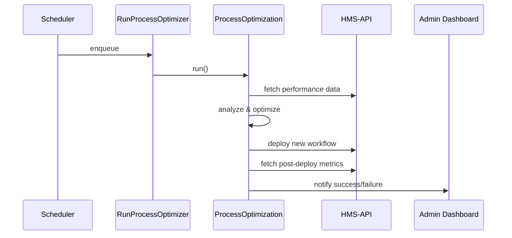

# Chapter 7: AI-Facilitated Process Optimization

In the previous chapter we met our [AI Representative Agent](06_ai_representative_agent_.md) that spots workflow bottlenecks and proposes improvements. Now we’ll build the next layer: **AI-Facilitated Process Optimization**—an end-to-end “continuous improvement consultant” embedded in your government IT.

---

## Motivation & Central Use Case

Imagine the Office of Community Oriented Policing Services (COPS) has a multi-step grant review. Citizens complain the process takes months. Our goal:

1. **Analyze** each step’s performance  
2. **Propose** a new, faster sequence  
3. **Deploy** the change automatically  
4. **Verify** that reviews now complete within policy timelines  

It’s like having a smart audit team that watches your grants system 24/7, makes improvements, and checks the results.

---

## Key Concepts

1. Monitoring & Data Collection  
   – Gather logs, feedback, timing data.

2. Optimization Engine  
   – AI models that suggest workflow changes.

3. Change Deployment  
   – Automated rollout of new steps (via [Backend API](03_backend_api__hms_api___hms_mkt__.md)).

4. Outcome Verification  
   – Measure before/after metrics to ensure improvements.

---

## Quick Start: Running the Optimizer

### 1. Schedule a Daily Job

Use Laravel’s scheduler to run every night:

```php
// app/Console/Kernel.php
protected function schedule($s)
{
    $s->job(new \App\Jobs\RunProcessOptimizer())->daily();
}
```
This enqueues our optimization job each day at midnight.

### 2. Job Entry Point

```php
// app/Jobs/RunProcessOptimizer.php
class RunProcessOptimizer implements ShouldQueue
{
    public function handle()
    {
        \App\Services\AI\ProcessOptimization::run();
    }
}
```
We call a single `run()` method that ties all steps together.

---

## Under the Hood: Step-by-Step Flow



1. Scheduler dispatches the job  
2. Service loads metrics via [Backend API](03_backend_api__hms_api___hms_mkt__.md)  
3. AI analyzes and suggests a new sequence  
4. Service calls API to update protocols  
5. Service re-measures and posts a notification  

---

## Internal Implementation

### ProcessOptimization Service

```php
// app/Services/AI/ProcessOptimization.php
namespace App\Services\AI;

class ProcessOptimization
{
    public static function run()
    {
        $data = self::gatherData();
        $plan = self::optimize($data);
        self::deployChanges($plan);
        self::verifyOutcomes($data);
    }
}
```
Each helper method handles one phase of the cycle.

### gatherData(): Pull Logs & Feedback

```php
protected static function gatherData()
{
    // Fetch step durations and citizen feedback
    $timings = \App\Models\UsageLog::summary();
    $fb      = \App\Models\Feedback::recent(90);
    return compact('timings','fb');
}
```
Collects the last 90 days of logs and surveys.

### optimize(): Spot Bottlenecks

```php
protected static function optimize($data)
{
    // Simple rule: if step A is slow, run B in parallel
    if ($data['timings']['stepA_avg'] > 5) {
        return ['parallelize' => ['A','B']];
    }
    return [];
}
```
Here we check if “Step A” exceeds 5 days, then suggest parallel steps.

### deployChanges(): Update Protocol

```php
protected static function deployChanges($plan)
{
    if (isset($plan['parallelize'])) {
        // Call HMS-API to modify the review protocol
        Http::put('/api/protocols/10', [
            'steps' => ['Submit','A&B in parallel','Finalize']
        ]);
    }
}
```
Uses the [Backend API](03_backend_api__hms_api___hms_mkt__.md) to rewrite the workflow.

### verifyOutcomes(): Measure Impact

```php
protected static function verifyOutcomes($oldData)
{
    $newAvg = \App\Models\UsageLog::summary()['stepA_avg'];
    event(new \App\Events\ProcessOptimized($oldData['timings'], $newAvg));
}
```
Sends an event so the admin dashboard can show “Process duration dropped from 7→4 days.”

---

## Conclusion

In this chapter you learned:

- **What** AI-Facilitated Process Optimization is: a continuous improvement loop.  
- **Why** it matters: trims idle time and enforces policy SLAs.  
- **How** to use it: schedule `RunProcessOptimizer`, then let the service gather, analyze, deploy, and verify.  
- **What’s under the hood**: a simple service with four phases and calls to the [Backend API](03_backend_api__hms_api___hms_mkt__.md).

Next up, we’ll cover the [Governance Layer](08_governance_layer_.md), which ensures these AI-driven changes stay transparent and auditable.

---

Generated by [AI Codebase Knowledge Builder](https://github.com/The-Pocket/Tutorial-Codebase-Knowledge)