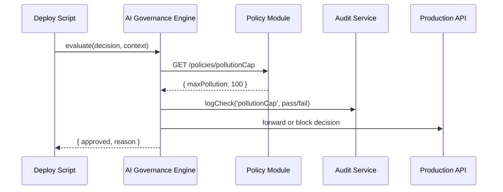

# Chapter 7: AI Governance Engine

Welcome back! In [Chapter 6: Policy Module](06_policy_module_.md) we built a service that defines and versions our business rules. Now we’ll create the **AI Governance Engine**—an ethical review board for every AI‐driven decision in HMS-EHR.

---

## Why an AI Governance Engine?

Imagine an environmental agency uses AI to automate permit approvals for factories. Before any decision goes live, we must ensure it:

- Respects **pollution caps** set by law  
- Honors **stakeholder rights**, like nearby communities  
- Logs every check for **transparency**  
- Protects sensitive data for **privacy**  

Just like a human ethics committee signs off on new legislation, our engine sits between the raw AI output and deployment, enforcing **transparency**, **truth**, **safety**, **ethics**, and **privacy** every time.

---

## Key Concepts

1. **Transparency**  
   Every evaluation is logged with inputs, checks, and results.

2. **Truth & Safety**  
   Verify facts (e.g., pollution estimate ≤ cap) and guard against harmful recommendations.

3. **Ethics**  
   Ensure no unfair bias—e.g., do not unfairly reject permits in certain communities.

4. **Privacy**  
   Strip or mask any personal data before logging or sharing.

5. **Integration Points**  
   The engine is called by deployment scripts or backend services before putting any AI decision into production.

---

## How to Use the AI Governance Engine

Below is a minimal example showing how a deployment script asks the engine to evaluate an AI’s permit decision.

```js
// src/aiGovernance/usage.js
const { AIGovernanceEngine } = require('./engine');
const policyService = require('../policy/policyService');
const auditService = require('./auditService');

const engine = new AIGovernanceEngine(policyService, auditService);

async function deployPermit(decision, context) {
  const result = await engine.evaluate(decision, context);
  if (result.approved) {
    console.log('Decision cleared for deployment');
    // send to live system...
  } else {
    console.error('Blocked:', result.reason);
  }
}

// Example call:
deployPermit(
  { permitId: 'A123', estimatedPollution: 80 },
  { user: 'inspector', timestamp: Date.now() }
);
```

Explanation:

- We create the engine with our **Policy Module** and an **Audit Service**.  
- We call `evaluate()`, passing the AI’s raw `decision` and a `context` object.  
- The engine returns `{ approved: true }` if all checks pass, or `{ approved: false, reason: '...' }` if not.

---

## What Happens Under the Hood?



1. **Deploy Script** calls the engine with a permit decision.  
2. **Engine** fetches relevant rules from our [Policy Module](06_policy_module_.md).  
3. Each rule is checked and recorded via the **Audit Service**.  
4. The engine either forwards the decision to production or blocks it and returns a reason.

---

## Inside the Engine: Core Code

File: `src/aiGovernance/engine.js`

```js
class AIGovernanceEngine {
  constructor(policyService, auditService) {
    this.policies = policyService;
    this.audit = auditService;
  }

  async evaluate(decision, context) {
    // 1. Load rule
    const capRule = await this.policies.getPolicy('pollutionCap');
    const max = capRule.data.maxPollution;

    // 2. Check and log
    const pass = decision.estimatedPollution <= max;
    this.audit.logCheck('pollutionCap', pass, context);

    // 3. Return result
    if (!pass) return { approved: false, reason: `Exceeds cap of ${max}` };
    return { approved: true };
  }
}

module.exports = { AIGovernanceEngine };
```

Explanation:

- We fetch the `pollutionCap` policy from `policyService`.  
- We compare the AI’s estimate against `maxPollution`.  
- We call `audit.logCheck()` with the rule name, pass/fail, and context.  
- We return a simple object indicating approval or the blocking reason.

---

## The Audit Service

File: `src/aiGovernance/auditService.js`

```js
function logCheck(rule, passed, context) {
  const entry = {
    timestamp: new Date().toISOString(),
    rule,
    passed,
    context // user, request ID, etc.
  };
  // In production, write to secure audit store
  console.log('[AI-GOV-AUDIT]', JSON.stringify(entry));
}

module.exports = { logCheck };
```

Explanation:

- Every rule check is recorded with a timestamp, the rule name, pass/fail, and any context.  
- These logs power our **transparency** and **compliance** reports.

---

## Summary

In this chapter you learned how to:

- Treat AI decisions like new legislation, reviewed by an “ethical board”  
- Enforce **transparency**, **truth**, **safety**, **ethics**, and **privacy**  
- Call the engine from deployment scripts or backend services  
- Check rules from the [Policy Module](06_policy_module_.md) and log every step  

Up next, we’ll see how administrators oversee these processes in the [Management Layer](08_management_layer_.md).

---

Generated by [AI Codebase Knowledge Builder](https://github.com/The-Pocket/Tutorial-Codebase-Knowledge)