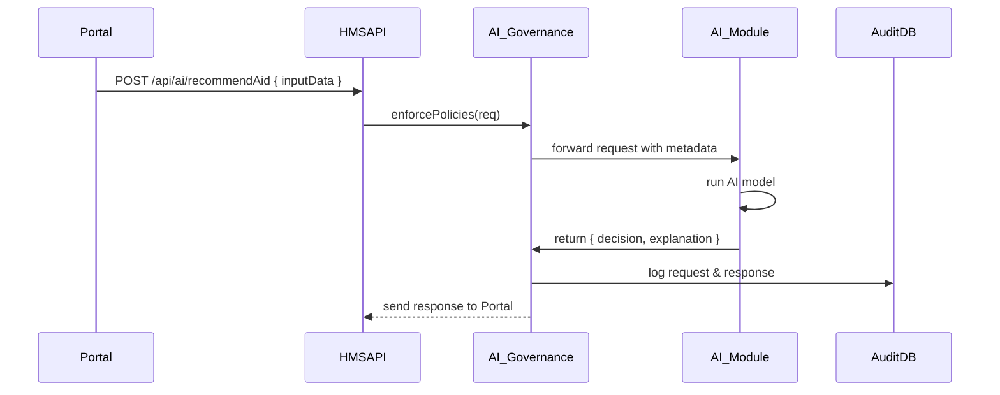

# Chapter 7: AI Governance Framework

In [Chapter 6: External System Sync](06_external_system_sync_.md) we learned how to bring outside data into HMS-CDF. Now we’ll add a “layered constitution” for AI—rules that ensure your AI components are transparent, ethical, and accountable.

## 7.1 Motivation & Central Use Case

Imagine your state runs an **AI‐driven welfare recommendation** service. When a caseworker or citizen portal asks “Who qualifies for housing aid?”, an AI model suggests applicants based on income, family size, and other factors. Sounds great—until you worry:

- Is the model fair?  
- Can citizens see why they were denied?  
- Who’s auditing the system?

An **AI Governance Framework** codifies the answers. Think of it as a layered constitution:

1. Top level: **Values** (transparency, fairness, accountability)  
2. Next: **Regulations** (policies that map values into code)  
3. Then: **Standards** (technical requirements like logging or explainability)  
4. Bottom: **Monitoring Bodies** (audit services that check enforcement)

By the end of this chapter, you’ll see how to declare those layers, enforce rules on every AI call, and log everything for audit.

## 7.2 Key Concepts

1. **Values**  
   High‐level principles your organization cares about (e.g., no bias, full disclosure).

2. **Policies (Regulations)**  
   Code‐friendly rules. For example: “Only approved models may be used in production.”

3. **Standards**  
   Technical specs each AI call must follow. For example:  
   - Include `explanation` metadata.  
   - Write a full request/response log.

4. **Monitoring**  
   A service that reads logs, checks for policy violations, and raises alerts.

## 7.3 Defining Your AI Governance Framework

Below is a minimal example. We define an AI Governance instance that will guard all calls to `/api/ai/*`.

```js
import { AIGovernance } from 'hms-cdf/ai/governance'

// 1. Create your governance config
const welfareAIGov = new AIGovernance({
  id: 'welfare-ai-gov',
  values: ['transparency','fairness','accountability'],
  policies: [
    { name: 'modelApproval', rule: 'mustUseApprovedModel' }
  ],
  standards: [
    { name: 'logging', level: 'full' },
    { name: 'explainability', required: true }
  ],
  monitoringEndpoint: '/ai-monitor'  // audit service path
})

// 2. Register it
welfareAIGov.initialize()
```

Explanation:  
- We list our **values**, a simple **policy** (only approved models), our **standards**, and where the **monitor** will listen.  
- Calling `initialize()` saves this config and wires up a pre‐request hook for AI routes.

## 7.4 Runtime Flow

What happens when the citizen portal calls an AI Module (see [Chapter 3: Module](03_module__modules___.md)) at `/api/ai/recommendAid`?  



Step‐by‐step:  
1. **HMS-API** receives the AI call.  
2. **AI Governance** checks policies (model approval), applies standards (attach explainability), then forwards.  
3. **AI Module** runs the model and returns an answer plus explanation.  
4. **AI Governance** logs everything in **AuditDB**.  
5. Response goes back to the portal.

## 7.5 Under the Hood

Here’s a simplified look at how `AIGovernance` works.

### 7.5.1 Initialization (ai/governance.ts)

```ts
export class AIGovernance {
  constructor(private cfg) {}

  initialize() {
    // 1) Persist governance config
    Database.save('aiGovernance', this.cfg)

    // 2) Attach enforcement hook to all /api/ai/* routes
    ApiRouter.use('/ai', this.enforce.bind(this))
  }
}
```

- We save the config so it can be inspected later.  
- We mount a middleware on all AI routes.

### 7.5.2 Enforcement Method

```ts
private async enforce(req, res, next) {
  // 1) Check model is approved
  if (!this.isModelAllowed(req.body.modelId)) {
    return res.status(403).send({ error: 'Unapproved model' })
  }
  // 2) Attach explanation flag
  req.headers['x-ai-explain'] = 'true'
  // 3) Let the request proceed
  next()
  // 4) After response, log everything
  AuditDB.save('aiCalls', {
    path: req.path,
    input: req.body,
    output: res.locals.aiOutput
  })
}
```

- **isModelAllowed()** looks up the approved‐model list.  
- We force an explainability header.  
- After the AI Module sends its result (stored in `res.locals.aiOutput`), we write a log.

## 7.6 Recap & Next Steps

You’ve learned how to:

- Declare an **AI Governance Framework** with values, policies, standards, and monitoring.  
- Enforce those rules on every AI call via a middleware hook.  
- Log requests and responses for full auditability.

Next, we’ll build the **Admin Portal** where you can view and tweak these settings in [Chapter 8: Admin Portal (HMS-GOV)](08_admin_portal__hms_gov__.md).

---

Generated by [AI Codebase Knowledge Builder](https://github.com/The-Pocket/Tutorial-Codebase-Knowledge)