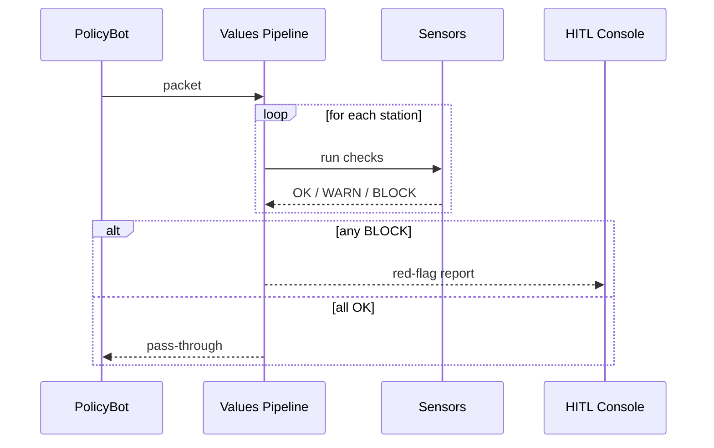

# Chapter 7: AI Governance Values Pipeline
[← Back to Chapter 6: Human-in-the-Loop (HITL) Oversight Console](06_human_in_the_loop__hitl__oversight_console_.md)

---

## 1 Why Do We Need a “Digital OMB Clearance Desk” for Every Byte?

Imagine the **Federal Committee on Statistical Methodology (FCSM)** is about to publish an AI-generated *Statistical Standards Update*.  
Before anything hits the Federal Register the draft must be:

1. **Truthful** – no hallucinated numbers,  
2. **Transparent** – all data sources cited,  
3. **Ethical & Safe** – no hidden bias against small-area populations,  
4. **Privacy-Preserving** – no microdata leakage,  
5. **Logged** – so GAO can audit next year.

Doing these checks by hand is slow and error-prone.  
The **AI Governance Values Pipeline (GVP)** turns those 5 checks into an **automatic conveyor belt**: each “packet” (draft, dataset, API response) rolls past sensors; anything suspicious is stopped, labelled in red, and kicked back to a human reviewer.

Result: *OMB-style clearance*—but continuous, not quarterly.

---

## 2 Key Concepts (Plain English)

| Term | What It Really Means | Government Analogy |
|------|---------------------|--------------------|
| **Packet** | A unit of content (JSON, PDF, or API response) | One filled-out SF-424 form |
| **Station** | A step on the belt that enforces a value (truth, privacy …) | “OMB Desk Officer” for that form |
| **Sensor** | Code that inspects packets at a station | A federal auditor with a checklist |
| **Flag** | Result of a sensor test (`OK`, `WARN`, `BLOCK`) | Green / yellow / red sticky note |
| **Logbook** | Immutable record of every sensor verdict | OMB clearance file stored at NARA |

Keep these five words in mind—everything else just wires them together.

---

## 3 Your First Conveyor Belt in 18 Lines

Goal: run a **policy draft** through all stations; block it if any sensor shouts “red”.

### 3.1 Install & Authenticate
```bash
pip install hms-gvp
export HMS_GVP_TOKEN="demo-sandbox-token"
```

### 3.2 Build & Run the Pipeline
```python
from hms_gvp import Pipeline, TruthSensor, PrivacySensor, SafetySensor

belt = Pipeline(name="FCSM_Policy_Belt")      # 1️⃣ create belt

belt.add_station("truth",   TruthSensor())    # 2️⃣ add stations
belt.add_station("privacy", PrivacySensor(k_anonymity=11))
belt.add_station("safety",  SafetySensor())

packet = {
    "id":   "draft-2024-08",
    "type": "policy_draft",
    "text": "All counties with <5 cases will be suppressed …",
    "sources": ["NCHS Table B", "ACS 2023"]
}

report = belt.inspect(packet)                 # 3️⃣ run inspection
print(report.summary())
```

Example output
```
Pipeline: FCSM_Policy_Belt
Result : BLOCKED (1 red, 1 yellow, 1 green)
• truth   ✅  (0 issues)
• privacy 🔴  k-anonymity < 11  → requires aggregation
• safety  🟡  language may stigmatize small counties
```

Explanation (3 bullets):

* We create a `Pipeline` and attach three **Stations**.  
* `inspect()` rolls the `packet` through each station.  
* A human sees a one-page verdict instead of 80 pages of logs.

---

## 4 What Happens Under the Hood?



Takeaway: The **Pipeline**, not the authoring bot, decides if content proceeds or gets escalated.

---

## 5 A Peek at the Implementation (Super-Short)

_File: `hms_gvp/core/pipeline.py`_
```python
class Pipeline:
    def __init__(self, name):
        self.name = name
        self.stations = []

    def add_station(self, label, sensor):
        self.stations.append((label, sensor))

    def inspect(self, packet):
        verdicts = {}
        for label, sensor in self.stations:
            verdicts[label] = sensor.check(packet)
            if verdicts[label].level == "BLOCK":
                break                           # stop belt early
        return Report(self.name, verdicts)
```

Notes for beginners:

1. `stations` is just a list of `(label, sensor)` tuples.  
2. Each `sensor` exposes a single `check()` method returning `OK / WARN / BLOCK`.  
3. Pipeline halts on the first **red flag**—saves compute and prevents leaks.

---

## 6 Connecting Existing HMS Components

| Source | How It Uses the Belt |
|--------|----------------------|
| Agents from [AI Agent Framework](04_ai_agent_framework__hms_agt__.md) | Call `belt.inspect()` before replying to citizens. |
| Drafts in [HITL Oversight Console](06_human_in_the_loop__hitl__oversight_console_.md) | Red-flagged packets are auto-queued for supervisors. |
| Legal checks in [Legal & Compliance Reasoner (HMS-ESQ)](08_legal___compliance_reasoner__hms_esq__.md) | Provides extra **Ethics Sensors** you can plug into a station. |

The Pipeline is **middleware**—everything either enters it or comes from it.

---

## 7 Adding Your Own Sensor in 12 Lines

Suppose FCSM wants a *BiasSensor* that screams if the word “urban” appears more than “rural”.

```python
from hms_gvp import Sensor, Verdict

class BiasSensor(Sensor):
    def check(self, packet):
        text = packet.get("text", "").lower()
        if text.count("urban") > text.count("rural") * 2:
            return Verdict("BLOCK", "Possible urban bias")
        return Verdict("OK")

belt.add_station("bias", BiasSensor())
```

• `Sensor` is an abstract base class; override `check()`.  
• `Verdict(level, note)` wraps status + human-readable note.  
• The new station will appear automatically in the report.

---

## 8 Viewing the Logbook (2 Lines)

```python
from hms_gvp import logs
print(logs.tail(3))          # show last 3 packets + verdicts
```

Every sensor verdict is stored with:

* timestamp,  
* packet ID & hash,  
* station label,  
* level + note,  
* reviewer (auto “pipeline” or human username).

Auditors can replay the entire belt months later.

---

## 9 Common Troubleshooting

| Symptom | Probable Cause | Quick Fix |
|---------|----------------|-----------|
| All packets **BLOCKED** | Over-strict sensor thresholds | Lower thresholds e.g. `PrivacySensor(k=5)`. |
| Logbook empty | `log_path` env var missing | `export GVP_LOG_PATH=~/gvp.log`. |
| Sensors never fire | Forgot `belt.inspect(packet)` | Ensure call sits **before** sending data out. |
| HITL queue not receiving red flags | HITL integration disabled | `belt.on_block = hitl.enqueue` callback. |

---

## 10 Recap & Next Steps

You learned to:

1. Build a **conveyor belt** that enforces transparency, truth, safety, ethics, and privacy.  
2. Plug canned and custom **Sensors** into stations.  
3. Automatically route red-flagged items to human reviewers.  
4. Keep an immutable **Logbook** for future audits.

Next we’ll dive deeper into the legal smarts behind some of those sensors—head over to  
[Chapter 8: Legal & Compliance Reasoner (HMS-ESQ)](08_legal___compliance_reasoner__hms_esq__.md).

---

---

Generated by [AI Codebase Knowledge Builder](https://github.com/The-Pocket/Tutorial-Codebase-Knowledge)