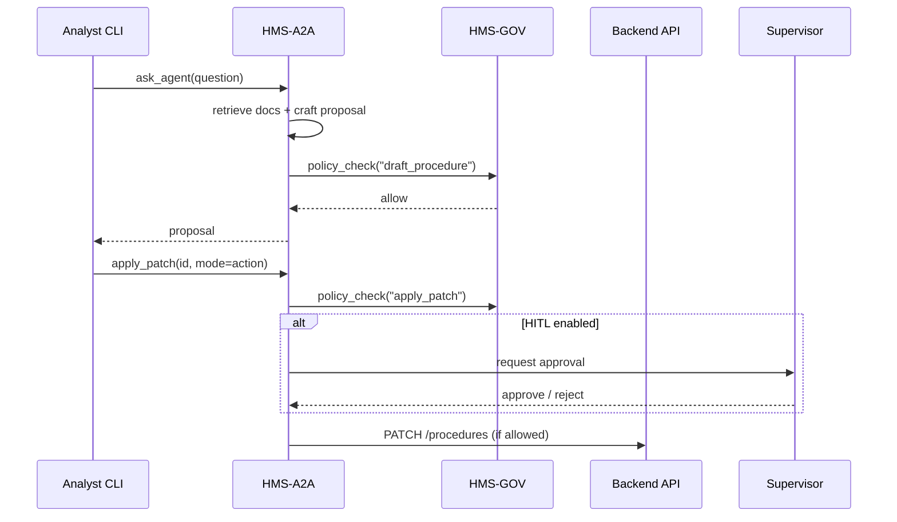

# Chapter 7: AI Representative Agent (HMS-A2A)

[← Back to Intent-Driven Navigation](06_intent_driven_navigation_.md)

---

## 1. Why Do We Need an “AI Representative Agent”?

Picture the **Office of Juvenile Justice**.  
Parents lodge daily complaints that first-offender hearings take **70+ days**.  
Analysts know:

* wait-time CSVs live in a data lake,  
* policies are buried in 300-page statutes,  
* staff are swamped with paperwork.

What if a **virtual junior analyst** could:

1. Read the complaints, numbers, and laws,  
2. Draft a new *“30-Day Fast-Track”* procedure,  
3. Submit the patch to the backend — **only if** Governance rules allow,  
4. Or politely wait for a human supervisor to click “Approve”.

That junior analyst is our **AI Representative Agent (HMS-A2A)**.

> Think of HMS-A2A as the *policy intern you never have to onboard*—  
> it suggests or implements improvements while staying inside clear guardrails.

---

## 2. Key Concepts in Plain English

| Concept | What it really means | Friendly analogy |
|---------|----------------------|------------------|
| Representative Agent | LLM-powered container that does policy analysis | Intern with instant access to every PDF |
| Knowledge Pack | Indexed bundle of complaints, metrics, laws | 3-ring binder on the intern’s desk |
| Prompt Template | Text that tells the agent *how* to think (“Return JSON patch…”) | Fill-in-the-blank worksheet |
| Draft Mode | Agent writes suggestions only | Sticky note handed to supervisor |
| Action Mode | Agent can call Backend API to push changes | Intern files the paperwork directly |
| HITL Override | Human must click *Approve* | Manager’s signature |
| Governance Gate | Automatic policy check before any API call | Firewall around the filing cabinet |
| Container Isolation | Agent runs in its own sandbox | Intern sits in a glass office—can’t steal files |

---

## 3. Quick-Start: Fix Our 70-Day Wait-Time in 12 Lines

### 3.1 Ask for a Recommendation

```python
# file: demo_agent.py
from hms_a2a import ask_agent, apply_patch

proposal = ask_agent(
    question="Draft a procedure to keep first-offender hearings under 30 days.",
    knowledge_packs=["ojj_complaints", "wait_times_2023", "juvenile_statutes"]
)

print(proposal["summary"])
```

What you’ll see (abridged):

```
🏛️  Proposal Summary:
• Create “Fast-Track Intake” slot on Tuesdays
• Auto-schedule judge within 3 days of filing
• Re-route nonviolent cases to mediation
```

### 3.2 (Optional) Let the Agent Push the Change

```python
if proposal["confidence"] > 0.80:
    apply_patch(proposal["patch_id"], mode="action")   # <= may trigger HITL
```

• If **Governance** allows and no Human-In-The-Loop (HITL) is configured, the backend receives the patch automatically.  
• Otherwise the patch lands in a “📝 Pending Approval” queue for a supervisor.

---

## 4. What Happens Behind the Curtain?



---

## 5. Inside the Code (Mini Tour)

### 5.1 Public Facade (`hms_a2a/__init__.py`)

```python
import uuid, json
from .llm import run_prompt
from .guardrails import gov_check, hitl_check
from .backend import send_patch

def ask_agent(question, knowledge_packs):
    prompt = _build_prompt(question, knowledge_packs)
    draft  = run_prompt(prompt)                 # LLM call
    gov_check("draft_procedure")                # Governance gate
    return json.loads(draft)                    # → dict with summary, patch_id

def apply_patch(patch_id, mode="draft"):
    gov_check("apply_patch")
    if mode == "action":
        hitl_check(patch_id)                    # may block
        return send_patch(patch_id)             # POST to backend
    return "saved_as_draft"
```

Walk-through  
1. `run_prompt` talks to the LLM vendor behind the scenes.  
2. `gov_check` denies the action if, say, the user’s role lacks permission.  
3. `hitl_check` pings a supervisor queue—covered in next chapter.  
4. `send_patch` calls the [Backend API Gateway](09_backend_api_gateway__hms_api__.md).

### 5.2 Prompt Builder (`hms_a2a/prompt.py`)

```python
SYSTEM = """
You are an OJJ policy analyst. 
Return a JSON with keys: summary, patch_id, confidence.
"""

def _build_prompt(question, packs):
    sources = "\n".join(f"<doc>{p}</doc>" for p in packs)
    return SYSTEM + sources + f"\n\nUser: {question}"
```

• Keeps prompts short; ensures the answer is machine-readable.

### 5.3 Guardrails (`hms_a2a/guardrails.py`)

```python
from hms_gov import check_permission

def gov_check(action):
    if not check_permission(role=current_role(), action=action, resource="a2a"):
        raise PermissionError("Governance deny")

def hitl_check(patch_id):
    if _hitl_enabled():
        queue.add(patch_id)   # human must approve
        raise RuntimeError("Awaiting HITL approval")
```

Less than 10 lines yet enforces both **Governance** and **HITL**.

---

## 6. Safety Nets in Plain English

1. **Governance First** – Every call funnels through [Governance Layer](01_governance_layer__hms_gov__.md).  
2. **Role-Based Access** – Only roles like `PolicyAnalyst` may trigger `apply_patch`. ([RBAC](04_role_based_access_control__rbac__.md))  
3. **Container Sandbox** – The agent can touch *only* its mounted data packs.  
4. **Audit Trail** – Each LLM prompt & response is logged to the same evidence bucket used in the [Security & Compliance Framework](03_security___compliance_framework_.md).  
5. **HITL Failsafe** – Supervisors have the final say. Next chapter dives deeper.

---

## 7. Common Pitfalls & Quick Fixes

| Pitfall | Symptom | Quick Fix |
|---------|---------|-----------|
| Prompt returns free-form text | `json.loads` fails | Add “Return JSON only” line to `SYSTEM` prompt |
| Governance deny errors | `PermissionError` raised | Ensure your role has `policy_analyst` in RBAC |
| Patch loops forever in HITL | Stays “Pending” | Supervisor must approve in [Human-In-The-Loop Decision Point](08_human_in_the_loop_decision_point_.md) |
| Agent pulls wrong data | Outdated Knowledge Pack | Rebuild the pack: `hms_a2a build-pack complaints_2023.csv` |

---

## 8. Try It Yourself

1. `pip install hms-a2a` (mock package).  
2. Copy `demo_agent.py` and run it.  
3. Review `a2a_audit.log` to see the full LLM prompt & response.  
4. Toggle `mode="action"` and watch it land in the HITL queue.  
5. In the supervisor console, click **Approve** and confirm the backend patch.

---

## 9. What You Learned

✓ How an **AI Representative Agent** turns raw complaints + laws into actionable policy patches.  
✓ The difference between **Draft Mode**, **Action Mode**, and **HITL**.  
✓ How Governance, RBAC, and audit logs keep the AI on a short leash.  
✓ Minimal code to interact with, and peek inside, HMS-A2A.

Next we’ll zoom into that supervisor console and learn how the **Human-In-The-Loop Decision Point** works.

[Continue to Human-In-The-Loop Decision Point](08_human_in_the_loop_decision_point_.md)

---

Generated by [AI Codebase Knowledge Builder](https://github.com/The-Pocket/Tutorial-Codebase-Knowledge)