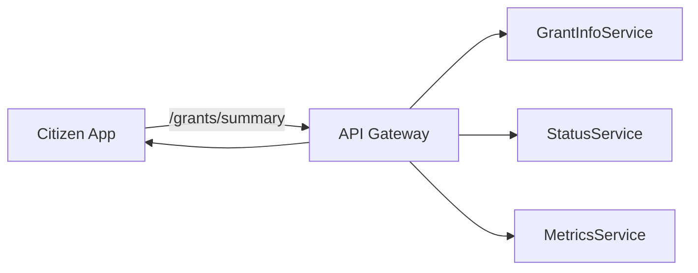
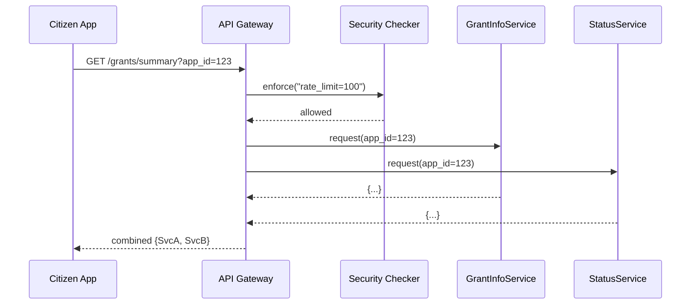

# Chapter 7: API Gateway

Welcome back! In [Chapter 6: Frontend Component Library](06_frontend_component_library_.md) we built reusable UI widgets. Now let’s learn how to expose backend services through a single “front desk” API that routes, secures, and even combines responses. This is the **API Gateway**.

---

## 1. Why an API Gateway?

Imagine the Rural Business-Cooperative Service runs three microservices:

- **GrantInfoService**: returns details about a grant program  
- **StatusService**: returns an application’s status  
- **MetricsService**: returns usage statistics  

Without a gateway, callers must know each URL and handle security and aggregation themselves. An **API Gateway** is like the receptionist at a federal building:

1. You arrive and show your credentials → gateway enforces security.  
2. You ask for “grant summary” → gateway calls the right offices and combines answers.  
3. You never see internal office doors (microservices) directly.

This centralizes routing, security, and response aggregation.



---

## 2. Key Concepts

- **Route**  
  A path (e.g. `/grants/info`) exposed to callers, mapped internally to one or more services.  
- **Security Policy**  
  Rules applied per route (rate limiting, authentication, CORS).  
- **Aggregation**  
  Combining multiple service responses into one.  
- **Service Shielding**  
  Internal services stay hidden—only the gateway’s endpoint is public.

---

## 3. Using the API Gateway

Here’s a minimal example. We’ll:

1. Create a gateway.  
2. Register simple and aggregated routes.  
3. Add a rate-limit policy.  
4. Handle a fake request.

```python
# File: app.py
from hms_ach.api_gateway import ApiGateway

gateway = ApiGateway()

# 1. Register single‐service routes
gateway.register_route("/grants/info", service="GrantInfoService")
gateway.register_route("/grants/status", service="StatusService")

# 2. Register an aggregated route
gateway.register_route(
    "/grants/summary",
    services=["GrantInfoService", "StatusService"]
)

# 3. Apply a simple rate‐limit policy
gateway.add_security_policy("/grants", policy="rate_limit=100")

# 4. Simulate handling a GET request
response = gateway.handle_request(
    method="GET",
    path="/grants/summary",
    params={"app_id": "RB-2024-001"}
)
print(response)
# Expected output:
# {
#   "GrantInfoService": "GrantInfoService response...",
#   "StatusService":  "StatusService response..."
# }
```

Explanation:

- `register_route` maps public paths to service names.  
- Aggregated routes list multiple services.  
- `add_security_policy` attaches policies by path prefix.  
- `handle_request` enforces policies, routes calls, and returns combined results.

---

## 4. Under the Hood: Step-by-Step Flow

When a client calls `GET /grants/summary`:



1. **Policy Enforcement**: gateway checks rate limits or auth.  
2. **Routing**: gateway finds which service(s) to call.  
3. **Service Calls**: gateway invokes each microservice.  
4. **Aggregation**: gateway merges responses and returns to client.

---

## 5. Peek at the Implementation

Below is a very simple `api_gateway.py` to illustrate these ideas.

```python
# File: hms_ach/api_gateway.py

class ApiGateway:
    def __init__(self):
        self.routes = {}    # path -> service or list
        self.policies = {}  # path prefix -> policy

    def register_route(self, path, service=None, services=None):
        # Single or multiple backends
        self.routes[path] = services or service

    def add_security_policy(self, prefix, policy):
        self.policies[prefix] = policy

    def handle_request(self, method, path, params):
        # 1. Enforce matching policies
        for prefix, pol in self.policies.items():
            if path.startswith(prefix):
                print(f"Enforcing policy: {pol}")
        # 2. Route to service(s)
        target = self.routes.get(path)
        # 3. Call one or many services
        if isinstance(target, list):
            return {s: self.call_service(s, params) for s in target}
        return self.call_service(target, params)

    def call_service(self, svc_name, params):
        # Placeholder for real network call
        return f"{svc_name} response for {params}"
```

Explanation:

- `self.routes` stores mappings.  
- `register_route` handles both single and list targets.  
- `handle_request` loops policies, then dispatches.  
- `call_service` simulates a backend call (in real life you'd use HTTP or gRPC).

When you tie this gateway to real microservice clients (see [Microservice](09_microservice_.md)), you get a unified, secure, and simplified front door.

---

## 6. Conclusion

You’ve learned how the **API Gateway**:

- Acts as a single front desk for all backend services.  
- Enforces security policies centrally.  
- Routes requests and even aggregates multiple responses.  

Next up, we’ll dig deeper into security with **[Authentication & Authorization](08_authentication___authorization_.md)**.

---

Generated by [AI Codebase Knowledge Builder](https://github.com/The-Pocket/Tutorial-Codebase-Knowledge)