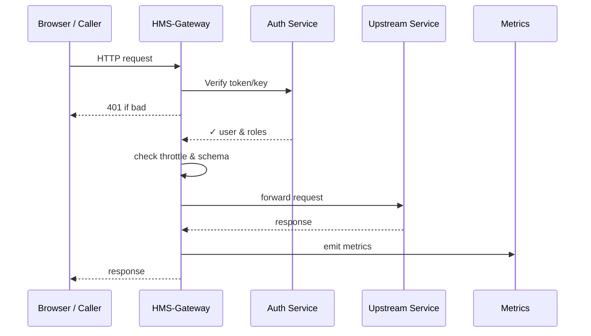

# Chapter 7: Backend API Gateway  

*A friendly sequel to* [Management Layer (HMS-SVC & HMS-ACH)](06_management_layer__hms_svc___hms_ach__.md)  

---

## 1. Why Do We Need a “Secure Turnstile”?

Picture the **Federal Library and Information Network (FEDLINK)**.  
It runs dozens of micro-services:

* `/books/search` – public  
* `/orders/place` – librarians only  
* `/funds/transfer` – Treasury-grade sensitive  

Without a **single doorway**, each team would build its own login, rate-limiter, and logging scheme—creating a maze of inconsistent gates.

**The Backend API Gateway (HMS-GW)** is that *one* government-wide doorway:

1. Checks your badge (authentication).  
2. Sees if you’re allowed in (authorization & roles).  
3. Counts how often you pass (throttling).  
4. Makes sure you carry the right forms (request/response schema validation).  
5. Stamps the log book for auditors (central metrics & tracing).

Think of HMS-GW as the security desk in the lobby of a federal building—every package and person goes through the same X-ray before reaching any office.

---

## 2. Key Concepts (Plain-English)

| Term | Beginner Explanation |
|------|----------------------|
| **Route** | A path you expose, e.g., `GET /books/search`. |
| **API Key / Token** | Your digital badge; proves *who* is calling. |
| **Policy** | Rules attached to a route—who can call, how often, and required JSON shape. |
| **Throttling** | Automatic speed limit (“max 100 calls/min per key”). |
| **Schema Validation** | The X-ray machine: blocks requests or responses that don’t match an agreed JSON schema. |

---

## 3. A 3-Minute Walk-Through: Opening `/books/search`

We’ll expose a **read-only search** endpoint for public users, limited to **60 calls per minute**.

### 3.1 Describe the Route (YAML, 14 lines)

```yaml
# file: routes/books_search.yaml
id: fedlink.books.search.v1
path: /books/search
methods: [GET]
upstream_url: http://books-svc.internal/search
auth: public       # no login required
throttle:
  rate: 60         # requests
  period: 60       # seconds
schema:
  response: book_list.json   # stored in Versioned Policy Store
```

Explanation:  
* Calls hitting `/books/search` are forwarded to the internal `books-svc` only if they pass throttle + schema checks.

### 3.2 Register the Route

```bash
hms gw apply routes/books_search.yaml
```

CLI output:

```
✓ Route fedlink.books.search.v1 active
```

### 3.3 Call It from the Portal (JavaScript, 7 lines)

```js
fetch('https://api.hms.gov/books/search?q=astronomy')
  .then(r => r.json())
  .then(list => console.log(list));
```

Result: an array of books, rate-limited to 60 calls/min per IP.  
No portal code change if the backend URL ever moves—only the Gateway config updates.

---

## 4. A Protected Route: `/funds/transfer`

Now a **sensitive** endpoint that only “Finance Officer” roles can access and must carry a JSON body matching `transfer_req.json`.

```yaml
# file: routes/funds_transfer.yaml
id: fedlink.funds.transfer.v1
path: /funds/transfer
methods: [POST]
upstream_url: http://finance-svc.internal/transfer
auth: token        # JWT or API key
rbac_roles: [FINANCE_OFFICER]
throttle:
  rate: 10
  period: 60
schema:
  request: transfer_req.json
  response: transfer_resp.json
audit: true         # always log full request id
```

Apply with the same `hms gw apply` command.  
We’ll meet `rbac_roles` in the next chapter.

---

## 5. What Happens Under the Hood?



Only five actors—easy to remember!

---

## 6. Tiny Peek at Gateway Plugins

### 6.1 Rate-Limiter Plugin (Go, 12 lines)

```go
func RateLimit(c *Context, limit int, window time.Duration) error {
  key := c.ApiKey + ":" + c.RouteID
  count := redis.Incr(key)
  if count == 1 { redis.Expire(key, window) }

  if count > limit {
     return c.Fail(429, "Too Many Requests")
  }
  return nil
}
```

Explanation:  
* `redis.Incr` tallies hits per key per window.  
* When over the limit, it returns **HTTP 429** before the request reaches any service.

### 6.2 JSON Schema Validator (Node.js, 15 lines)

```js
import Ajv from 'ajv';
const ajv = new Ajv();

export function validate(body, schema) {
  const valid = ajv.validate(schema, body);
  if (!valid) {
    throw { status: 400, msg: ajv.errorsText() };
  }
}
```

Attached as pre-request and post-response hooks in the Gateway.

---

## 7. Connecting with Other HMS Layers

| Layer | Why It Matters |
|-------|----------------|
| [Governance Layer](03_governance_layer__hms_gov__.md) | Stores throttle & auth policies—Gateway reads them dynamically. |
| [Role-Based Access Control (RBAC)](08_role_based_access_control__rbac__.md) | Gateway checks `rbac_roles` before forwarding. |
| [Observability & Metrics Pipeline](13_observability___metrics_pipeline_.md) | Gateway pushes per-route metrics (`latency`, `429_count`). |
| [Data Privacy & Compliance Layer](09_data_privacy___compliance_layer_.md) | Scrubs PII from logs generated by Gateway. |

---

## 8. Quick-Start Checklist

1. Write a **route YAML** with `path`, `upstream_url`, and policies.  
2. Run `hms gw apply <file>`.  
3. (If protected) issue API keys or JWT tokens via HMS-Auth.  
4. Monitor calls in the Observability dashboard.  
5. Update YAML anytime—no need to redeploy micro-services.

---

## 9. FAQ for Beginners

**Q: Do I redeploy Gateway to add a new route?**  
No. `hms gw apply` hot-loads the config.

**Q: Can I test locally?**  
Yes. Run `hms gw start --mock` which spins up a Docker container on `localhost:8080` with the same plugins.

**Q: What if my service needs WebSockets or gRPC?**  
Gateway supports TCP pass-through routes—schema and throttle plugins still work.

---

## 10. Summary & What’s Next

In this chapter you learned:

• HMS-Gateway is the single, secure doorway for every API call.  
• You declared public and protected routes in plain YAML.  
• Gateway enforced authentication, role checks, throttling, and schema validation—with no extra code in services.  
• You peeked at the tiny plugins doing the heavy lifting.  

Next, we’ll zoom in on **who** is allowed to do **what** across the platform. Grab your clearance badge and continue to [Role-Based Access Control (RBAC)](08_role_based_access_control__rbac__.md).

---

Generated by [AI Codebase Knowledge Builder](https://github.com/The-Pocket/Tutorial-Codebase-Knowledge)