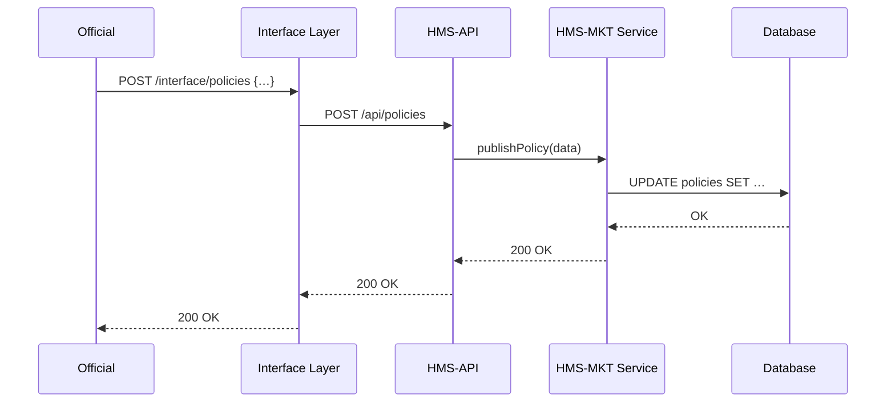

# Chapter 7: Backend API (HMS-API/HMS-MKT)

In [Chapter 6: Human-in-the-Loop (HITL) Oversight](06_human_in_the_loop__hitl__oversight_.md) we added a human review checkpoint for AI proposals. Now let’s look under the hood at the **Backend API**, our system’s secure bridge between frontends, AI agents, and downstream services like **HMS-MKT**. Think of it as the city’s central permit office: it validates, routes, and logs every request.

---

## 1. Why a Backend API?

Imagine a government clerk clicks “Publish Policy” in the secure portal. That action must:

1. Verify the clerk’s identity and permissions.
2. Ensure the data is well-formed.
3. Forward the request to the right internal service (e.g., HMS-MKT).
4. Log the change for audits.
5. Return a clear success or error back to the portal.

Without a single gateway, every frontend or AI agent would duplicate this logic—leading to security gaps, inconsistent APIs, and extra maintenance.

---

## 2. Key Concepts

1. **Secure Gateway**  
   – Central entry point for all API calls.  
   – Enforces HTTPS, tokens, CORS.

2. **Authentication & Authorization**  
   – Checks JWTs or API keys.  
   – Maps callers to roles (official, agent, service).

3. **Routing to Services**  
   – `/policies` → HMS-MKT subsystem.  
   – `/foia` → FOIA service, `/metrics` → monitoring.

4. **Validation**  
   – Uses schemas (e.g., JSON Schema) to catch bad data early.

5. **Auditing & Logging**  
   – Every request/response is recorded with user ID, timestamp, endpoint.

6. **Rate Limiting**  
   – Prevents overload and abuse (e.g., max 100 requests/min).

---

## 3. Calling the Backend API

Here’s how your Interface Layer or frontend code talks to the API:

```js
// src/backend/apiClient.js
const fetch = require('node-fetch');

async function post(endpoint, data, token) {
  const res = await fetch(`https://api.hms.gov${endpoint}`, {
    method: 'POST',
    headers: {
      'Content-Type': 'application/json',
      'Authorization': `Bearer ${token}`
    },
    body: JSON.stringify(data)
  });
  return res.json(); // parsed JSON from API
}

module.exports = { post };
```
This simple client always sends a JWT token and JSON.  

Now use it in a handler:

```js
// src/interface/handlers/publishPolicy.js
const apiClient = require('../../backend/apiClient');

async function publish(req, res) {
  // req.user.token set by auth middleware
  const result = await apiClient.post(
    '/policies',
    { proposalId: req.body.id, threshold: req.body.threshold },
    req.user.token
  );
  res.json(result);
}

module.exports = { publish };
```
When an official clicks “Publish,” our Interface Layer forwards the decision to `/policies`.

---

## 4. Under the Hood: Sequence Diagram

Here’s what happens step-by-step when the portal publishes a policy:



1. **Interface Layer** accepts `/interface/policies`.  
2. **HMS-API** authenticates, validates, and routes to HMS-MKT.  
3. **HMS-MKT Service** updates the database.  
4. Responses bubble back in order.

---

## 5. Backend API Code Snippets

### 5.1 Route Definition

```js
// hms-api/src/routes/policies.js
const express = require('express');
const { publishPolicy } = require('../handlers/policies');
const router = express.Router();

// Main entry point for policy changes
router.post('/policies', publishPolicy);

module.exports = router;
```
This file wires HTTP POST `/policies` to our handler.

### 5.2 Handler Logic

```js
// hms-api/src/handlers/policies.js
const mkt = require('../../services/mktService');

async function publishPolicy(req, res) {
  // 1. (Auth & validation middleware ran earlier)
  const result = await mkt.publish(req.body);
  // 2. Audit log
  console.log(`User ${req.user.id} published ${req.body.proposalId}`);
  // 3. Return result to caller
  res.json(result);
}

module.exports = { publishPolicy };
```
The handler calls HMS-MKT via a simple service API, logs the action, then replies.

---

## 6. What We’ve Learned

- The **Backend API** is our secure, centralized gateway—validating, routing, logging, and rate-limiting requests.  
- We saw how a policy publication flows from the portal to HMS-API to HMS-MKT and back.  
- Key pieces: route definitions, handlers, service calls, and an `apiClient` wrapper.

Next up, we’ll expand our reach and connect to outside systems. See [Chapter 8: External System Integration](08_external_system_integration_.md) to learn how HMS-NFO talks with third-party data sources and federal databases.

---

Generated by [AI Codebase Knowledge Builder](https://github.com/The-Pocket/Tutorial-Codebase-Knowledge)