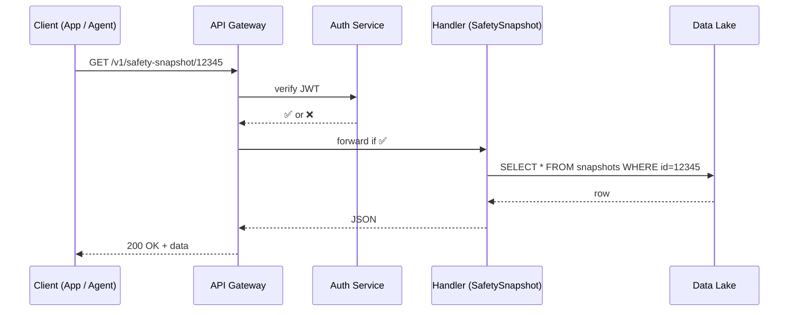

# Chapter 7: Backend Service & Public API (HMS-SVC / HMS-MKT)

[← Back to Chapter&nbsp;6: Protocol Builder UI](06_protocol_builder_ui_.md)

---

## 1. Why Do We Need a “Secure Loading Dock”?

Imagine the Federal Motor Carrier Safety Administration (FMCSA) releasing a mobile app that lets truckers:

1. Pull their **Safety Snapshot**.  
2. Share it with a potential employer.  
3. Submit real-time logbook data.

At 2 a.m. the same gateway is also hit by:

* An **AI agent** that scores crash risk (see [AI Representative Agent](04_ai_representative_agent__hms_agt___agx__.md)).  
* A **third-party fleet vendor** syncing inspections.  

Everyone must walk through one guarded door—**HMS-SVC / HMS-MKT**—which:

* Verifies identity (Auth).  
* Enforces speed limits (Rate-Limit).  
* Checks paperwork (Schema / Version).  

No secret side doors, no midnight code paths.

---

## 2. Key Concepts in Plain English

| Word | Think “What” |
|------|--------------|
| API Gateway | The guard booth; first stop for every request. |
| Resource | A named thing you can ask for (`/safety-snapshot`). |
| Version (`v1`, `v2`) | A lane on the highway; new lanes never break old trucks. |
| Auth Token (JWT) | Your federal ID badge; proves who you are. |
| Rate Limit | A speed limit sign; e.g., 60 calls/min per token. |
| Service Adapter | Tiny file that knows how to fetch/update the real database. |
| OpenAPI Doc | The traffic map; every lane, every exit defined. |

Keep these seven ideas handy; they unlock 80 % of HMS-SVC.

---

## 3. Guided Walk-Through: “Get Safety Snapshot”

Goal: a mobile app shows a driver’s FMCSA safety record.

### 3.1 One-Line Call (client side)

```js
const res = await fetch(
  'https://api.hms.gov/v1/safety-snapshot/driver/12345', {
    headers: { 'Authorization': 'Bearer eyJhbGciOi...' }
  })
console.log(await res.json())
```

Expected JSON (partial):

```json
{
  "driverId": "12345",
  "crashScore": 88,
  "violations": 2,
  "latestInspection": "2024-05-03"
}
```

If the caller blasts 1000 requests/minute, the gateway answers `429 Too Many Requests`. If the JWT is expired, it returns `401 Unauthorized`. Same rules for apps, AI agents, or vendors.

---

## 4. What Happens Under the Hood?



Only five actors—easy to trace.

---

## 5. Minimal Server Code (All < 20 Lines!)

_File: `svc/src/routes/safety.ts`_

```ts
import { Router } from 'express'
export const router = Router()

router.get('/:driverId', async (req, res) => {
  const id = req.params.driverId
  // 1) Simple schema check
  if (!/^\d+$/.test(id)) return res.status(400).send('Bad ID')

  // 2) Fetch from data lake (fake DB call)
  const row = await db('snapshots').where({ driverId: id }).first()

  // 3) If not found, 404
  if (!row) return res.status(404).send('Not found')

  // 4) Return only allowed fields
  res.json({
    driverId: row.driverId,
    crashScore: row.crashScore,
    violations: row.violations,
    latestInspection: row.latestInspection
  })
})
```

_File: `svc/src/index.ts`_

```ts
import express from 'express'
import rateLimit from 'express-rate-limit'
import { router as safety } from './routes/safety'

const app = express()
app.use('/v1/safety-snapshot', rateLimit({ windowMs: 60_000, max: 60 }))
app.use('/v1/safety-snapshot', safety)

app.listen(3000, () => console.log('HMS-SVC up on :3000'))
```

Explanations:

1. `rateLimit` = hardcoded **60 calls/min** (easy to tweak).  
2. Only path exposed is `/v1/safety-snapshot`.  
3. No token code shown; gateway middleware injects `req.user` after JWT check.

---

## 6. Versioning: Adding `v2` Safely

```ts
// svc/src/routes/safetyV2.ts
router.get('/:driverId', async (req,res) => {
  /* 1) Same look-up as v1 */
  /* 2) New field: carrierName */
})
// index.ts
app.use('/v2/safety-snapshot', safetyV2)
```

The old FMCSA mobile app still calls `/v1` and never breaks; new clients can upgrade when ready.

---

## 7. Publishing Your API Contract (OpenAPI)

Snippet of `openapi.yaml`:

```yaml
paths:
  /v1/safety-snapshot/{driverId}:
    get:
      summary: Get driver safety stats
      parameters:
        - name: driverId
          in: path
          required: true
          schema: { type: string }
      responses:
        '200':
          $ref: '#/components/schemas/SafetySnapshot'
```

Why care?  
• Front-end teams can auto-generate TypeScript clients.  
• [Micro-Frontend Shell](01_hms_mfe_micro_frontend_shell_.md) shows live API docs.  
• Marketplace listings can expose sandbox calls securely.

---

## 8. Connecting to Other HMS Pieces

Component | How They Use the API
----------|---------------------
[HMS-MFE Micro-Frontend Shell](01_hms_mfe_micro_frontend_shell_.md) | Widgets fetch `/v1/safety-snapshot` to display charts.
[HMS-MKT Agent & Data Marketplace](03_hms_mkt_agent___data_marketplace_.md) | Wraps certain endpoints as “data products” with metering.
[AI Representative Agent](04_ai_representative_agent__hms_agt___agx__.md) | Calls the same routes under its own JWT; rate limit is higher but still enforced.
[HMS-ACT Workflow Engine](08_hms_act_orchestration___workflow_engine_.md) | Triggers process steps (e.g., “Notify carrier if crashScore > 90”).

---

## 9. 60-Second Local Test

```bash
# 1. Clone and run
git clone https://github.com/hms-demo/hms-svc
cd hms-svc && npm i && npm run dev

# 2. Seed fake data
curl -X POST localhost:3000/dev/seed

# 3. Call the API
curl -H "Authorization: Bearer test123" \
     localhost:3000/v1/safety-snapshot/12345
```

You should see JSON with `crashScore`, `violations`, etc. Repeat 70 times in a minute and watch `429` appear.

---

## 10. Recap

You now know:

• Why **HMS-SVC / HMS-MKT** is the single guarded gateway for data & commands.  
• The key ideas: tokens, rate limits, versions, adapters.  
• How to expose a new endpoint in < 20 lines and document it with OpenAPI.  
• How other HMS layers (front-end, agents, workflows) reuse the same pipe.

Ready to see **how long-running workflows call these APIs, wait, and react**? Jump to [HMS-ACT Orchestration & Workflow Engine](08_hms_act_orchestration___workflow_engine_.md).

---

Generated by [AI Codebase Knowledge Builder](https://github.com/The-Pocket/Tutorial-Codebase-Knowledge)