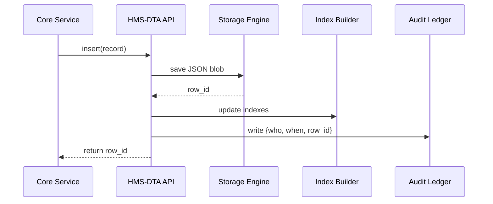

# Chapter 7: Central Data Repository (HMS-DTA)

*(linked from [Core Backend Services (HMS-SVC)](06_core_backend_services__hms_svc__.md))*  

---

## 1. Why a “National Archives” for Our Platform?

Picture the **Chief Acquisition Officers Council (CAOC)** running a public dashboard that shows:

* How many purchase requests were filed this week.  
* Average approval time by agency.  
* Historical decisions for FOIA auditors.

Where does every form, log line, and metric **actually live** so that:

1. AI agents can calculate trends.  
2. Dashboards can paint pretty charts.  
3. Auditors can replay decisions from *three years ago*.

Answer: **Central Data Repository (HMS-DTA)**—our digital National Archives.

> Analogy: HMS-DTA is a giant, well-labeled filing cabinet in a locked room.  
> Anyone can *request* a folder, but only the librarian hands it over.

---

## 2. Key Concepts (Plain-English Cheat-Sheet)

| Concept | What It Really Means | Friendly Analogy |
|---------|---------------------|------------------|
| Collection | A group of similar records (e.g., `passport_forms`). | Drawer in the filing cabinet. |
| Record | One JSON document (a form, a log entry, a metric). | Single file folder. |
| Index | Search helper on one or more fields. | Color tabs so you find folders faster. |
| Role-Based Access | Who may *read* or *write* each collection. | Library card with “Top Secret” clearance level. |
| Retention Policy | How long records stay before archival/purge. | “Keep tax files 7 years.” |

---

## 3. A Five-Minute Walk-Through

### 3.1 Use-Case: Storing a Passport Renewal Form

`HMS-SVC` (backend) has just accepted a citizen’s passport-renewal payload (see last chapter).  
Now it needs to **persist** the data.

```python
# file: svc_store_passport.py
import hms_dta_client as dta

# 1. Compose the record
record = {
    "citizen_id": "CIT-9001",
    "photo_url": "https://photos.gov/alice.jpg",
    "status": "QUEUED",
    "submitted_at": "2024-03-15T14:01:00Z"
}

# 2. Write it to the 'passport_forms' collection
id_ = dta.insert(
    collection="passport_forms",
    doc=record,
    actor="svc_passport@state.gov"   # for audit trail
)

print("Saved as", id_)               # => e.g. PF-8f2c1a
```

**What just happened?**

1. `insert` stored the JSON plus an auto-generated ID.  
2. The write was logged so auditors know *who* saved *what*.  
3. Indexes on `citizen_id` and `submitted_at` make future searches instant.

### 3.2 Later: An AI Agent Reads Aggregated Stats

```python
# file: agent_stats.py
import hms_dta_client as dta

# How many forms arrived today?
count = dta.count(
    collection="passport_forms",
    where={"submitted_at": ">=2024-03-15"}
)

print("Today's volume:", count)
```

The agent didn’t worry about tables, SQL, or credentials; it simply asked DTA.

---

## 4. Under the Hood – What Happens Step-by-Step?



Only **five actors** keep the mental model simple.

---

## 5. Peeking at the Code (Tiny & Friendly)

### 5.1 Public Client (`hms_dta_client.py`)

```python
import requests, os

API = os.getenv("HMS_DTA_URL", "https://dta.gov")

def insert(collection, doc, actor):
    res = requests.post(
        f"{API}/c/{collection}",
        json={"doc": doc, "actor": actor}
    )
    return res.json()["id"]

def count(collection, where):
    res = requests.get(
        f"{API}/c/{collection}/count",
        params=where
    )
    return res.json()["count"]
```

* Less than 15 lines; hides auth/token logic for clarity.  
* Same pattern works for `get()`, `update()`, or `search()`.

### 5.2 Server Endpoint Skeleton (`dta/api.py`)

```python
from fastapi import FastAPI
from .store import save_json, query_count, write_audit
app = FastAPI()

@app.post("/c/{name}")
def create(name: str, payload: dict):
    row_id = save_json(name, payload["doc"])
    write_audit(actor=payload["actor"], action="INSERT", row=row_id)
    return {"id": row_id}

@app.get("/c/{name}/count")
def count(name: str, submitted_at: str = None):
    n = query_count(name, submitted_at)
    return {"count": n}
```

Notice:

* **10 functional lines** – business logic lives in helpers.  
* Every write calls `write_audit` for compliance.

---

## 6. Role-Based Access Control (RBAC)

A YAML snippet defines who can touch what:

```yaml
# file: dta_roles.yml
collections:
  passport_forms:
    read:  ["svc_passport@state.gov", "dashboard@state.gov"]
    write: ["svc_passport@state.gov"]
  health_logs:
    read:  ["cdc_analyst@hhs.gov"]
    write: ["svc_health@hhs.gov"]
```

The API layer simply checks:

```python
def allowed(actor, action, collection):
    return actor in POLICY[collection][action]
```

Beginner takeaway: **one dictionary lookup** enforces the rule.

---

## 7. Indexing 101 – Faster Searches

Create an index in one line:

```python
dta.create_index(
    collection="passport_forms",
    fields=["citizen_id", "submitted_at"]
)
```

Behind the scenes, DTA builds a B-tree (or Cloud-provider equivalent).  
You don’t have to know how—only that searches get faster.

---

## 8. Hands-On Mini-Lab (5 Minutes)

1. Clone the demo repo  
   `git clone https://github.com/example/hms-nfo.git`  
2. Start the mock DTA server  
   `python -m dta.mock_server`  
3. Insert a record  

   ```bash
   curl -X POST localhost:9400/c/passport_forms \
        -d '{"doc":{"citizen_id":"CIT-42"}, "actor":"tester@demo"}'
   ```  

4. Count today’s forms  

   ```bash
   curl localhost:9400/c/passport_forms/count?submitted_at=>=2024-03-15
   ```  

You just archived government data like a pro!

---

## 9. How Other Layers Use HMS-DTA

• [Human-in-the-Loop Oversight (HITL)](04_human_in_the_loop_oversight__hitl__.md) stores approval tickets here.  
• [Accountability & Performance Metrics Tracker](05_accountability___performance_metrics_tracker_.md) reads raw events from here.  
• AI orchestration in [Agent Framework (HMS-AGT)](09_agent_framework__hms_agt____extensions__hms_agx__.md) subscribes to change streams for real-time learning.

---

## 10. Recap & What’s Next

* HMS-DTA is the **single source of truth**—the locked, indexed filing cabinet.  
* Simple client methods (`insert`, `count`, `search`) cover 80 % of needs.  
* Role-based rules keep sensitive health or financial data compartmentalized.  
* Every write is instantly audited for future inspectors.

Ready to move money with the same rigor we move data?  
Jump to [Financial Transaction Hub (HMS-ACH)](08_financial_transaction_hub__hms_ach__.md).

---

Generated by [AI Codebase Knowledge Builder](https://github.com/The-Pocket/Tutorial-Codebase-Knowledge)