# Chapter 7: Compliance & Legal Reasoning Service (HMS-ESQ)

[← Back to Chapter&nbsp;6: Policy & Regulatory Knowledge Base (HMS-EDU + ESQ)](06_policy___regulatory_knowledge_base__hms_edu___esq__.md)

---

## 1. Why do we need an “in-house counsel” for code?

Picture this Friday afternoon story:

1. A development squad at the **Federal Transit Administration (FTA)** finishes a new workflow that autofills bus-safety inspection forms.  
2. They push **Deploy**.  
3. Monday’s headlines read:  
   *“FTA app violates Section 508 accessibility rules – advocacy groups file suit.”*

Ouch.

HMS-ESQ is the invisible *general counsel* that automatically runs a **legal & compliance checklist** every time something in HMS-AGX wants to ship—be it:

* a new micro-frontend,  
* an AI recommendation, or  
* a policy drafted in CDF.

If ESQ gives a green light, you’re safe; if it spots risk, it halts the release and tells people exactly **which law** is in the way and how to fix it.

---

## 2. High-level use case

*Goal:* Publish the FTA bus-inspection workflow **only if** it complies with:

* Section 508 (accessibility)  
* Privacy Act of 1974  
* FTA internal memo “Safety 22-09”  
* Budget limits in 49 USC §5338

---

## 3. Key concepts (plain English)

| Concept | Think of it as… |
|---------|-----------------|
| **Checklist** | A grocery list of rules your change must satisfy. |
| **Rule Evaluator** | A robot lawyer who ticks ✅ or ❌ next to each item. |
| **Risk Score** | The robot’s “how bad could this be?” meter (0–1). |
| **Mitigation Suggestion** | Concrete fix (“add alt-text”, “request funding waiver”). |
| **Legal Dossier** | A signed PDF (and JSON) proving you passed the check. |

---

## 4. Quick start – 15 lines of code

```python
from hms_agx.esq import Counsel
from hms_agx.kb  import KnowledgeBase   # from Chapter 6

kb      = KnowledgeBase()
counsel = Counsel(kb=kb)                # plug KB into ESQ

result = counsel.review(
    change_id = "fta-bus-workflow-v3",
    description = "New e-sign bus safety form",
    files = ["form.html", "script.js"]
)

print(result.status)        # "blocked"
print(result.mitigation[0]) # "Add WCAG alt-text to "
```

What happened?

1. We created a **Counsel** object.  
2. `review()` scanned the change against known laws.  
3. It blocked the deploy and told us *exactly* what to fix.

---

## 5. Life of an ESQ review (step-by-step)

```mermaid
sequenceDiagram
    participant Dev as Dev Team
    participant CI as Build Pipeline
    participant ESQ as HMS-ESQ
    participant KB as Policy KB
    participant HITL as Human Counsel
    Dev->>CI: git push
    CI->>ESQ: review request
    ESQ->>KB: fetch rules & precedents
    ESQ-->>CI: result (with risk score)
    ESQ-->>HITL: 🔔 if risk > 0.7
```



---

## 6. Minimum viable implementation (peek under the hood)

### 6.1 Tiny Rule file (YAML)

```yaml
# rules/section_508.yaml
id: WCAG_ALT_TEXT
text: "Images must have alt text"
pattern: "]*>"
test: "alt="
penalty: 0.3   # raises risk by 0.3 if violated
```

### 6.2 Micro Evaluator (<=20 lines)

```python
# file: hms_agx/esq/core.py
import re, glob, yaml

class Counsel:
    def __init__(self, kb):
        self.kb = kb
        self.rules = [yaml.safe_load(open(p))
                      for p in glob.glob("rules/*.yaml")]

    def review(self, change_id, description, files):
        risk = 0; notes = []
        code = "\n".join(open(f).read() for f in files)

        for r in self.rules:
            if re.search(r["pattern"], code) and not r["test"] in code:
                risk += r["penalty"]
                notes.append(f"❌ {r['text']}")

        status = "blocked" if risk > 0 else "approved"
        return Review(status, round(risk,2), notes)

class Review:
    def __init__(self,s,r,n): self.status,self.risk,self.mitigation=n
```

Explanation:  
• Loads simple YAML rules.  
• Scans changed files with regex.  
• Calculates cumulative risk.  
• Returns a `Review` object.

(Real HMS-ESQ uses AST parsing, LLM reasoning, and policy citations from the KB.)

---

## 7. Seeing the full dossier

```python
dossier = counsel.make_dossier(result, change_id="fta-bus-workflow-v3")
print(dossier.path)  # "./dossiers/fta-bus-workflow-v3.pdf"
```

The PDF includes:

* Summary table (rule, status, citation).  
* Risk score graph.  
* Timestamp & signed hash (anti-tamper).  
* “Next steps” checklist.

This dossier is stored in the append-only Audit Log shared with HITL (see [Human-in-the-Loop Oversight](04_human_in_the_loop__hitl__oversight_.md)).

---

## 8. How other chapters plug in

• **Micro-Frontend Library** (Chapter 2) calls ESQ in its publish script.  
• **AI Representative Agent** (Chapter 3) invokes ESQ before sending API calls that might trigger privacy or spending rules.  
• **CDF Engine** (Chapter 5) pipes every bill through ESQ to flag constitutional risks.  
• **Process Optimization Workflow** (next chapter) consumes ESQ’s risk data to reroute tasks.

---

## 9. Extending ESQ without code

Non-developers can add rules via a web form:

1. Open the **“New Rule”** brick (`mfe.load("esq/rule-editor")`).  
2. Fill fields:  
   * Law citation: “49 USC §5338(c)”  
   * Condition: “amount > authorized_funding”  
   * Penalty: 0.5  
3. Save ➜ YAML auto-generated & tested.

---

## 10. Frequently Asked Questions

**Q: Does ESQ replace real lawyers?**  
No. It removes *routine* misses; complex cases still ping Human Counsel (HITL).

**Q: What if two rules conflict?**  
ESQ detects contradictions via the Citation Graph (Chapter 6) and escalates for manual resolution.

**Q: How fast is a review?**  
Typical change < 2 MB → ~300 ms.

**Q: Can agencies keep proprietary rules private?**  
Yes. Rules can be namespaced and access-controlled; ESQ enforces sandboxing.

---

## 11. What you learned

• HMS-ESQ is the automatic general counsel that guards every release.  
• Core pieces: Checklist, Rule Evaluator, Risk Score, Mitigation, Legal Dossier.  
• You ran a 15-line example that blocked a non-compliant change.  
• You peeked at a tiny internal evaluator and YAML rule.  
• ESQ integrates with nearly every previous chapter to keep HMS-AGX safe and lawful.

Ready to see how these compliant, risk-aware changes flow through the **Process Optimization Workflow**?  
Continue to [Chapter 8: Process Optimization Workflow](08_process_optimization_workflow_.md) 🚀

---

Generated by [AI Codebase Knowledge Builder](https://github.com/The-Pocket/Tutorial-Codebase-Knowledge)