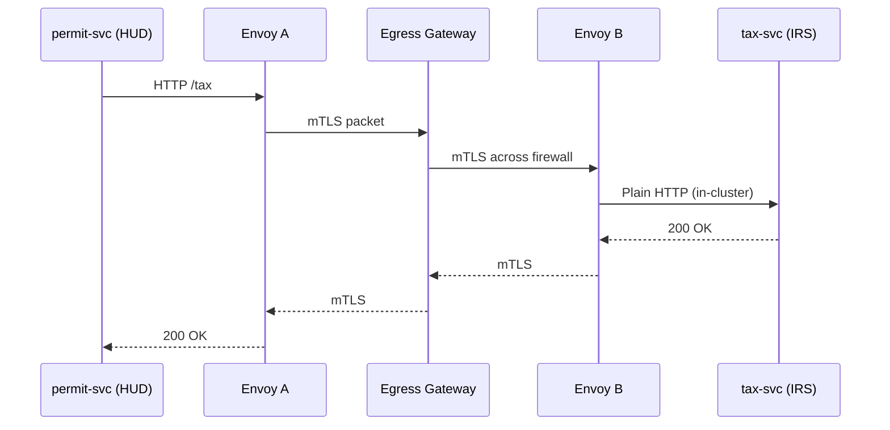

# Chapter 7: Cross-Domain Service Mesh  
*(link back → [Modular Microservice Architecture](06_modular_microservice_architecture_.md))*  

---

## 1 · Why Do We Need One More Layer?

### 60-Second Story – “The Diplomatic Pouch”

The **Export–Import Bank (EXIM)** must verify a shipping invoice that sits in a **Denali Commission** database.  
Both agencies host their micro-services on different, tightly-firewalled networks:

```
EXIM SecureNet  ←⛔→  Denali GovCloud
```

Without help, developers beg network teams for VPN tunnels, open firewall tickets, and trade plain-text HTTP by accident.  
With a **Cross-Domain Service Mesh** the call looks like this from code inside EXIM:

```ts
await fetch('http://invoice-svc.denali.svc.cluster.local/v1/invoice/883');
```

Behind the scenes the mesh:

1. Wraps the request in **mTLS encryption** (like sealing a diplomatic pouch).  
2. Authenticates the caller with **zero-trust** rules.  
3. Retries or “circuit-breaks” if the Denali side is slow.  
4. Crosses the firewall through a single, pre-approved **egress gateway**—no new tickets!  

Developers keep shipping features; network admins keep sleeping at night.

---

## 2 · Key Ideas in Plain English

| Term | Beginner-Friendly Meaning |
|------|---------------------------|
| Service Mesh | An automatic motorway that connects every micro-service, adds seatbelts (encryption), traffic lights (policies), and tow-trucks (retries) **without** changing your code. |
| Sidecar Proxy | A tiny helper container (e.g., Envoy) injected next to **each** service; it handles all traffic in & out. |
| Control Plane | The “air-traffic control” (e.g., Istio, Linkerd) that tells every sidecar which routes & policies to use. |
| mTLS | “Mutual TLS” – both sides present certificates, so nobody can masquerade. |
| Circuit Breaking | Auto-stops calls to a struggling service so it can recover instead of collapsing. |
| Egress Gateway | The single, locked-down exit door your packets use to cross a network boundary. |

Analogy: Sidecar proxies are armored cars; the control plane is the dispatcher sending GPS routes and rules.

---

## 3 · Quick Start – Make Two Domains Talk

We’ll connect **permit-service** in _Domain A_ (HUD network) to **tax-service** in _Domain B_ (IRS network).

### 3.1  Install the Mesh (once per cluster)

```bash
# VERY simplified; real script uses helm charts
$ istioctl install --set profile=demo
```

*Explanation*:  
`istioctl` sets up the control plane (`istiod`) plus an **egress-gateway** on each side.

### 3.2  Opt-In a Service With One Label

```yaml
# permit-service/deployment.yaml (excerpt)
metadata:
  labels:
    istio-injection: enabled   # <-- magical line
```

*Explanation*:  
Istio mutates the pod at deploy time, adding an **Envoy sidecar**.  
No code changes, no new Docker image.

### 3.3  Allow Cross-Domain Traffic

```yaml
# permit-service/mesh.yaml   (≤16 lines)
apiVersion: networking.istio.io/v1beta1
kind: ServiceEntry
metadata: { name: tax-service-irs }
spec:
  hosts: [ "tax-svc.irs.svc.cluster.local" ]
  location: MESH_EXTERNAL
  ports: [ { number: 80, name: http } ]
  resolution: DNS
```

*Explanation*:  
• `ServiceEntry` tells Istio “there is an *external* host you may call”.  
• The control plane programs the egress gateway with this info.

---

## 4 · What Happens Under the Hood?



Notes  
1. **mTLS** is enforced on every hop except the final in-cluster jump.  
2. If `B` is slow, `PB` can retry or open the circuit so `A` fails fast.  
3. Firewall sees **one port** (443) only: audit teams love this.

---

## 5 · Digging Deeper (But Still Beginner-Friendly)

### 5.1  Automatic Retries & Timeouts (DestinationRule)

```yaml
apiVersion: networking.istio.io/v1beta1
kind: DestinationRule
metadata: { name: tax-policy }
spec:
  host: tax-svc.irs.svc.cluster.local
  trafficPolicy:
    connectionPool: { http: { http1MaxPendingRequests: 1 } }
    outlierDetection: { consecutiveErrors: 3, interval: 10s }
```

*Explanation*:  
• After 3 consecutive failures, Envoy marks the IRS endpoint “unhealthy” and opens the circuit for 10 s.

### 5.2  Who Can Call Whom? (AuthorizationPolicy)

```yaml
kind: AuthorizationPolicy
metadata: { name: hud-calls-irs }
spec:
  selector: { matchLabels: { app: permit-service } }
  rules:
  - to: [ { operation: { hosts: [ "tax-svc.irs.svc.cluster.local" ] } } ]
    when: [ { key: request.auth.principal, values: [ "permit-svc.hud.svc" ] } ]
```

*Explanation*:  
Only pods holding the **HUD permit-service certificate** may call `tax-svc`.  
This is **zero-trust**—no blanket “10.0.0.0/8” allow list.

---

## 6 · Minimal Code Example – Service-to-Service Call

```ts
// permit-service/controllers/tax.ts
export async function getTax(id: string) {
  const res = await fetch(`http://tax-svc.irs.svc.cluster.local/v1/taxes/${id}`,
                           { timeout: 2000 });       // 2 s
  return res.ok ? res.json() : { error: 'IRS unavailable' };
}
```

What you **do NOT** see: TLS handshakes, retries, or cert validation—Envoy does it for you.

---

## 7 · Common Pitfalls & Easy Fixes

| Pitfall | Fast Fix |
|---------|----------|
| Forgetting the `istio-injection` label | Add the label; redeploy. |
| Large payloads timing out at gateway | Increase `maxRequestBytes` in `DestinationRule` or switch to gRPC streaming. |
| Circuits never close after recovery | Tune `outlierDetection.baseEjectionTime`. |
| “It works locally but not cross-domain” | Ensure `ServiceEntry.location=MESH_EXTERNAL` and firewall allows the gateway IP. |

---

## 8 · Recap & Next Steps

You now know how the **Cross-Domain Service Mesh**:

• Injects sidecars to encrypt and control every packet.  
• Lets agencies talk through a single, auditable gateway.  
• Adds automatic retries, circuit-breaking, and zero-trust auth—**without touching your app code**.

Next we’ll learn how to **pull data from systems *outside* our clusters**, such as legacy mainframes or public APIs, using an [External System Sync Connector](08_external_system_sync_connector_.md).

---

Generated by [AI Codebase Knowledge Builder](https://github.com/The-Pocket/Tutorial-Codebase-Knowledge)