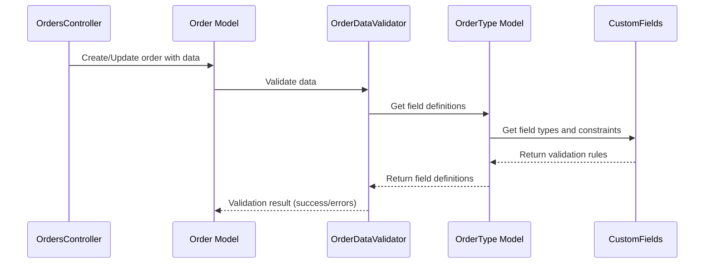

# Chapter 7: Custom Fields

Coming from learning about [Profile](06_profile.md)s, let's now explore how we can add custom information to our [Order](02_order.md)s. Remember Alice's pizza order? We stored her toppings and crust preferences in the `data` attribute of the `Order` object.  But what if we also wanted to capture her preferred delivery time or any special instructions?  We need a way to define and manage these extra pieces of information for different [Order Type](03_order_type.md)s. That's where `Custom Fields` come in.

## What are Custom Fields?

Custom Fields are like customizable options for each [Order Type](03_order_type.md). Think of them like choosing toppings for a pizza or providing details for a support request. They provide flexibility in capturing order-specific information.

## Alice's Pizza: Delivery Time and Instructions

Let's say we want to add "Delivery Time" and "Special Instructions" to our "Pizza Order" [Order Type](03_order_type.md).  These would be our Custom Fields.

## Key Concepts

* **Definition:** Custom Fields are defined within the `fields` section of the YAML file that defines the [Order Type](03_order_type.md).
* **Types:**  Each Custom Field has a type, such as `string`, `number`, `boolean`, or `datetime`.
* **Label:** A human-readable name for the field, like "Delivery Time".

## Defining Custom Fields

We can define our new Custom Fields in the `pizza_order.yml` file:

```yaml
order_type:
  # ... other order type details
  fields:
    # ... existing fields like toppings and crust
    delivery_time:
      type: datetime
      label: Delivery Time
    instructions:
      type: string
      label: Special Instructions
```

This YAML snippet adds two Custom Fields: `delivery_time` of type `datetime` and `instructions` of type `string`.

## Using Custom Fields

When Alice places her order, she can now provide her preferred delivery time and any special instructions.  This information is stored in the `data` attribute of the [Order](02_order.md) object.

```ruby
# app/controllers/orders_controller.rb (simplified)
def create
  @order = Order.new(
    # ... other order details
    data: { 
      # ... existing data like toppings and crust
      delivery_time: "2024-07-20T18:00:00Z",
      instructions: "Extra napkins please!"
    }
  )
  @order.save
end
```

This code now includes the `delivery_time` and `instructions` in the `data` hash.

## Under the Hood

When an [Order](02_order.md) is created or updated, the `OrderDataValidator` checks if the provided `data` conforms to the Custom Fields defined in the [Order Type](03_order_type.md).



The `OrderDataValidator` (located in `app/validators/order_data_validator.rb`) uses the `CustomFields` classes (located in `app/classes/custom_fields`) to perform the validation.

```ruby
# app/validators/order_data_validator.rb (simplified)
fds = record.field_definition_set
fds.validate_value(:data, record.data)
```

This code retrieves the field definitions from the [Order Type](03_order_type.md) and validates the `data` against those definitions.

The `CustomFields::DataTypes` classes (located in `app/classes/custom_fields/data_types`) handle the type-specific validation and coercion. For example, the `CustomFields::DataTypes::Datetime` class validates that the `delivery_time` is a valid datetime value.

```ruby
# app/classes/custom_fields/data_types/datetime.rb (simplified)
Time.iso8601(value) rescue ArgumentError # Validate datetime format
```

## Conclusion

You've learned about Custom Fields and how they allow you to add custom data to your [Order](02_order.md)s. You've seen how to define them in the [Order Type](03_order_type.md) YAML file and how they are used when creating or updating orders. Next, let's explore how the [Hydra BPM Widget (HBW)](08_hydra_bpm_widget__hbw_.md) interacts with the BPM engine. [Next: Hydra BPM Widget (HBW)](08_hydra_bpm_widget__hbw_.md)


---

Generated by [AI Codebase Knowledge Builder](https://github.com/The-Pocket/Tutorial-Codebase-Knowledge)