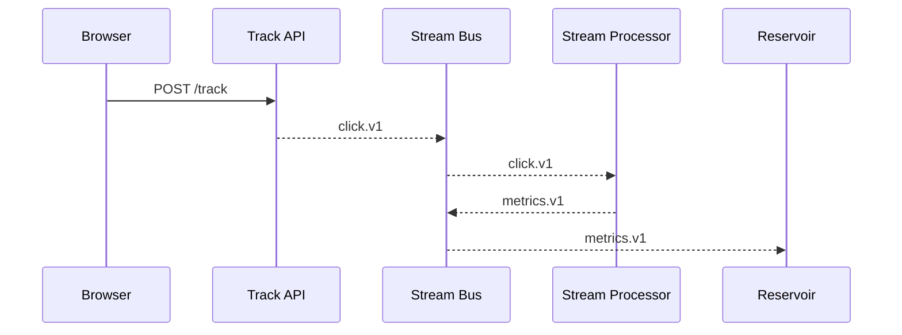

# Chapter 7: Data Pipeline & Real-Time Analytics
*Coming from [Event-Driven Workflow Orchestration](06_event_driven_workflow_orchestration_.md).*

---

## 1. Why Bother? – A 2-Minute Story  

The **Office of Minority Health (OMH)** just launched a new *“Healthy Communities Grant”* portal.  
Yesterday, applicants complained on social media that the site “freezes on page 3.”  
OMH needs to know—**right now**—where people drop off, how long pages take, and whether recent code changes saved money.

Without a live data pipeline they would:

* Wait for nightly batch jobs.
* Guess at fixes.
* Miss today’s application deadline.

A **real-time analytics pipeline** turns every click, form field, and server log into *up-to-the-second* dashboards.  
The AI Agent (introduced in [AI Representative Agent (HMS-A2A)](15_ai_representative_agent__hms_a2a__.md)) can then *automatically* recommend code rollbacks, extra servers, or UX tweaks.

---

## 2. Mental Model – “Water Works” Analogy  

| Water-Plant Term | Pipeline Component | One-Liner |
|------------------|--------------------|-----------|
| Faucet           | **Producer**       | Browser, API, or microservice that emits events (clicks, logs). |
| Pipe             | **Stream Bus**     | RabbitMQ/Kafka topic moving events downstream. |
| Filter           | **Stream Processor** | Code that cleans, aggregates, or joins events. |
| Reservoir        | **Time-Series DB** | InfluxDB/Prometheus table storing metrics. |
| Gauge            | **Dashboard**      | Grafana/DIY page visualizing numbers live. |

Keep “Faucet → Pipe → Filter → Reservoir → Gauge” in mind as we code.

---

## 3. Guided Walk-Through: “Why Did Page 3 Freeze?”  

Goal in < 100 lines total:

1. Collect click events (`PageViewed`, `FormSubmitted`).  
2. Compute average page load time **every 10 seconds**.  
3. Push the result to a mini dashboard.  
4. Let the AI Agent read the metric and print advice.

### 3.1 Producing Events – Browser Snippet  

```javascript
// click_producer.js  (run in portal)
function send(ev){fetch("/track",{method:"POST",
  headers:{'Content-Type':'application/json'},
  body:JSON.stringify(ev)});
}

performance.onresourcetimingbufferfull = ()=>{}; // skip for demo

window.addEventListener("load",()=>{
  send({type:"PageViewed", page:location.pathname,
        t:performance.timing.domComplete});
});
```

Explanation (≤40 words):  
When a page loads, we POST a tiny JSON to `/track`; the backend will forward it to the stream bus.

---

### 3.2 Ingest Endpoint – Microservice (Python 18 lines)

```python
# track_api.py
from fastapi import FastAPI, Request
import pika, json
app = FastAPI()
mq = pika.BlockingConnection().channel()

@app.post("/track")
async def track(req: Request):
    ev = await req.json()
    mq.basic_publish(exchange="hms", routing_key="click.v1",
                     body=json.dumps(ev))
    return {"ok": True}
```

What happens?  
• Receives the browser POST.  
• Publishes event to topic `click.v1`.  
• Returns 200 immediately—no heavy work here.

---

### 3.3 Stream Processor – 14-Line Aggregator  

```python
# avg_loader.py
import pika, json, time, statistics
buf = []

def flush():
    if buf:
        avg = statistics.mean(buf)
        payload = {"metric":"avg_load_ms",
                   "value": round(avg,2),
                   "ts": time.time()}
        mq.basic_publish(exchange="hms", routing_key="metrics.v1",
                         body=json.dumps(payload))
        buf.clear()

mq = pika.BlockingConnection().channel()
q = mq.queue_declare('', exclusive=True).method.queue
mq.queue_bind(exchange="hms", queue=q, routing_key="click.v1")

def on_msg(_c,_m,_p,body):
    ev=json.loads(body)
    if ev["type"]=="PageViewed":
        buf.append(ev["t"])
    if time.time()%10<1: flush()          # every 10 s

mq.basic_consume(queue=q,on_message_callback=on_msg,auto_ack=True)
mq.start_consuming()
```

Explanation:  
1. Collects `PageViewed` timings in `buf`.  
2. Every ~10 seconds, publishes an aggregated metric to `metrics.v1`.  
3. No DB yet—keeps the demo clear.

---

### 3.4 Storing Metrics – 12-Line In-Memory “Reservoir”  

```python
# reservoir.py
from collections import deque
import pika, json
STORE = deque(maxlen=300)          # 5 min at 1 msg/s

mq = pika.BlockingConnection().channel()
q = mq.queue_declare('', exclusive=True).method.queue
mq.queue_bind(exchange="hms", queue=q, routing_key="metrics.v1")

def on_msg(_,__,___,body):
    STORE.append(json.loads(body))  # [{metric,value,ts}, …]

mq.basic_consume(queue=q, on_message_callback=on_msg, auto_ack=True)
mq.start_consuming()
```

---

### 3.5 Mini Dashboard – Flask 16 Lines  

```python
# dashboard.py
from flask import Flask, jsonify
import reservoir                          # just imports & starts listener
app = Flask(__name__)

@app.route("/")
def home():
    if reservoir.STORE:
        latest = reservoir.STORE[-1]
        return f"Avg page load: {latest['value']} ms"
    return "No data yet."

@app.route("/metrics.json")
def metrics(): return jsonify(list(reservoir.STORE))
```

Run `flask run` and open http://localhost:5000 —the number updates in real time!

---

### 3.6 AI Agent Consumes Metrics  

```python
# ai_advisor.py
import requests, time
while True:
    m = requests.get("http://localhost:5000/metrics.json").json()[-1]
    if m["value"] > 3000:
        print("🤖  Suggestion: scale UI pods or optimize images.")
    time.sleep(15)
```

Now you have a full feedback loop: **click → pipeline → dashboard → AI suggestion**.

---

## 4. Under the Hood – Step-By-Step  



Five participants, single pass—easy to trace.

---

## 5. Where This Fits in HMS-SCM  

```mermaid
flowchart LR
    subgraph Runtime
        UI[Portals] --> API
        API -->|events| BUS
    end
    BUS --> PROC
    PROC --> Reservoir
    Reservoir --> Dash[Dashboard]
    Dash -->|json| AI[HMS-A2A]
    Dash -.-> Mon([Monitoring\n& KPIs\n(Chapter 8)])
```

*Producers* live in every layer; *consumers* can be analytics, monitoring, or other microservices.

---

## 6. Internals & Extensibility  

1. **Schema Registry (Optional)** – Store JSON-Schema for each topic to avoid “mystery fields.”  
2. **Window Types** – Swap mean for 95-th percentile or sliding windows—just change the processor.  
3. **Persistent Store** – Replace `reservoir.py` with InfluxDB, Timescale, or Prometheus for longer history.  
4. **Governance Hooks** – Policies from [Governance Layer (HMS-GOV)](02_governance_layer__hms_gov__.md) can redact PII before events leave the API.  
5. **Change Safety** – Any change to processors travels through [Change Management & Versioning](04_change_management___versioning_.md).

---

## 7. Debugging Tips for Beginners  

* `rabbitmqctl list_queues` – see if events pile up.  
* Print event sizes; a huge payload can clog pipes.  
* Remember time zones when graphing timestamps.  
* Use `curl localhost:5000/metrics.json` for quick JSON sanity checks.

---

## 8. Key Takeaways  

• A real-time pipeline is just “faucet → pipe → filter → reservoir → gauge.”  
• Less than 100 lines delivers live insight into citizen experience.  
• AI Agents can read the same metrics to *justify* or *adjust* recommendations.  
• The design respects earlier chapters (events, governance, change mgmt.) and feeds the next one—**Monitoring & KPIs**.

---

## 9. What’s Next?  

Dashboards are helpful but we still need *alerting*, *SLA enforcement*, and *long-term KPIs*.  
Jump to [Monitoring, Telemetry, and KPIs](08_monitoring__telemetry__and_kpis_.md) to turn these raw numbers into actionable signals for every federal program.

---

Generated by [AI Codebase Knowledge Builder](https://github.com/The-Pocket/Tutorial-Codebase-Knowledge)