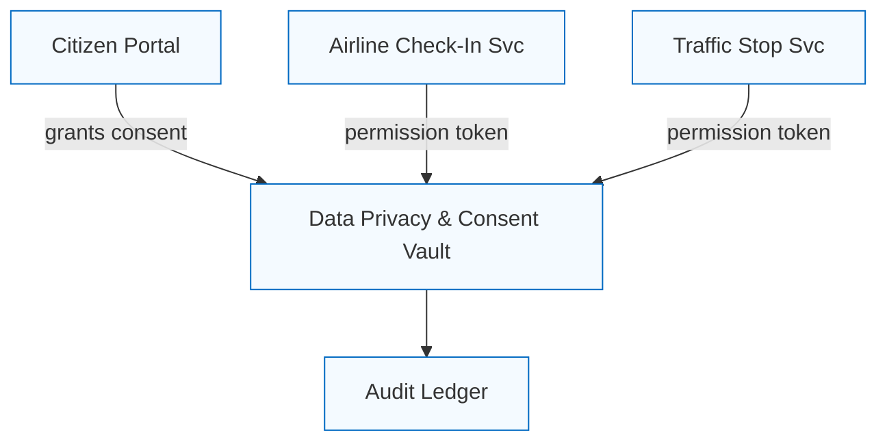
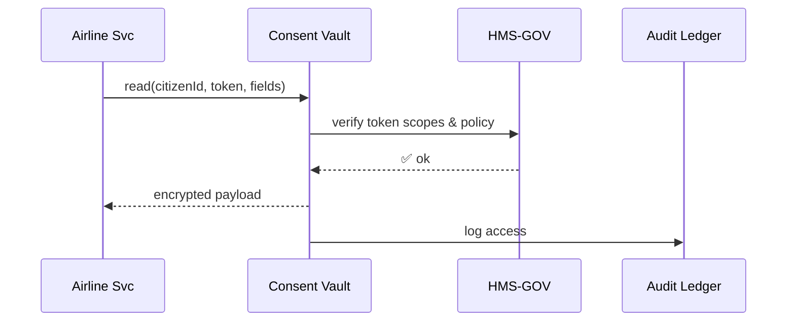

# Chapter 7: Data Privacy & Consent Vault
*[Jump back to Chapter 6: Security & Compliance Envelope](06_security___compliance_envelope_.md)*  

---

## 1. Why Do We Need a “Vault” at All?

Imagine the **U.S. Department of Transportation (DOT)** launches a smart-phone “Digital Driver’s License” (DDL):

1. The app stores **name, photo, address, organ-donor choice**—classic PII.  
2. Citizens can choose to **share their license with an airline** for boarding or **with police** during a traffic stop.  
3. DOT must follow **GDPR** (EU travelers), **HIPAA** (organ-donor flag counts as health data), and 50 different state privacy laws.

Hard-coding privacy rules into every micro-service would be a nightmare.  
Enter the **Data Privacy & Consent Vault**—a single, policy-driven safe where:

* Sensitive data lives **encrypted**.  
* Every piece of data has an attached **consent record**.  
* Services must present a signed **permission token** or get *zero* bytes back.

Think “Census Bureau secure room” but for API calls.

---

## 2. Key Concepts (Plain-English Cheat-Sheet)

| Term              | Friendly Analogy |
|-------------------|------------------|
| Vault Row         | A locked filing-cabinet drawer holding one citizen’s data. |
| Consent Record    | A sticky note on the drawer: “Jane allows Airlines to read *photo* until 2026-12-31”. |
| Permission Token  | A time-limited visitor badge a service must wear to open the drawer. |
| Scope             | Which fields the badge covers (e.g., `photo`, `organDonor`). |
| Revocation        | The citizen yells “Stop!”—all existing badges become invalid. |
| Pseudonymization  | Drawer labels replaced with random IDs so staff can’t guess whose data it is. |

---

## 3. 60-Second Mental Model



1. Citizen grants consent via the portal.  
2. Vault stores consent + data.  
3. Services bring a valid **permission token** to read/write.  
4. Every action is copied to the [Auditing & Traceability Ledger](13_auditing___traceability_ledger_.md).

---

## 4. Hands-On Walk-Through: “Show My License at the Airport”

### 4.1 Citizen Gives Consent (Frontend)

```js
// portal/consent.js  (≤12 lines)
import { vault } from "@hms/sdk";

async function grantAirlineAccess() {
  await vault.consent.grant({
    citizenId: "CIT-123",
    partner:   "airline",
    scopes:    ["photo", "name"],
    expiresAt: "2026-12-31"
  });
}
```

Explanation  
• `vault.consent.grant` hits a **/consent** API; no PII exposed yet.  
• Scopes are explicit—only `photo` & `name` allowed.  

### 4.2 Airline Service Requests a Permission Token

```js
// airline/checkin.js
import { vault } from "@hms/sdk";

const token = await vault.token.issue({
  citizenId: "CIT-123",
  partner:   "airline",
  scopes:    ["photo","name"]
});
// attach to upcoming API call
```

Result: `token` is a signed JWT looking like  
`eyJ...src="vault" scopes="photo,name" exp=1717171…`.

### 4.3 Reading Data Inside a Secure Micro-Service

```js
// airline/routes/license.js  (≤15 lines)
router.get("/ddl/:citizenId", async (req, res) => {
  const { citizenId } = req.params;
  const token = req.headers["x-permission-token"];

  // Validate & fetch in one call
  const data = await vault.read({
    citizenId,
    token,                 // proves consent
    fields: ["photo","name"]
  });

  res.json({ photo: data.photo, name: data.name });
});
```

What you did NOT write: encryption, GDPR date checks, revocation logic—all handled by the vault.

---

## 5. Quick-Start in 30 Seconds

```bash
npm i -g @hms/vault-cli           # install CLI
hms-vault init                    # spins up local dev vault
hms-vault status                  # should say "RUNNING (dev mode)"
```

You’re ready to follow the code samples above.

---

## 6. Under the Hood — What Happens When `vault.read` Runs?



1. Vault checks the JWT signature and expiry.  
2. Vault calls [Governance Layer](01_governance_layer__hms_gov__.md) to ensure the scope is still legal (e.g., state just changed privacy law).  
3. Data returned is decrypted on the fly, **never** stored on disk by the service.  
4. Ledger records *who*, *what*, *when*—useful later in Chapter 13.

---

## 7. Mini Peek into Vault Internals (Simplified)

### 7.1 Permission Check

```go
// file: vault/perm.go (≤18 lines)
func Authorize(token JWT, reqFields []string) error {
    if !token.IsValid() { return ErrInvalid }

    for _, f := range reqFields {
        if !token.Scope.Has(f) {
            return fmt.Errorf("no consent for %s", f)
        }
    }
    if time.Now().After(token.Expires) { return ErrExpired }

    return nil
}
```

Beginner notes  
• Loops through each requested field; denies if not in scope.  
• Time check enforces automatic expiry.  

### 7.2 Encryption at Rest (Conceptual)

All sensitive columns are stored as `AES256_GCM(ciphertext, key_id)`.  
Keys live in the **Security & Compliance Envelope**’s KMS, not the database.

---

## 8. Revocation: “Oops, I Clicked the Wrong Partner”

```js
await vault.consent.revoke({
  citizenId: "CIT-123",
  partner:   "airline"
});
```

Effect:  
1. Vault flags consent as *REVOKED*.  
2. All active permission tokens for that (citizen, partner) pair are invalidated in < 5 sec.  
3. Any subsequent `vault.read` returns **403 Forbidden**.

---

## 9. Common Pitfalls & Fixes

| Symptom | Likely Cause | Quick Fix |
|---------|--------------|-----------|
| `403: token expired` | Token TTL too short | Re-issue with a longer `expiresAt`, but stay within policy max. |
| `no consent for field` | Service requested extra fields | Ask the citizen for expanded consent. |
| High DB latency | Encrypt-on-read overhead | Batch fields instead of many single-field calls. |

---

## 10. FAQ

**Q: Can I store non-PII data in the vault?**  
Technically yes, but it adds overhead. Reserve the vault for data that truly needs consent tracking.

**Q: Does the vault handle “right to be forgotten”?**  
Yes—call `vault.erase(citizenId)`; data is shredded, and a tombstone remains for auditing.

**Q: How fine-grained can scopes be?**  
Field-level by default; you can nest JSON paths like `medical.allergies`.

---

## 11. What You Learned

• The **Data Privacy & Consent Vault** is the single source of truth for both sensitive data **and** the permission trail that guards it.  
• Services don’t juggle legalese—they just present a **permission token**.  
• Revocation, encryption, auditing, and policy updates are automatic.  

Ready to see how we map those permissions to *roles* across thousands of users and services?  
Continue to [Chapter 8: Role & Access Control Matrix](08_role___access_control_matrix_.md).

---

Generated by [AI Codebase Knowledge Builder](https://github.com/The-Pocket/Tutorial-Codebase-Knowledge)