# Chapter 7: Domain-Specific Modules (HMS-MED, HMS-UHC, HMS-MBL, etc.)

*(Coming straight from [Front-End Micro-Frontends (HMS-MFE)](06_front_end_micro_frontends__hms_mfe__.md).)*  

---

## 1. Why Do We Need “Domain-Specific Modules”?

Picture this citizen story:

1. **Elena** visits `benefits.gov` to **compare health-insurance plans** during open enrollment.  
2. She also wants to **download last year’s medical records** to see which plan covered her prescriptions.  
3. Finally, she checks whether she qualifies for a **small-business loan** to open a pharmacy.

Three totally different federal missions—health data, insurance exchanges, trade loans—yet Elena experiences **one** seamless portal.  
Behind the curtain, HMS swaps in three specialized “wings”:

| Wing | Mission | Extra Rules It Must Honor |
|------|---------|---------------------------|
| **HMS-MED** | HIPAA-grade health data | PHI encryption, audit trail retention |
| **HMS-UHC** | Insurance marketplace sync | ACA, CMS data specs |
| **HMS-MBL** | Micro-trade analytics | USTR export controls, SBA scoring |

**Domain-Specific Modules** are these plug-and-play wings.  
They reuse every shared layer you already met (governance, micro-services, APIs, UI bricks) but _bolt on_ the regulations, data schemas, and test suites unique to their field.

---

## 2. Key Concepts (One-by-One)

| Term | Beginner Analogy | What It Means Here |
|------|------------------|--------------------|
| Module “Wing” | Extra floor added to the capitol | A namespaced folder (`hms-med`, `hms-uhc`, …) holding code, schemas, tests |
| Compliance Pack | Safety checklist | Curated rules & scanners for that domain (e.g., HIPAA §164) |
| Data Schema Bundle | Lego instruction sheet | JSON/XSD/FHIR files describing allowed records |
| Adapter Layer | Universal power outlet | Translates domain data to HMS-wide formats (`HMS-DTA`) |
| Certification Suite | Driving test | Automated CI workflow that proves the wing obeys its laws |

---

## 3. A Tiny Use-Case Walk-Through

Goal: **Elena downloads her medical record** through HMS-MED.

### 3.1 High-Level Flow

```mermaid
sequenceDiagram
  participant UI as Portal UI
  participant API as HMS-API (health)
  participant MED as HMS-MED Service
  participant CDF as HMS-CDF (rules)
  UI->>API: GET /med/records?patient=E123
  API->>MED: request after auth
  MED->>CDF: check HIPAA export rule
  CDF-->>MED: ✅ allowed
  MED-->>API: ZIP file link
  API-->>UI: download_url
```



Only five actors; two (API & MED) are domain-specific.

### 3.2 Code Peeks (≤ 20 lines each)

#### a) HMS-MED Service Endpoint

```python
# file: hms_med/records.py
from fastapi import FastAPI, Depends, HTTPException
import httpx, os

app = FastAPI()
CDF = os.getenv("CDF_URL","http://cdf")

def hipaa_ok(user_id:str):
    r = httpx.get(f"{CDF}/rules/HIPAA_EXPORT_OK?user={user_id}")
    return r.json()["allow"]

@app.get("/records")
def export(patient:str, user:str = Depends()):
    if not hipaa_ok(user):
        raise HTTPException(403, "HIPAA block")
    # fetch FHIR bundle from data lake (details skipped)
    return {"download_url": f"/dls/{patient}.zip"}
```

Explanation:  
• Looks 98 % like a normal micro-service.  
• Extra HIPAA gate is just one helper function.

#### b) Compliance Pack Manifest

```yaml
# file: hms_med/compliance.yaml
module: hms-med
laws:
  - HIPAA-164.308(a)(1)
  - HIPAA-164.312(e)(1)
tests:
  - test/audit_trail.py
  - test/phi_encryption.py
```

CI will refuse deployment if any listed test fails.

---

## 4. Inside the Wing Folder

```
hms-med/
  ├─ src/           # services & adapters
  ├─ schemas/       # FHIR, X12, etc.
  ├─ compliance.yaml
  └─ tests/
hms-uhc/
  └─ ...
hms-mbl/
  └─ ...
```

Each wing is **self-contained**, versioned, and can be installed/uninstalled via  
`hms mkt install hms-med`.

---

## 5. How a Wing “Plugs In”


Steps performed by the installer:

1. **Deploy** extra services (e.g., `med-records`, `med-fhir-adapter`).  
2. **Register** new APIs with [Backend API Layer](04_backend_api_layer__hms_svc___hms_api__.md).  
3. **Inject** compliance plug-ins into the API gateway.  
4. **Append** design tokens (`theme-med.scss`) so front-ends can show medical icons.  
5. **Schedule** certification tests in CI.

All automatic—no manual tickets.

---

## 6. Adapter Layer in Action (Code-Light)

Imagine a generic HMS report wants every dataset as **Parquet**.  
HMS-MED stores FHIR JSON. The adapter converts on the fly:

```python
# file: hms_med/adapter.py  (≤ 15 lines)
import fhir.resources.patient as FhirPatient
import pyarrow as pa, pyarrow.parquet as pq

def to_parquet(bundle_json: dict, out:str):
    rows = [FhirPatient(**e).dict() for e in bundle_json["entry"]]
    table = pa.Table.from_pylist(rows)
    pq.write_table(table, out)
```

Now analytics tools in [Data Core & Lake (HMS-DTA)](15_data_core___lake__hms_dta__.md) can crunch health data like any other dataset.

---

## 7. Certification Suite (CI Snippet)

```bash
# file: .github/workflows/cert.yml  (extract)
- name: Run HIPAA suite
  run: |
    pytest tests/ --tags hipaa
- name: Verify data schema
  run: |
    jsonschema -i sample_bundle.json schemas/fhir_patient.json
```

Green checks = wing is safe to fly.

---

## 8. Common Beginner Questions

| Question | Quick Answer |
|----------|--------------|
| “Do I have to learn every law?” | No. The **Compliance Pack** encodes them. You only write code that calls its helper functions. |
| “Can two wings talk to each other?” | Yes—through shared APIs. Data travels via the adapters so formats stay consistent. |
| “What if a law changes?” | Update the **compliance.yaml** + rule files in [HMS-CDF](02_hms_cdf___policy_engine___codified_democracy_foundation__.md). CI reruns certification before deploy. |

---

## 9. How Wings Relate to the Rest of HMS

```mermaid
graph TD
  MED["🏥 HMS-MED"] --> API["🔗 HMS-API"]
  MED --> DTA["🗄️ HMS-DTA"]
  MED --> OPS["🔭 HMS-OPS"]
  MED --> ESQ["🛡️ HMS-ESQ"]
```



• Uses **HMS-API** contracts to expose endpoints.  
• Stores data in **HMS-DTA** via adapters.  
• Compliance verified by **HMS-ESQ**.  
• Logs and metrics flow to **HMS-OPS**.

The same pattern repeats for **HMS-UHC**, **HMS-MBL**, and any future wing.

---

## 10. Hands-On Recap

You learned:

1. Domain-Specific Modules are **snap-in wings** that add regulated capabilities.  
2. Each wing ships with a **compliance pack**, **data schemas**, **adapters**, and **certification tests**.  
3. Installing a wing is one command; thereafter every shared HMS layer treats it like a first-class citizen.  
4. Tiny code snippets showed how HIPAA checks and data conversion happen in ≤ 20 lines.

---

## 11. What’s Next?

Now that our wings exist, we need a **traffic controller** to coordinate their many tasks—approvals, document uploads, notifications—without human sleeplessness.  
That coordinator is the **Activity Orchestration layer** you’ll meet in  
[Activity Orchestration (HMS-ACT & HMS-OMS)](08_activity_orchestration__hms_act___hms_oms__.md).

---

Generated by [AI Codebase Knowledge Builder](https://github.com/The-Pocket/Tutorial-Codebase-Knowledge)