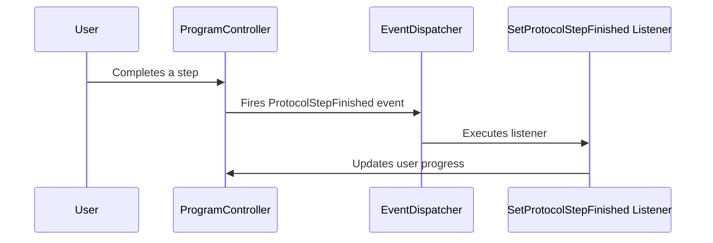

# Chapter 7: Events and Listeners

In the previous chapter, [Scheduled Tasks](06_scheduled_tasks.md), we learned how to automate actions within our programs.  This chapter introduces **Events and Listeners**, a way for different parts of our application to communicate with each other.

## Passing Messages Between App Parts

Imagine you're building a house. When the foundation is complete, the framing team needs to be notified so they can start their work.  Events and listeners work similarly in our app.  When something happens (an "event"), like a user completing a step in a [Program](01_protocols_and_programs.md), other parts of the app that are "listening" for that event can take action.

## Events: The Signal

An event is like sending a signal or a message that something has happened.  For example, when a user finishes a step in a program, the app "fires" a `ProtocolStepFinished` event.

## Listeners: The Responders

Listeners are like receivers tuned to specific signals. They "listen" for specific events and perform actions when those events occur.  For example, a listener might be responsible for updating the user's progress when the `ProtocolStepFinished` event is fired.

## Example: Finishing a Program Step

Let's see how events and listeners work when a user finishes a step in a program:

1. **User Completes Step:** The user finishes a step in their program.
2. **Event Fired:** The app fires the `ProtocolStepFinished` event.
3. **Listener Activated:** The `SetProtocolStepFinished` listener, which is "subscribed" to the `ProtocolStepFinished` event, is activated.
4. **Listener Action:** The listener performs actions like updating the user's progress, checking for the next step, and potentially triggering other events.

## Using Events and Listeners

You don't directly interact with events and listeners through the user interface. They work behind the scenes to handle communication between different parts of the app.  They are defined in the code and automatically triggered when specific actions occur.

## Internal Implementation

The `EventServiceProvider` (in `Providers/EventServiceProvider.php`) registers the listeners for various events.

```php
// Providers/EventServiceProvider.php (simplified)
use App\Events\ProtocolStepFinished;
use App\Listeners\SetProtocolStepFinished;

// ...

protected $listen = [
    ProtocolStepFinished::class => [
        SetProtocolStepFinished::class,
    ],
];
```

This code snippet shows how the `SetProtocolStepFinished` listener is registered to listen for the `ProtocolStepFinished` event.

Here's a simplified sequence diagram illustrating the process:



The `EventDispatcher` (part of Laravel's core) is responsible for notifying the appropriate listeners when an event is fired.

The `SetProtocolStepFinished` listener (in `Listeners/SetProtocolStepFinished.php`) contains the logic for handling the event.

```php
// Listeners/SetProtocolStepFinished.php (simplified)
public function handle(ProtocolStepFinished $event): void
{
    // ... logic to update user progress, check next step, etc. ...
}
```

The `EventTypes` enum (in `Enums/EventTypes.php`) defines the different types of events used in the app.

```php
// Enums/EventTypes.php (simplified)
const Notification = 'notification';
const Message = 'message';
// ...
```

## Conclusion

In this chapter, we learned about Events and Listeners, a mechanism for communication between different parts of the app. We saw how events act as signals and listeners respond to those signals. We also explored the internal implementation, including the `EventServiceProvider` and the `SetProtocolStepFinished` listener.

Next, we'll learn about [Subprojects](08_subprojects.md), which allow you to organize your app into smaller, manageable units.


---

Generated by [AI Codebase Knowledge Builder](https://github.com/The-Pocket/Tutorial-Codebase-Knowledge)