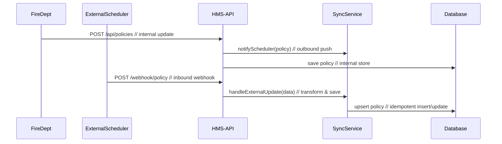

# Chapter 7: External System Synchronization

Welcome back! In [Chapter 6: Human-In-The-Loop Override](06_human_in_the_loop_override_.md) we added a review queue so supervisors can approve, adjust, or veto AI proposals. Now we’ll learn how HMS-AGX keeps all related systems—schedulers, data dashboards, citizen portals—in perfect sync whenever policies or data change.

## 1. Why External System Synchronization?

Imagine two city departments:

- **Building Department** updates permit rules.
- **Scheduling Department** manages inspection calendars.

When the Building team changes a rule, the Scheduling system must pick it up instantly. Otherwise inspectors follow outdated checklists, causing delays.

Central Use Case:  
The Fire Safety Agency updates its “mandatory sprinkler inspection” policy. We need to:

1. Push that change to a third-party inspection scheduler.  
2. Update our internal database.  
3. Refresh the citizen-facing portal so applicants see the new requirement.

By linking these systems in real time, everyone sees the same up-to-date rules.

## 2. Key Concepts

1. Real-time Links  
   Systems notify each other the moment data changes.

2. Webhooks vs. Polling  
   - Webhooks: the source system “pushes” updates to us.  
   - Polling: we “ask” the source system at intervals if anything changed.

3. Data Transformation  
   Convert incoming payloads into our internal model.

4. Idempotency  
   Ensure the same update applied twice doesn’t duplicate or corrupt data.

## 3. How to Use This Abstraction

### 3.1 Handling Inbound Webhooks

When the external scheduler sends policy updates, HMS-AGX exposes a webhook:

```js
// src/routes/syncRoutes.js
const express = require('express');
const { handleExternalUpdate } = require('../services/syncService');
const router = express.Router();

router.post('/policy', async (req, res) => {
  await handleExternalUpdate(req.body);  // process external payload
  res.status(200).send('OK');
});

module.exports = router;
```

Explanation:
- Clients `POST` updates to `/webhook/policy`.  
- We call `handleExternalUpdate()` to transform and save the change.  
- Return `200 OK` so the sender knows we received it.

### 3.2 Sending Outbound Notifications

When HMS-AGX updates a policy internally, we notify other systems:

```js
// src/services/syncService.js
const fetch = require('node-fetch');

async function notifyScheduler(policy) {
  await fetch('https://scheduler.gov/api/updates', {
    method: 'POST',
    headers: { 'Content-Type': 'application/json' },
    body: JSON.stringify(policy)
  });
}

module.exports = { notifyScheduler };
```

Explanation:
- `notifyScheduler()` sends our updated policy as JSON.  
- The external scheduler’s API endpoint ingests it and updates its records.

## 4. Under the Hood: Sequence Diagram



1. **Internal Update**: FireDept calls our API → we notify scheduler & save the change.  
2. **External Update**: Scheduler pushes a change → we transform and upsert into our DB.

## 5. Internal Implementation

### 5.1 syncService.js

```js
// src/services/syncService.js
const db = require('../db');

async function handleExternalUpdate(data) {
  const policy = {
    id: data.id,
    text: data.description,
    effective: data.effectiveDate
  };
  // Upsert: avoid duplicates if called twice
  await db.query(
    `INSERT INTO policies(id, text, effective)
     VALUES($1,$2,$3)
     ON CONFLICT(id) DO UPDATE SET text=$2, effective=$3`,
    [policy.id, policy.text, policy.effective]
  );
}

async function notifyScheduler(policy) {
  // outbound push as shown above
}

module.exports = { handleExternalUpdate, notifyScheduler };
```

Explanation:
- Transform the incoming webhook `data` into our `policy` model.  
- Use an upsert query so repeated calls don’t duplicate rows.  
- Export both inbound and outbound functions.

### 5.2 Registering Routes

```js
// src/server.js
const express = require('express');
const syncRoutes = require('./routes/syncRoutes');
const app = express();

app.use(express.json());
app.use('/webhook', syncRoutes);

app.listen(8080, () => console.log('HMS-API on :8080'));
```

Explanation:
- Mount `syncRoutes` at `/webhook`.  
- Incoming `POST /webhook/policy` calls our handler.

## 6. Why This Matters

- Consistency: All systems display the same policy instantly.  
- Reliability: Webhooks replace error-prone manual imports.  
- Speed: No more waiting for nightly batch jobs.  
- Scalability: Add more systems by reusing the same `syncService` functions.

## Conclusion

In this chapter, you learned how to link HMS-AGX with external systems—handling inbound webhooks and sending outbound notifications, all with safe, idempotent upsert logic. Next up, we’ll dive into embedding core values like fairness and transparency into every AI-driven action:

[Chapter 8: AI Governance Values](08_ai_governance_values_.md)

---

Generated by [AI Codebase Knowledge Builder](https://github.com/The-Pocket/Tutorial-Codebase-Knowledge)