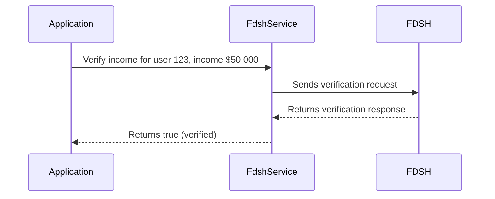

# Chapter 7: FDSH Services

In the previous chapter, [Models (Mongoid)](06_models__mongoid_.md), we learned how to store and retrieve data about users. Now, let's imagine we need to verify some of that user information, like their income or citizenship status.  We can't just take their word for it!  Our central use case is verifying a user's income using an external service. This is where FDSH Services come in.

## FDSH Services: Your Application's Verification Helper

FDSH (Federal Data Services Hub) is an external service that helps us verify information. Think of it like a background check service. Our application can send information to FDSH, and FDSH will send back a response telling us if the information is valid.

## Example: Verifying Income

Let's say we have a user's reported income and want to verify it with FDSH.  We can use a simplified Ruby method to interact with the FDSH service:

```ruby
# app/services/fdsh_service.rb (simplified)
class FdshService
  def verify_income(user_id, income)
    # ... Code to construct the request to FDSH ...

    response = send_request_to_fdsh(request)

    # ... Code to process the response from FDSH ...

    return verification_result # true or false
  end

  # ... other methods to interact with FDSH ...
end
```

This `verify_income` method takes the user's ID and reported income as input. It then constructs a request to send to FDSH.  After receiving the response, it processes it and returns `true` if the income is verified and `false` otherwise.  The details of constructing the request and processing the response are handled internally within the `FdshService`.

## Using the `FdshService`

In our application, we can use the `FdshService` like this:

```ruby
# app/controllers/users_controller.rb (simplified)
fdsh_service = FdshService.new
if fdsh_service.verify_income(user.id, user.reported_income)
  # Income verified!
else
  # Income not verified!
end
```

This code creates a new `FdshService` object and calls the `verify_income` method.  Based on the result, the application can take appropriate action.

## How FDSH Services Work Under the Hood



The application calls the `FdshService`.  The `FdshService` constructs a request and sends it to FDSH. FDSH processes the request and sends back a response. The `FdshService` then processes the response and returns the verification result to the application.

## Internal Implementation and Configuration

The actual interaction with FDSH is handled by libraries and configurations within the application.  The `client_config` directory, specifically files like `client_config/me/system/config/templates/features/enroll_app/fdsh_services.yml`, contain settings and [Feature Toggles (EnrollRegistry)](04_feature_toggles__enrollregistry_.md) related to FDSH services.  These configurations determine which FDSH services are enabled for a particular client and how the requests are formatted.  For example:

```yaml
# client_config/me/system/config/templates/features/enroll_app/fdsh_services.yml (simplified)
registry:
  - namespace:
      - :fdsh_services
    features:
      - key: :ridp_h139
        is_enabled: true
```

This snippet shows that the `ridp_h139` FDSH service is enabled for Maine.  The `FdshService` uses these configurations to determine which services to call and how to construct the requests.

## Conclusion

In this chapter, we learned how FDSH Services help us verify user information. We saw how to use the `FdshService` to verify income and how it interacts with the FDSH system. We also touched upon the configuration of FDSH services within the `client_config` directory. This provides a secure way to validate critical user data.

Next, we'll explore how to handle time-consuming operations in the background using [Asynchronous Communication (EventSource, Sidekiq/Resque)](08_asynchronous_communication__eventsource__sidekiq_resque_.md).


---

Generated by [AI Codebase Knowledge Builder](https://github.com/The-Pocket/Tutorial-Codebase-Knowledge)