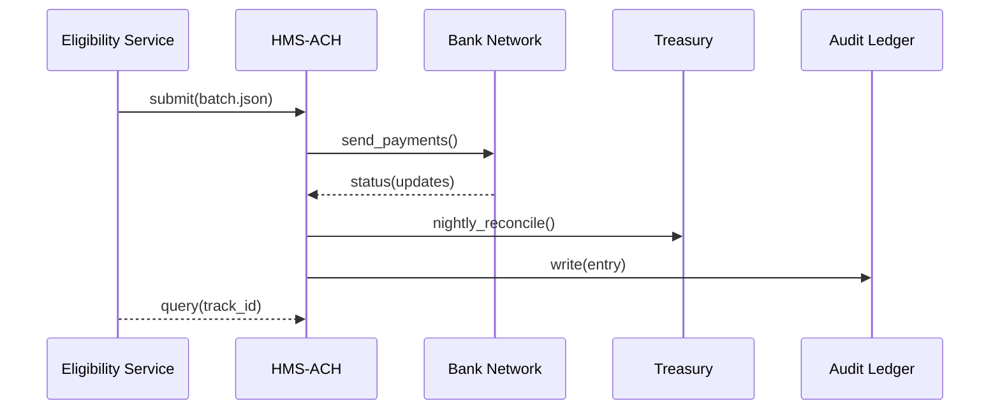

# Chapter 7: Financial Clearinghouse (HMS-ACH)

[← Back to Chapter&nbsp;6: Simulation & Testing Sandbox (HMS-ESR)](06_simulation___testing_sandbox__hms_esr__.md)

---

## 1. Why Do We Need HMS-ACH?

Picture this:

> Congress authorises **$3,000 instant flood-relief payments** for every damaged home in West Virginia.  
> Your rule has passed every test in HMS-ESR.  
> Citizens are refreshing their bank apps—**they expect money today, not next month.**

HMS-ACH is the platform’s **secure, programmable check-book**.  
It turns _policy decisions_ into _cleared dollars_ while leaving an auditable paper-trail for the Treasury, the Inspector General, and, ultimately, taxpayers.

---

## 2. A Beginner-Friendly Story

1. The **Eligibility Service** marks 4,219 households as “Approved”.  
2. It calls HMS-ACH with the list and tells it: *“Pay $3,000 each, ASAP.”*  
3. HMS-ACH chooses the fastest rail (FedNow if the recipient’s bank supports it, otherwise same-day ACH).  
4. Each payment gets a **Tracking ID** you (or auditors) can look up later.  
5. At midnight, HMS-ACH automatically reconciles with the Treasury general ledger, so every penny is accounted for.

---

## 3. Key Concepts ( in Plain English )

| Term | Friendly Analogy | One-Sentence Job |
|------|------------------|------------------|
| Payment Instruction | A signed check | Says *who* gets *how much* and *why*. |
| Rail Selector | GPS route finder | Picks ACH, FedNow, or wire to meet speed & cost targets. |
| Batch Window | Mail truck departure time | Cut-off when today’s payments leave the building. |
| Treasury Reconciliation | Balancing your cheque book | Ensures HMS-ACH records match Treasury records $-for-$. |
| Immutable Audit Ledger | CCTV footage | Records every payment step so auditors can replay later. |

---

## 4. Paying Flood Victims – Hands-On ( < 20 Lines )

Below is a **toy** example; HMS-ACH in production speaks secure gRPC and FIPS-compliant crypto, but the logic is identical.

```python
# file: send_relief.py   (18 lines)
from hms_ach import ACH, Payment

ach = ACH(env="sandbox")          # sandbox ≈ test-net

batch = [
    Payment(id="WV1001", routing="051904524", account="123456789",
            amount=3000, purpose="FLOOD_RELIEF"),
    Payment(id="WV1002", routing="051900515", account="987654321",
            amount=3000, purpose="FLOOD_RELIEF"),
]

receipt = ach.submit(batch)       # returns dict

print("Batch ID :", receipt["batch_id"])
print("Tracks   :", receipt["tracks"])   # list of Tracking IDs
```

Example output:

```
Batch ID : BR23XZ
Tracks   : ['TRK-0001', 'TRK-0002']
```

What just happened?

* Payments were validated (routing format, OFAC check).  
* Each instruction got a **Tracking ID** (`TRK-####`).  
* The sandbox faked success so you can inspect the flow without moving real money.

---

## 5. What Happens Behind the Curtain?



1. Service submits a batch.  
2. HMS-ACH sends each payment through the selected rail.  
3. Status pings (success/return) stream back.  
4. ACH and Treasury ledgers are balanced nightly.  
5. Everything is written to the Audit Ledger.

---

## 6. A Peek at the Minimal Implementation

### 6.1 Payment Dataclass

```python
# file: hms_ach/core.py
from dataclasses import dataclass

@dataclass
class Payment:
    id: str
    routing: str
    account: str
    amount: int      # cents for precision
    purpose: str
```

Keeps each instruction self-contained and easy to serialize.

### 6.2 ACH Submit (≤ 20 Lines)

```python
# file: hms_ach/ach.py
import time, uuid, json

class ACH:
    def __init__(self, env="prod"): self.env = env
    def submit(self, payments):
        batch_id = uuid.uuid4().hex[:6].upper()
        tracks = []
        for p in payments:
            track = "TRK-" + uuid.uuid4().hex[:4].upper()
            self._send(p, track)
            tracks.append(track)
        self._audit(batch_id, payments, tracks)
        return {"batch_id": batch_id, "tracks": tracks}

    def _send(self, p, track):
        print(f"💸 [{track}] -> {p.routing}/{p.account}  ${p.amount/100:.2f}")

    def _audit(self, bid, payments, tracks):
        entry = {"ts": time.time(), "batch": bid,
                 "items": len(payments), "tracks": tracks}
        open("audit.log","a").write(json.dumps(entry)+"\n")
```

Explanations:  
* `submit` loops payments, assigns tracking IDs.  
* `_send` is a stub for real rail integrations.  
* `_audit` appends a line to `audit.log` (production uses [System Observability & Ops Center](19_system_observability___ops_center__hms_ops__.md)).

### 6.3 Nightly Reconcile (Toy Example)

```python
# file: hms_ach/reconcile.py
import json, hashlib

def reconcile():
    with open("audit.log") as f:
        digest = hashlib.sha256(f.read().encode()).hexdigest()
    print("Report sent to Treasury:", digest[:12])
```

In real life HMS-ACH pushes structured NPFC/TGA files, but the idea is: **Treasury sees exactly what citizens saw.**

---

## 7. How HMS-ACH Talks to Other Layers

* The **rule** that authorises payments originates in the [Policy Deployment Pipeline](04_policy_deployment_pipeline__ci_cd_for_rules__.md).  
* Before any payment leaves, each instruction is scanned by [Compliance Guardrail Framework (HMS-ESQ)](05_compliance_guardrail_framework__hms_esq__.md) for sanctions, spending caps, etc.  
* Simulated batches can be dry-run inside [Simulation & Testing Sandbox (HMS-ESR)](06_simulation___testing_sandbox__hms_esr__.md) to forecast cash-flow impacts.  
* All tracking IDs, returns, and reconciliation digests stream into [System Observability & Ops Center](19_system_observability___ops_center__hms_ops__.md) dashboards.

---

## 8. 60-Second Lab

1. Clone the mini repo (placeholder):

   ```bash
   git clone https://github.com/example/hms-ach-mini.git
   cd hms-ach-mini
   ```

2. Run the script:

   ```bash
   python send_relief.py
   ```

3. Open `audit.log`—you’ll see your batch captured forever.

4. Change a payment `routing` number to `"000000000"` and re-run.  
   Watch the stub print an error (in production, the payment would be automatically returned and re-queued).

---

## 9. Recap & What’s Next

You now know:

1. HMS-ACH is the **money-mover** that translates policy into cleared dollars.  
2. A *Payment Instruction* + *Rail Selector* + *Audit Ledger* keeps funds fast, safe, and traceable.  
3. With < 20 lines you can test payments locally, then graduate to the real rails.  

In the next chapter we’ll see how **AI agents** can act on citizens’ behalf—requesting these payments, answering questions, and learning as they go. Ready to meet them?  
→ [AI Representative Agent Framework (HMS-AGT / HMS-AGX)](08_ai_representative_agent_framework__hms_agt___hms_agx__.md)

---

---

Generated by [AI Codebase Knowledge Builder](https://github.com/The-Pocket/Tutorial-Codebase-Knowledge)