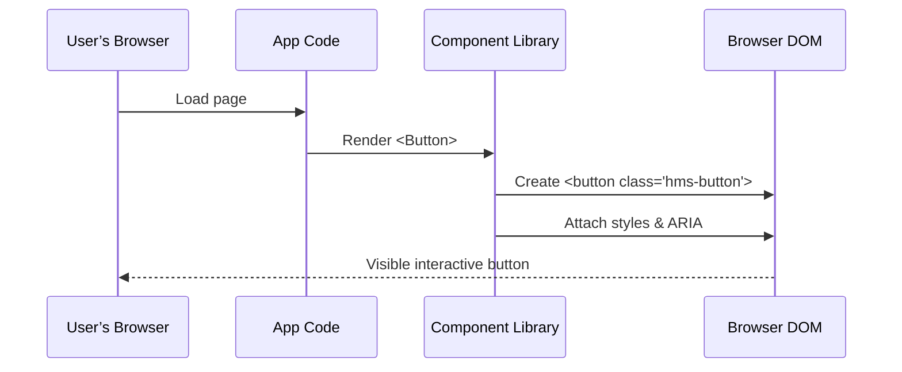

# Chapter 7: Frontend Component Library

Welcome back! In the previous chapter we learned how HMS-DEV keeps external calendars and case-management tools in sync in [External System Synchronization](06_external_system_synchronization_.md). Now it’s time to build the user interfaces with a shared **Frontend Component Library**.

---

## 7.1 Why a Frontend Component Library?

Imagine two different federal agencies—the U.S. Marshals Service and the National Institute of Diabetes and Digestive and Kidney Diseases—both need to build citizen-facing forms, charts, and notification banners. Without a shared library, each team:

- Reinvents the same buttons and form fields  
- Ships UIs that look and behave differently  
- Spends extra time fixing accessibility or design issues  

A **Frontend Component Library** is like a toolbox of standards parts: pre-built buttons, inputs, banners, and charts that

1. Ensure a consistent look and feel  
2. Meet accessibility (WCAG) rules out of the box  
3. Speed up development of new agency interfaces  

---

## 7.2 Key Concepts

1. **Component**  
   A reusable UI building block (e.g., Button, TextInput, Banner).

2. **Theme**  
   A central place to define colors, fonts, and spacing so every component “speaks the same design language.”

3. **Accessibility**  
   Built-in keyboard support, ARIA attributes, and color contrast checks.

4. **Documentation**  
   Live examples and usage guidelines so developers know how to use each component.

---

## 7.3 Using the Library in Your App

Say the Marshals Service needs a simple login form. Here’s how a developer uses our `hms-ui-library`:

```jsx
import React from 'react'
import { TextInput, Button } from 'hms-ui-library'

function MarshalLogin() {
  return (
    <form>
      <TextInput label="Officer ID" placeholder="12345" />
      <TextInput
        label="Passcode"
        type="password"
        placeholder="••••••"
      />
      <Button type="submit">Log In</Button>
    </form>
  )
}
```

Explanation:
- We import `TextInput` and `Button` from the library.
- We compose them in a `<form>` without rewriting styles or validation.
- The UI stays consistent with other HMS-DEV screens.

---

## 7.4 Under the Hood: Rendering a Component

Here’s what happens when the browser loads that `<Button>`:



1. The app code asks the library for `<Button>`.  
2. The library returns a styled `<button>` element.  
3. Styles and accessibility hooks are applied.  
4. The browser displays the final button.

---

## 7.5 Inside the Library: Minimal Code Walkthrough

Here’s a simplified file structure:

```
hms-ui-library/
  src/
    components/
      Button.jsx
      TextInput.jsx
    theme.js
    index.js
```

### 1. src/components/Button.jsx

```jsx
import React from 'react'
import './button.css'         // CSS for .hms-button

export function Button({ children, type = 'button' }) {
  return (
    <button className="hms-button" type={type}>
      {children}
    </button>
  )
}
```

> A basic React button with a shared CSS class for styling and hover/focus behavior.

### 2. src/components/TextInput.jsx

```jsx
import React from 'react'

export function TextInput({ label, ...props }) {
  return (
    <div className="hms-input-group">
      <label className="hms-label">{label}</label>
      <input className="hms-input" {...props} />
    </div>
  )
}
```

> A labeled input field. CSS classes ensure consistent spacing and accessible labels.

### 3. src/theme.js

```js
export const theme = {
  colors: {
    primary: '#005bbb',     // HMS blue
    danger: '#d32f2f'       // Alert red
  },
  fontFamily: 'Arial, sans-serif'
}
```

> Central theme settings. Components can import `theme` to align on colors and typography.

### 4. src/index.js

```js
export * from './components/Button'
export * from './components/TextInput'
export { theme } from './theme'
```

> A single entry point so apps import from `'hms-ui-library'`.

---

## 7.6 Conclusion

In this chapter you learned how a **Frontend Component Library**:

- Provides reusable, accessible UI building blocks  
- Ensures a consistent design across HMS-DEV applications  
- Speeds up development of new agency interfaces  

Next up, we’ll see how these components power real pages and workflows in the [Interface Layer](08_interface_layer_.md).

---

Generated by [AI Codebase Knowledge Builder](https://github.com/The-Pocket/Tutorial-Codebase-Knowledge)