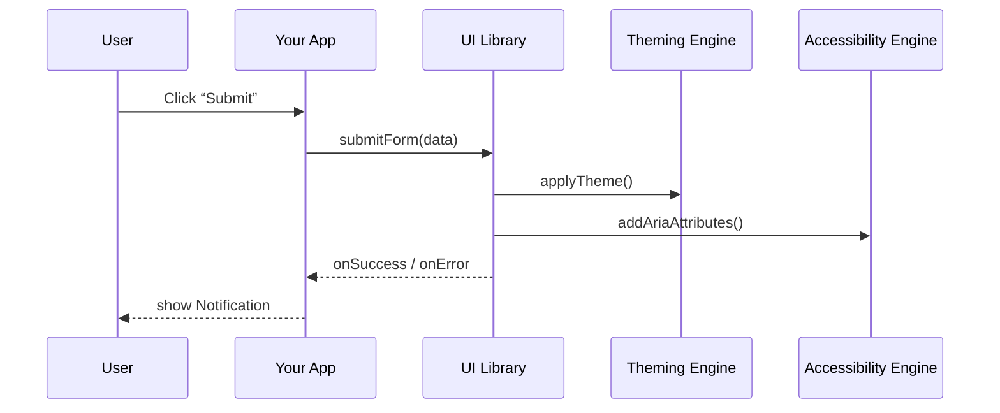

# Chapter 7: Frontend Interface Components

Building on our [Backend API](06_backend_api_.md), this chapter shows how to create consistent, accessible user interfaces across both HMS-MFE (citizen portal) and HMS-GOV (admin portal). Think of it like a government website’s style guide: a library of ready-made forms, charts, and notifications that guarantee a unified look, feel, and Section 508 compliance.

---

## Why Frontend Interface Components?

Imagine you’re a front-end developer for a state benefits portal. You need:

- A residential application form that matches every other agency form  
- A dashboard chart that looks like the official analytics site  
- Pop-up notifications that meet accessibility standards  

Without a shared component library, each page could feel and behave differently—confusing citizens and inspectors alike. Our **Frontend Interface Components** solve this by offering reusable, accessible UI building blocks.

---

## Central Use Case

Alice needs to complete a multi-step “Housing Assistance” form. Bob (an admin) needs to review submissions with charts and see system alerts. Both portals pull from the same component library:

1. Display step-by-step form fields  
2. Render status charts for applications  
3. Show banner or toast notifications  

---

## Key Concepts

1. **Component Library**  
   A set of pre-built UI elements (FormField, Button, Chart, Notification) that follow the HMS style guide.

2. **Workflows**  
   Common patterns like multi-step wizards or data review flows, built from basic components.

3. **Accessibility Engine**  
   Ensures components meet Section 508—keyboard navigation, ARIA labels, color contrast.

4. **Theming**  
   Global colors, fonts, and spacing so HMS-MFE and HMS-GOV look uniform.

---

## Using the Component Library

Here’s how you might build a simple two-field form with a submit button:

```jsx
// src/pages/HousingForm.jsx
import { Form, FormField, Button, Notification } from 'hms-ui'

export function HousingForm() {
  return (
    <Form onSubmit={handleSubmit}>
      <FormField label="Name" name="applicantName" required />
      <FormField label="Income" name="income" type="number" required />
      <Button type="submit">Submit</Button>
      {/* Notification shows on success or error */}
      <Notification id="form-notice" />
    </Form>
  )
}
```
Explanation:  
- We import four components.  
- `<Form>` wraps fields and handles validation.  
- `<Notification>` displays messages after submission.

To render a chart of application counts by status:

```jsx
// src/pages/AdminDashboard.jsx
import { Chart } from 'hms-ui'

const data = [
  { status: 'Under Review', count: 12 },
  { status: 'Approved', count: 8 },
  { status: 'Denied', count: 3 }
]

export function AdminDashboard() {
  return <Chart type="bar" data={data} xKey="status" yKey="count" />
}
```
Explanation:  
- `<Chart>` takes data and renders a bar chart following HMS color and font rules.

---

## What Happens Under the Hood?

When your app calls `<Form>` or `<Chart>`, the UI library:

1. Applies consistent styling (CSS variables, theme)  
2. Adds accessibility attributes (ARIA, keyboard handlers)  
3. Handles core logic (validation, data binding, chart axes)  



---

## Inside the Code

### File: components/form.js

```js
// components/form.js
export function Form({ children, onSubmit }) {
  return (
    <form onSubmit={e => {
      e.preventDefault()
      const data = new FormData(e.target)
      onSubmit(Object.fromEntries(data))
    }}>
      {children}
    </form>
  )
}
```
Explanation:  
- Wraps a native `<form>`, prevents default submit, collects field values, and calls your handler.

### File: components/formField.js

```js
// components/formField.js
export function FormField({ label, name, ...props }) {
  return (
    <div className="hms-form-field">
      <label htmlFor={name}>{label}</label>
      <input id={name} name={name} {...props}
        aria-required={props.required} />
    </div>
  )
}
```
Explanation:  
- Renders a label/input pair with ARIA attributes for accessibility.

### File: components/chart.js

```js
// components/chart.js
import { renderBarChart } from './chartEngine'

export function Chart({ type, data, xKey, yKey }) {
  return <div className="hms-chart" ref={node => {
    renderBarChart(node, data, xKey, yKey)
  }} />
}
```
Explanation:  
- Delegates drawing to a simple `chartEngine`, ensuring consistent axes and colors.

### File: components/notification.js

```js
// components/notification.js
export function Notification({ id }) {
  // Internally subscribes to a global event bus
  // to display messages in a banner/toast
  return <div id={id} className="hms-notification" />
}
```
Explanation:  
- Listens for events like `notify.success` or `notify.error` and shows messages with correct branding and ARIA live regions.

---

## Conclusion

You’ve learned how to use the **Frontend Interface Components** library to build consistent, accessible UIs in both HMS-MFE and HMS-GOV. We covered form fields, charts, notifications, theming, and accessibility hooks—all following a government-style guide. Next up: adding autonomous helpers with our [AI Representative Agent](08_ai_representative_agent_.md).

---

Generated by [AI Codebase Knowledge Builder](https://github.com/The-Pocket/Tutorial-Codebase-Knowledge)